# Tài liệu mô tả Turbo Code Decoder

# Cấu trúc phân cấp module top

- [TurboDecode (Top)]()
    - [TurboDecCtrl]()
        - [SISO]()
            - [alpha]()
            - [beta]()
            - [gamma]()
            - [ext]()
            - [DualReadPortRAM]() x2 cho RAM_beta, RAM_gamma
        - [Interleaver_Extra]()
        - [Interleaver]()
        - [INP]()
    - [LLR_RAM]()
        - [DualReadPortRAM]() x3 cho AB, Y1W1, Y2W2
    - [LLR_RAM_EXT]()
        - [DualReadPortRAM]() cho EXT

# Yêu cầu chức năng

Khối CTC Encoder như mô tả theo chuẩn WiMAX, IEEE 802.16 tạo ra chuỗi encoded data bao gồm dữ liệu cần gửi và mã sửa sai. Chuỗi này được điều chế và gửi đi trên kênh truyền. Tại phía thu, tín hiệu nhận được sẽ được giải điều chế, xác định các bit encoded data dưới dạng soft LLR của dữ liệu và mã sửa sai.

Nhiệm vụ của khối Turbo Code Decoder là decode từ soft LLR thành dữ liệu hard bit sử dụng giải thuật Max-Log-Map.

Yêu cầu chức năng:
- Hỗ trợ các block size: 6, 9, 12, 18, 24, 27, 30, 45, 48, 54, 60, 120, 240, 360, 480, 600.
- ~~Hỗ trợ các rate (puncturing pattens).~~ (OPTIONAL)
- Hỗ trợ thay đổi block size, số vòng lặp, rate mà không làm gián đoạn quá trình decode.
- Thiết kế đồng bộ, đơn miền tín hiệu đồng hồ.
- ~~Song song đa khối giải mã SISO để tăng tốc độ decode cho các block size hỗ trợ điều này.~~ (OPTIONAL)

Yêu cầu kỹ thuật:
- Tần số hoạt động tối đa cần tương đương hoặc tốt hơn thiết kế của Xilinx - 216.029 MHz (IEEE 802.16e CTC Decoder Core).
- Tối ưu độ trễ giải mã, tài nguyên sử dụng.

# Overview

## Mô tả quá trình giải mã

Hình dưới là sơ đồ khối của quá trình giải mã.

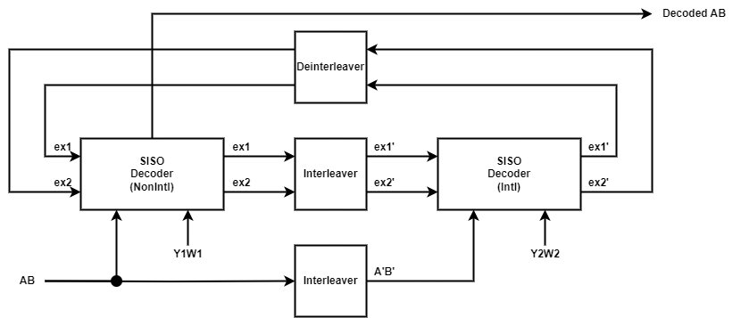

__A__, __B__ là các LLR tương ứng với chuỗi dữ liệu, cùng với các LLR của chuỗi parity bit __Y1__, __W1__, __Y2__, __W2__. __A__, __B__, __Y1__, __W1__ được xử lý bởi bộ giải mã _SISO Non-Interleave_. Chuỗi __A__, __B__ sẽ được _interleave_ để thành chuỗi __A'__ và __B'__, cùng với __Y2__ và __W2__ sẽ được xử lý bởi bộ giải mã _SISO Interleave_. Ngoài việc sử dụng dữ liệu kênh, mỗi bộ giải mã SISO sử dụng thông tin ngoại lai (extrinsic information) từ bộ giải mã khác để cập nhật đầu ra thông tin ngoại lai của chính nó. Lưu ý rằng thông tin ngoại lai __ex1__, __ex2__ từ bộ giải mã _SISO Non-Interleave_ phải được _interleave_ trước khi được xử lý bởi bộ giải mã _SISO Interleave_. Tương tự, thông tin ngoại lai __ex1'__, __ex2'__ từ bộ giải mã _SISO Interleave_ phải được _deinterleave_ trước khi được xử lý bởi bộ giải mã _SISO Non-Interleave_. Một nửa vòng lặp xảy ra mỗi khi một bộ giải mã hoàn thành việc tạo ra các thông tin ngoại lai mới. Một vòng lặp đầy đủ bao gồm hai nửa vòng lặp.

## Phân tích thiết kế

### Bắt đầu decode với Non-Interleave hoặc Interleave SISO Decoder

Việc lựa chọn bắt đầu nửa vòng lặp đầu tiên với Non-Interleave SISO hay Interleave SISO sẽ có ảnh hưởng tới độ hiệu quả và cách thiết kế. Một yếu tố thực tế khi chọn thứ tự giải mã liên quan đến bản chất của kênh. Trong kênh nhiễu AWGN, thứ tự giải mã không nên ảnh hưởng đến BER. Tuy nhiên trong kênh fading, nửa vòng lặp đầu tiên sẽ có một số ưu thế nếu nó dựa trên dữ liệu interleave.

- __Bắt đầu decode với Interleave SISO__: Bằng cách bắt đầu với bộ giải mã Interleave SISO, một vòng lặp đầy đủ xảy ra khi bộ giải mã Non-Interleave hoàn thành việc cập nhật đầu ra của nó. Các chuỗi bit thông tin ước tính, __A__ và __B__, từ bộ giải mã Non-Interleave có thể được sử dụng ngay.
- __Bắt đầu decode với Non-Interleave SISO__: Ngược lại, khi bắt đầu với bộ giải mã Non-Interleave, vòng lặp đầy đủ kết thúc với bộ giải mã Interleave, và các chuỗi bit ước tính, __A'__ và __B'__, phải được deinterleave thành __A__, __B__ trước khi output ra.

=> Bắt đầu bằng Interleave SISO.

### Tối ưu hóa tài nguyên

Vì khối SISO 1 và 2 có sự phụ thuộc thông tin ngoại lai lẫn nhau nên khi một khối SISO đang thực hiện decode, SISO còn lại sẽ không làm gì cả. Thay vào đó, ta chỉ sử dụng một khối SISO duy nhất, và dựa vào việc đang ở nửa vòng lặp nào mà AB/AB', Y1W1/Y2W2, ex1ex2/ex1'ex2' sẽ được sử dụng.

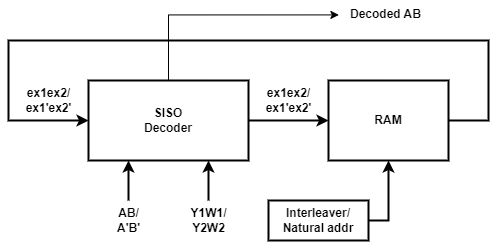

### Bộ nhớ

RAM chứa thông tin về LLR của __AB__, __Y1W1__, __Y2W2__ và __EXT__ (ex1 và ex2). Khi khởi tạo cho quá trình decode, __AB__, __Y1W1__, __Y2W2__ sẽ được nạp vào RAM tương ứng theo địa chỉ tăng tuyến tính (natural order addressing) và sẽ không thay đổi giá trị trong suốt quá trình encode.

Đồng thời, __EXT__ RAM cũng sẽ được khởi tạo với tất cả các phần tử đều có giá trị bằng 0. Có nhiều cách để khởi tạo cho giá trị ngoại lai __EXT__, cần triển khai thử nghiệm để xác định cách phù hợp. Đề xuất bao gồm:
- Ghi lần lượt các giá trị 0 vào __EXT__ RAM; hoặc
- Lần giải mã đầu tiên sẽ mux kênh đầu vào để nạp giá trị 0 lần lượt vào khối SISO thay vì đọc từ __EXT__ RAM như bình thường. Output của SISO sẽ ghi đè lên RAM, và từ lần sử dụng tiếp theo có thể lấy các giá trị này ra để sử dụng.

Mỗi RAM cần lưu trữ được số lượng cặp LLR = Block size * 4. Với Block size hỗ trợ tối đa = 600, số cặp cần lưu trữ = 600 * 4 = 2400 => 12 bit địa chỉ, mỗi địa chỉ lưu trữ word size = LLR bit size * 2.

### Interleave/Deinterleave

Interleave là xáo trộn dữ liệu trong một block, việc xáo trộn này được thực hiện thông qua việc sử dụng chuỗi địa chỉ Interleave để đọc/ghi RAM. Việc đọc từ RAM sử dụng chuỗi địa chỉ nói trên tạm gọi là quá trình Interleave hóa dữ liệu, còn việc ghi chuỗi Interleave vào RAM sử dụng chính chuỗi địa chỉ trước đó gọi là quá trình Deinterleave.

Hình dưới minh họa một khối RAM X chứa 4 phần tử, chuỗi địa chỉ Interleave lần lượt là 2, 3, 1, 0. Quá trình Interleave chuỗi X trong RAM thành chuỗi X' và rồi Deinterleave trở lại thành chuỗi X được mô tả như phép ánh xạ.

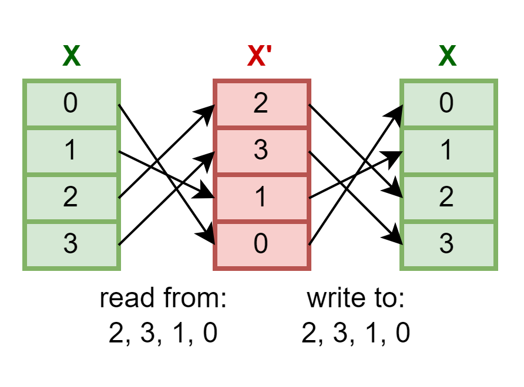

Áp dụng cho khối SISO, nửa vòng lặp đầu yêu cầu Interleave chuỗi AB và chuỗi EXT từ vòng lặp trước để tạo chuỗi A'B' và EXT' đầu vào cho quá trình decode. Sau khi decode, đầu ra EXT' sẽ ở dạng Interleave, cần thực hiện Deinterleave để tạo chuỗi EXT sử dụng cho nửa vòng lặp tiếp theo. Ở nửa vòng lặp tiếp theo, không yêu cầu Interleave nên chuỗi AB và EXT có thể được lấy lần lượt từ RAM. Hình dưới mô tả một vòng lặp của quá trình decode, bên trái là nửa đầu vòng lặp (SISO Interleave) và bên phải là nửa vòng lặp còn lại (SISO Deinterleave, hay Non-Interleave).

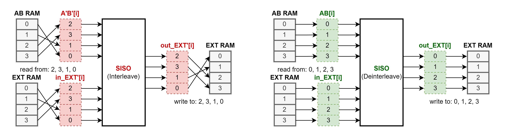

# Entity: TurboDecode 
- **File**: TurboDecode.sv

## Diagram

### Top interface

### Submodules
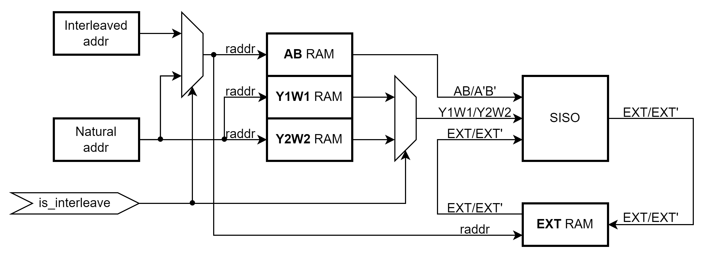

## Ports

| Port name                            | Direction | Type           | Description                                                                             |
| ------------------------------------ | --------- | -------------- | --------------------------------------------------------------------------------------  |
| clk                                  | input     |                | Tín hiệu đồng hồ. Module hoạt động theo cạnh lên của `clk`                              |
| rst                                  | input     |                | Reset đồng bộ khi `rst` = 1                                                             |
| i_BLK_SIZE                           | input     | [9:0]          | Số byte của Block size. Được lấy mẫu `block_size` = `i_BLK_SIZE` sau chu kỳ kích hoạt.  |
| i_NINTER                             | input     | [7:0]          | Số vòng lặp giải mã                                                                     |
| i_LLR_AB<br>i_LLR_Y1W1<br>i_LLR_Y2W2 | input     | signed [INP_DW*2-1:0] | Dữ liệu LLR đầu vào từ kênh AB, Y1W1, Y2W2                                  |
| i_FD_IN                              | input     |                | First Data IN. Báo hiệu bắt đầu một chuỗi dữ liệu đầu vào mới                           |
| o_INP_LAST                           | output    |                | Báo hiệu dữ liệu hợp lệ tiếp theo là mẫu cuối cùng, kết thúc chuỗi đầu vào của một block|
| o_BLK_START                          | output    |                | Báo hiệu phần tử đầu tiên của chuỗi đầu ra hợp lệ                          |
| o_BLK_LAST                           | output    |                | Báo hiệu phần tử cuối cùng của chuỗi đầu ra hợp lệ                           |
| o_decoded_AB                         | output    | [1:0]          | Chuỗi bit AB sau giải mã                                       |
| o_RDY                                | output    |                | Đầu ra hợp lệ                                                                           |
| o_RFFD                               | output    |                | Ready For First Data. Sẵn sàng cho một block dữ liệu đầu vào kế tiếp


## FSM
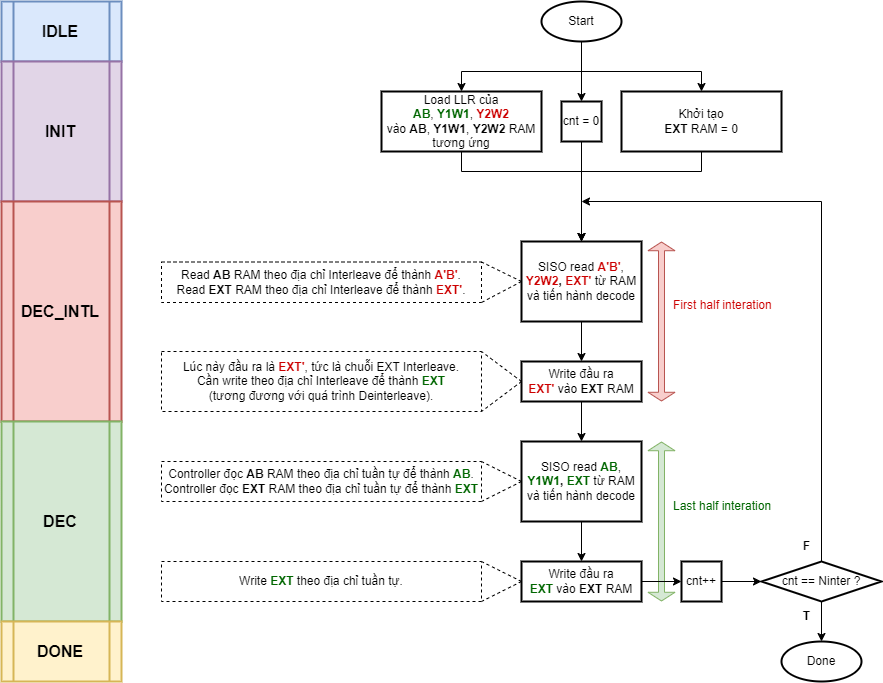

|FSM States|Description|
|:-:|-|
|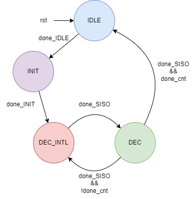|__done_IDLE__: Bắt đầu quá trình decode <br> __done_INIT__: Đã nhận toàn bộ LLRs cần thiết cho quá trình decode <br> __done_SISO__: SISO hoàn tất, kết thúc nửa vòng lặp quá trình decode <br> __done_cnt__: Đếm đủ số lượng vòng lặp cần decode|

# Entity: SISO

## Ports

## Functional Description

Mô tả thuật toán code C:
``` Cpp
// SISO thực hiện tính các tham số Gamma, Alpha, Beta
gammaAtInputExtrinsic = findLogOfGammaForIntrinsic(inpLLR_EXT);
[gamma_tmp, gammaForOutputExtrinsic] = calculLogGamma(LLR_ABYW);
gamma = calculLogOfTurboGamma(gamma_tmp, gammaAtInputExtrinsic);
alpha = calculLogAlpha(gamma);
beta  = calculLogBeta (gamma);
// Sử dụng Gamma, Alpha, Beta để tính thông tin trao đổi Ext và chuỗi bit giải mã decoded_AB.
logProbability = calculLogProbability(alpha, beta, gamma);
decoded_AB     = subMapTakeDecision(logProbability);
outLLR_EXT_tmp = calculLogOutputExtrinsic(alpha, beta, gammaForOutputExtrinsic);
outLLR_EXT     = calculLLRofOutputExtrinsic(outLLR_EXT_tmp);
```

Khi triển khai phần cứng:
- __findLogOfGammaForIntrinsic__, __calculLogGamma__, __calculLogOfTurboGamma__ sẽ được merge thành khối __SISO_Gamma__ thực hiện __[gamma, gammaForOutputExtrinsic] = calculLogGammaMerge(LLR_ABYW, inpLLR_EXT)__ do việc tính toán trong các hàm trên có mối liên hệ với nhau.
- __calculLogAlpha__ và __calculLogBeta__ lần lượt được triển khai thành khối __SISO_Alpha__ và __SISO_Beta__ tương ứng.
- __calculLogProbability, subMapTakeDecision, calculLogOutputExtrinsic, calculLLRofOutputExtrinsic__ sẽ được merge thành khối __SISO_Ext__ thực hiện __[decoded_AB, outLLR_EXT] = calculLogExtMerge(alpha, beta, gamma, gammaForOutputExtrinsic)__.

``` MATLAB
% Init LLR RAM with A, B, Y1, Y2, W1, W2 and EXT LLRs.
LLR_EXT = zeroes(); % EXT init with all 0's
is_interleave = 0;
LLR_RAM.store(is_interleave, LLR_A, LLR_B, LLR_Y, LLR_W, LLR_EXT);

is_interleave = 1; % Start Decoding with interleave SISO first
while (!done) % Each half iteration
    % Load LLRs of A, B, Y1, W1, EXT or A', B', Y2, W2, EXT'
    [LLR_A, LLR_B, LLR_Y, LLR_W, LLR_EXT]  = LLR_RAM.load(is_interleave);
    [logGamma, logGammaForOutputExtrinsic] = SISO_Gamma(
        LLR_A, LLR_B, LLR_Y, LLR_W, LLR_EXT
    ); % Calculate Gamma
    logAlpha              = SISO_Alpha(logGamma); % Calculate Alpha
    logBeta               = SISO_Beta (logGamma); % Calculate Beta
    [decoded_AB, LLR_EXT] = SISO_Ext  (
        logGamma, logGammaForOutputExtrinsic
    ); % Calculate Extrinsic infomation EXT and decoded AB
    LLR_RAM.store(is_interleave, LLR_EXT); % Store EXT or EXT'
    is_interleave = !is_interleave;
end
```
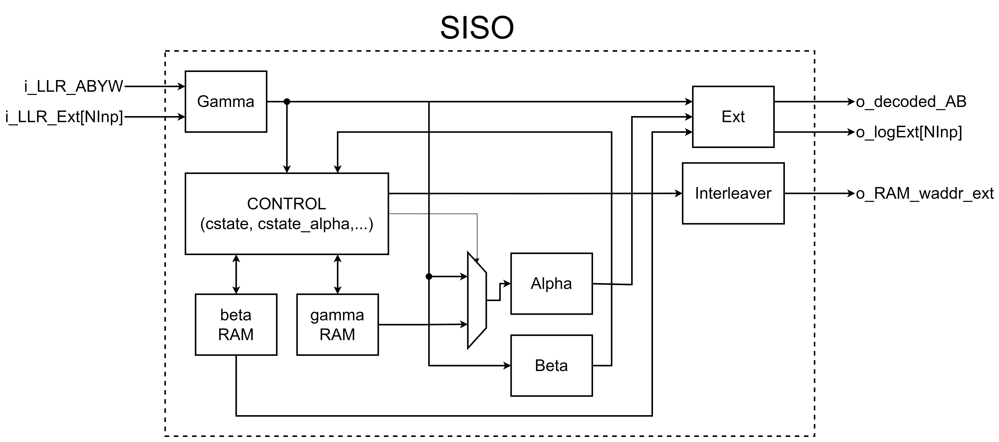

Sequence index $k \in [0,N_c-1]$, state $s \in \{000, 001, ..., 111\}$, input couple $i \in \{00, 01, 10, 11\}$

### Find Gamma:
```MATLAB
function [logGamma, logGammaForOutputExtrinsic] = calculLogGammaMerge(
    LLR_A, LLR_B, LLR_Y, LLR_W, LLR_EXT
)
    for k = 0:Nc-1
        for s = 0:NState-1
            for i = 0:NInp-1
                output_ABYW = GetOutputSymbol(s, i);
                [LLR_SYST, LLR_PAR] = calcul_LLR_SYST_LLR_PAR(
                    output_ABYW, LLR_A[k], LLR_B[k], LLR_Y[k], LLR_W[k]
                );
                logGamma[k][s][i] = LLR_SYST + LLR_PAR + LLR_EXT[k][i];
                logGammaForOutputExtrinsic[k][s][i] = LLR_PAR;
            end
        end
    end
end
```

```MATLAB
function [LLR_SYST, LLR_PAR] = calcul_LLR_SYST_LLR_PAR(
    output_ABYW, LLR_A, LLR_B, LLR_Y, LLR_W
);
    LLR_SYST_A = output_ABYW.A ? LLR_A : -LLR_A;
    LLR_SYST_B = output_ABYW.B ? LLR_B : -LLR_B;
    LLR_PAR_Y  = output_ABYW.Y ? LLR_Y : -LLR_Y;
    LLR_PAR_W  = output_ABYW.W ? LLR_W : -LLR_W;
    LLR_SYST   = LLR_SYST_A + LLR_SYST_B;
    LLR_PAR    = LLR_PAR_Y  + LLR_PAR_W;
end
```

### Find Alpha

```MATLAB
function logAlpha = calculLogAlpha(logGamma)
    % Calculate Prelog of Alpha by:
    % 1. Init Alpha at k = Nc - nbSymbolsOfTheProlog to all ln(1/NState)
    % 2. Following the Trellis from k = Nc - nbSymbolsOfTheProlog to Nc to accumulate Prelog Alpha
    k = Nc - nbSymbolsOfTheProlog
    for s = 0:NState-1
        logAlpha[k][s] = ln(1/NState) = ln(1/8);
    end
    for k = Nc-nbSymbolsOfTheProlog+1:Nc
        for s = 0:NState-1
            for i = 0:NInp-1
                forward_state = GetForwardState(s, i);
                tmp_logAlpha[i] = logAlpha[k-1][s] + logGamma[k-1][s][i];
                logAlpha[k][forward_state] = max(tmp_logAlpha);
            end
        end
    end

    % Final Prolog Alpha at last k = Nc is then be used as initial value at k = 0 in Calculating Alpha process
    for s = 0:NState-1
        init_logAlpha[s] = logAlpha[Nc][s];
    end
    
    % Calculate Prelog of Alpha by:
    % 1. Init Alpha at k = 0 to the final Alpha of the Prelog process
    % 2. Following the Trellis from k = 1 to Nc to accumulate Alpha
    k = 0
    for s = 0:NState-1
        logAlpha[k][s] = init_logAlpha[s];
    end
    for k = 1:Nc
        for s = 0:NState-1
            for i = 0:NInp-1
                forward_state = GetForwardState(s, i);
                tmp_logAlpha[i] = logAlpha[k-1][s] + logGamma[k-1][s][i];
                logAlpha[k][forward_state] = max(tmp_logAlpha);
            end
        end
    end
end
```

### Find Beta

```MATLAB
function logBeta = calculLogBeta(logGamma)
    % Calculate Prelog of Beta by:
    % 1. Init Beta at k = 0 + nbSymbolsOfTheProlog to all ln(1/NState)
    % 2. Following the Trellis from k = 0 + nbSymbolsOfTheProlog to 0 to accumulate Prelog Beta
    k = 0 + nbSymbolsOfTheProlog
    for s = 0:NState-1
        logBeta[k][s] = ln(1/NState) = ln(1/8);
    end
    for k = 0+nbSymbolsOfTheProlog:0
        for s = 0:NState-1
            for i = 0:NInp-1
                forward_state = GetForwardState(s, i);
                tmp_logBeta[i] = logBeta[k+1][forward_state] + logGamma[k][s][i];
                logBeta[k][forward_state] = max(tmp_logBeta);
            end
        end
    end

    % Final Prolog Beta at last k = 0 is then be used as initial value at k = Nc in Calculating Beta process
    for s = 0:NState-1
        init_logBeta[s] = logBeta[0][s];
    end
    
    % Calculate Prelog of Beta by:
    % 1. Init Beta at k = Nc to the final Beta of the Prelog process
    % 2. Following the Trellis from k = Nc-1 to 0 to accumulate Beta
    k = Nc
    for s = 0:NState-1
        logBeta[k][s] = init_logBeta[s];
    end
    for k = Nc-1:0
        for s = 0:NState-1
            for i = 0:NInp-1
                forward_state = GetForwardState(s, i);
                tmp_logBeta[i] = logBeta[k+1][forward_state] + logGamma[k][s][i];
                logBeta[k][forward_state] = max(tmp_logBeta);
            end
        end
    end
end
```

### Find EXT and decoded AB

```MATLAB
function [outputExtrinsic, decoded_AB] = calculLogExtMerge(
    logAlpha, logBeta, logGamma, logGammaForOutputExtrinsic
)
    FP_FeedBackCoeff = 24; FP_Q = 5; % fixed-point const
    for k = 0:Nc-1
        for i = 0:NInp-1
            for s = 0:NState-1
                forward_state = GetForwardState(s, i);
                tmp_logProbability[k][i][s] = logAlpha[k][s] + logBeta[k+1][forward_state] + logGamma[k][s][i];
                tmp_logOutputExtrinsic[k][i][s] = logAlpha[k][s] + logBeta[k+1][forward_state] + logGammaForOutputExtrinsic[k][s][i];
            end
            logProbability    [k][i] = max(tmp_logProbability    [k][i]);
            logOutputExtrinsic[k][i] = max(tmp_logOutputExtrinsic[k][i]);
        end
        
        decoded_AB[k] = max_idx(logProbability[k]);  % Which input AB (0-3) have highest log probability
        maxExt    [k] = max(logOutputExtrinsic[k]);

        for i = 0:NInp-1
            outputExtrinsic[k][i] = (FP_FeedBackCoeff * (logOutputExtrinsic[k][i] - maxExt[k])) >> FP_Q;
        end
    end

end
```

### Trellis Functions

Trạng thái tiếp theo và đầu ra dựa trên trạng thái hiện tại và đầu vào:

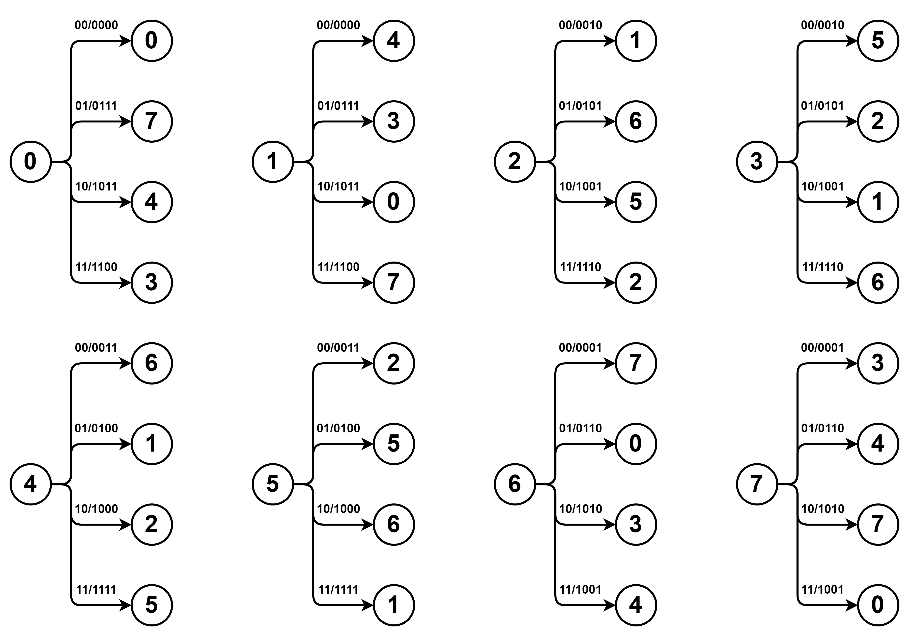

Trạng thái trước đó dựa trên trạng thái hiện tại và đầu vào:

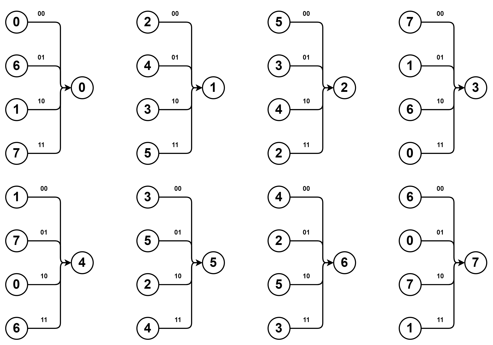

```MATLAB
function output_ABYW = GetOutputSymbol(state, AB)
    case (state)
        0, 1: case (AB)
            0, 3: YW = 0;
            1, 2: YW = 3;
        endcase
        2, 3: case (AB)
            0, 3: YW = 2;
            1, 2: YW = 1;
        endcase
        4, 5: case (AB)
            0, 3: YW = 3;
            1, 2: YW = 0;
        endcase
        6, 7: case (AB)
            0, 3: YW = 1;
            1, 2: YW = 2;
        endcase
    endcase
    output_ABYW = [AB, YW];
end
```

```MATLAB
function forward_state = GetForwardState(state, AB)
    case (state)
        0: case (AB)
            0: forward_state = 0;
            1: forward_state = 7;
            2: forward_state = 4;
            3: forward_state = 3;
        endcase
        1: case (AB)
            0: forward_state = 4;
            1: forward_state = 3;
            2: forward_state = 0;
            3: forward_state = 7;
        endcase
        ...
    endcase
end
```

```MATLAB
function backward_state = GetBackwardState(state, AB)
    case (state)
        0: case (AB)
            0: forward_state = 0;
            1: forward_state = 6;
            2: forward_state = 1;
            3: forward_state = 7;
        endcase
        1: case (AB)
            0: forward_state = 2;
            1: forward_state = 4;
            2: forward_state = 3;
            3: forward_state = 5;
        endcase
        ...
    endcase
end
```

### Nhận xét

Giả sử có thể truy cập random access vào bất kỳ phần tử tại vị trí $k$ chuỗi LLR của A, B, Y, W, EXT, tham số Gamma tại vị trí đó có thể được tính một cách dễ dàng theo công thức đã trình bày trước đó.

Tham số Alpha yêu cầu tính tổng tích lũy qua Trellis thông qua việc trace xuôi (forward) từ điểm bắt đầu ($k = Nc - nbSymbolsOfTheProlog$ đối với tìm Prelog Alpha và $k = 0$ đối với tìm Alpha) cho tới điểm kết thúc $k = Nc$. Điều này dẫn tới sự phụ thuộc vào chuỗi giá trị tại vị trí $k-1$ trước đó khi muốn tính Alpha tại vị trí $k$.

Tham số Beta yêu cầu tính tổng tích lũy qua Trellis thông qua việc trace ngược (backward) từ điểm bắt đầu ($k = 0 + nbSymbolsOfTheProlog$ đối với tìm Prelog Beta và $k = Nc$ đối với tìm Beta) cho tới điểm kết thúc $k = 0$. Điều này dẫn tới sự phụ thuộc vào chuỗi giá trị tại vị trí $k+1$ sau đó khi muốn tính Beta tại vị trí $k$.

Alpha và Beta yêu cầu Gamma để tính, không cần RAM dể lưu Gamma vì có thể đọc trực tiếp từ các LLR RAM tại vị trí tương ứng để tính.

EXT và decoded_AB yêu cầu Alpha, Beta, Gamma tại vị trí tương ứng, có thể tính đồng thời chuỗi Alpha và Beta rồi lần lượt lưu vào Alpha RAM, Beta RAM tuy nhiên vẫn phải chờ cho tới khi toàn bộ chuỗi đã được ghi vào trong RAM để bắt đầu tính toán. Thay vào đó có thể tính Alpha hoặc Beta trước và lưu vào RAM, sau đó tính tham số còn lại đến đâu sẽ tính được EXT và decoded_AB đến đó nên không yêu cầu RAM để lưu trữ. Việc tính toán Beta trước, Alpha sau sẽ có lợi hơn vì chuỗi EXT và decoded_AB sẽ theo chiều tính Alpha (xuôi theo chiều Trellis).

# Entity: SISO_Alpha 
- **File**: SISO_Alpha.sv

## Diagram

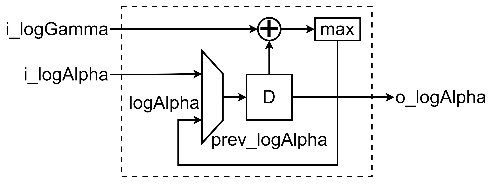

## Generics

| Generic name | Type | Value | Description   |
| ------------ | ---- | ----- | ------------- |
| EXT_DW       |      | 16    | Data Width    |

## Ports

| Port name    | Direction | Type  | Description                                                                             |
| ------------ | --------- | ----- | --------------------------------------------------------------------------------------  |
| clk          | input     |       | Tín hiệu đồng hồ. Module hoạt động theo cạnh lên của `clk`                              |
| ~~rst~~      | ~~input~~ |       | ~~Reset đồng bộ khi `rst` = 1.~~                                                        |
| i_logGamma   | input     | signed [EXT_DW-1:0] [NState][NInp]|Tham số Gamma được sử dụng cho tính toán|
| i_logAlpha   | input     | signed | Tham số Alpha khởi tạo cho quá trình Precode Alpha hoặc quá trình tính Alpha|
| i_start      | input     |       | Khởi tạo Alpha. Khi kích hoạt, thanh ghi `prev_logAlpha` được lưu trữ giá trị từ `i_logAlpha`|
| i_valid      | input     |       | Tính toán Alpha tại chỉ số kế tiếp trong chuỗi. Khi kích hoạt, `i_logGamma` và `prev_logAlpha` sẽ được dùng để tính toán và cập nhật giá trị cho `prev_logAlpha`.|
| o_logAlpha   | output    | signed [EXT_DW-1:0][NState] | Giá trị tham số Alpha tại chỉ số hiện tại trong chuỗi. Đầu ra này được gán với giá trị của thanh ghi `prev_logAlpha`.|
| o_valid      | output    |       | Đầu ra `o_logAlpha` hợp lệ. |

# Entity: SISO_Beta
- **File**: SISO_Beta.sv

## Diagram

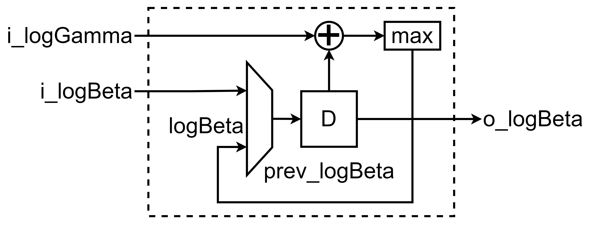

## Generics

| Generic name | Type | Value | Description   |
| ------------ | ---- | ----- | ------------- |
| EXT_DW       |      | 16    | Data Width    |

## Ports

| Port name    | Direction | Type  | Description                                                                             |
| ------------ | --------- | ----- | --------------------------------------------------------------------------------------  |
| clk          | input     |       | Tín hiệu đồng hồ. Module hoạt động theo cạnh lên của `clk`                              |
| ~~rst~~      | ~~input~~ |       | ~~Reset đồng bộ khi `rst` = 1.~~                                                        |
| i_logGamma   | input     | signed [EXT_DW-1:0] [NState][NInp]|Tham số Gamma được sử dụng cho tính toán|
| i_logBeta    | input     | signed | Tham số Beta khởi tạo cho quá trình Precode Beta hoặc quá trình tính Beta|
| i_start      | input     |       | Khởi tạo Beta. Khi kích hoạt, thanh ghi `prev_logBeta` được lưu trữ giá trị từ `i_logBeta`|
| i_valid      | input     |       | Tính toán Beta tại chỉ số kế tiếp trong chuỗi. Khi kích hoạt, `i_logGamma` và `prev_logBeta` sẽ được dùng để tính toán và cập nhật giá trị cho `prev_logBeta`.|
| o_logBeta   | output    | signed [EXT_DW-1:0][NState] | Giá trị tham số Beta tại chỉ số hiện tại trong chuỗi. Đầu ra này được gán với giá trị của thanh ghi `prev_logBeta`.|
| o_valid      | output    |       | Đầu ra `o_logBeta` hợp lệ. |


