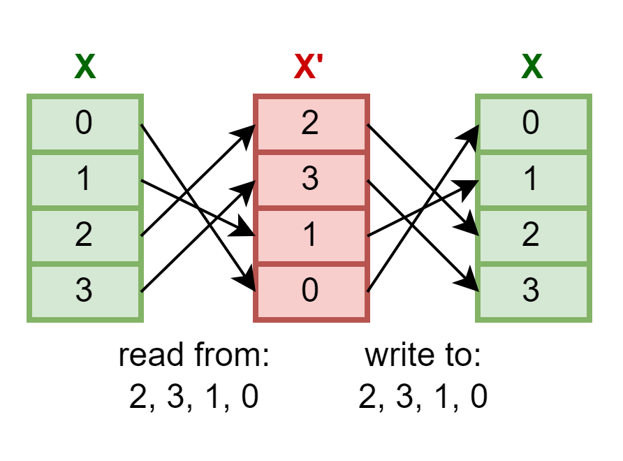

# Tài liệu mô tả Turbo Code Decoder

# Cấu trúc phân cấp module top

- [TurboDecode (Top)]()
    - [TurboDecCtrl]()
        - [SISO]()
            - [alpha]()
            - [beta]()
            - [gamma]()
            - [ext]()
            - [DualReadPortRAM]() x2 cho RAM_beta, RAM_gamma
        - [Interleaver_Extra]()
        - [Interleaver]()
        - [INP]()
    - [LLR_RAM]()
        - [DualReadPortRAM]() x3 cho AB, Y1W1, Y2W2
    - [LLR_RAM_EXT]()
        - [DualReadPortRAM]() cho EXT

# Yêu cầu chức năng

Khối CTC Encoder như mô tả theo chuẩn WiMAX, IEEE 802.16 tạo ra chuỗi encoded data bao gồm dữ liệu cần gửi và mã sửa sai. Chuỗi này được điều chế và gửi đi trên kênh truyền. Tại phía thu, tín hiệu nhận được sẽ được giải điều chế, xác định các bit encoded data dưới dạng soft LLR của dữ liệu và mã sửa sai.

Nhiệm vụ của khối Turbo Code Decoder là decode từ soft LLR thành dữ liệu hard bit sử dụng giải thuật Max-Log-Map.

Yêu cầu chức năng:
- Hỗ trợ các block size: 6, 9, 12, 18, 24, 27, 30, 45, 48, 54, 60, 120, 240, 360, 480, 600.
- ~~Hỗ trợ các rate (puncturing pattens).~~ (OPTIONAL)
- Hỗ trợ thay đổi block size, số vòng lặp, rate mà không làm gián đoạn quá trình decode.
- Thiết kế đồng bộ, đơn miền tín hiệu đồng hồ.
- ~~Song song đa khối giải mã SISO để tăng tốc độ decode cho các block size hỗ trợ điều này.~~ (OPTIONAL)

Yêu cầu kỹ thuật:
- Tần số hoạt động tối đa cần tương đương hoặc tốt hơn thiết kế của Xilinx - 216.029 MHz (IEEE 802.16e CTC Decoder Core).
- Tối ưu độ trễ giải mã, tài nguyên sử dụng.

# Overview

## Mô tả quá trình giải mã

Hình dưới là sơ đồ khối của quá trình giải mã.

__A__, __B__ là các LLR tương ứng với chuỗi dữ liệu, cùng với các LLR của chuỗi parity bit __Y1__, __W1__, __Y2__, __W2__. __A__, __B__, __Y1__, __W1__ được xử lý bởi bộ giải mã _SISO 1_. Chuỗi __A__, __B__ sẽ được _interleave_ để thành chuỗi __A'__ và __B'__, cùng với __Y2__ và __W2__ sẽ được xử lý bởi bộ giải mã _SISO 2_. Ngoài việc sử dụng dữ liệu kênh, mỗi bộ giải mã SISO sử dụng thông tin ngoại lai (extrinsic information) từ bộ giải mã khác để cập nhật đầu ra thông tin ngoại lai của chính nó. Lưu ý rằng thông tin ngoại lai __ex1__, __ex2__ từ bộ giải mã _SISO 1_ phải được _interleave_ trước khi được xử lý bởi bộ giải mã _SISO 2_. Tương tự, thông tin ngoại lai __ex1'__, __ex2'__ từ bộ giải mã _SISO 2_ phải được _deinterleave_ trước khi được xử lý bởi bộ giải mã _SISO 1_. Một nửa vòng lặp xảy ra mỗi khi một bộ giải mã hoàn thành việc tạo ra các thông tin ngoại lai mới. Một vòng lặp đầy đủ bao gồm hai nửa vòng lặp.

## Phân tích thiết kế

### Bắt đầu decode với Non-Interleave hoặc Interleave SISO Decoder

Việc lựa chọn bắt đầu nửa vòng lặp đầu tiên với Non-Interleave SISO hay Interleave SISO sẽ có ảnh hưởng tới độ hiệu quả và cách thiết kế. Một yếu tố thực tế khi chọn thứ tự giải mã liên quan đến bản chất của kênh. Trong kênh nhiễu AWGN, thứ tự giải mã không nên ảnh hưởng đến BER. Tuy nhiên trong kênh fading, nửa vòng lặp đầu tiên sẽ có một số ưu thế nếu nó dựa trên dữ liệu interleave.

- __Bắt đầu decode với Interleave SISO__: Bằng cách bắt đầu với bộ giải mã Interleave SISO, một vòng lặp đầy đủ xảy ra khi bộ giải mã Non-Interleave hoàn thành việc cập nhật đầu ra của nó. Các chuỗi bit thông tin ước tính, __A__ và __B__, từ bộ giải mã Non-Interleave có thể được sử dụng ngay.
- __Bắt đầu decode với Non-Interleave SISO__: Ngược lại, khi bắt đầu với bộ giải mã Non-Interleave, vòng lặp đầy đủ kết thúc với bộ giải mã Interleave, và các chuỗi bit ước tính, __A'__ và __B'__, phải được deinterleave thành __A__, __B__ trước khi output ra.

=> Bắt đầu bằng Interleave SISO.

### Tối ưu hóa tài nguyên

Vì khối SISO 1 và 2 có sự phụ thuộc thông tin ngoại lai lẫn nhau nên khi một khối SISO đang thực hiện decode, SISO còn lại sẽ không làm gì cả. Thay vào đó, ta chỉ sử dụng một khối SISO duy nhất, và dựa vào việc đang ở nửa vòng lặp nào mà AB/AB', Y1W1/Y2W2, ex1ex2/ex1'ex2' sẽ được sử dụng.

### Bộ nhớ

RAM chứa thông tin về LLR của __AB__, __Y1W1__, __Y2W2__ và __EXT__ (ex1 và ex2). Khi khởi tạo cho quá trình decode, __AB__, __Y1W1__, __Y2W2__ sẽ được nạp vào RAM tương ứng theo địa chỉ tăng tuyến tính (natural order addressing) và sẽ không thay đổi giá trị trong suốt quá trình encode.

Đồng thời, __EXT__ RAM cũng sẽ được khởi tạo với tất cả các phần tử đều có giá trị bằng 0. Có nhiều cách để khởi tạo cho giá trị ngoại lai __EXT__, cần triển khai thử nghiệm để xác định cách phù hợp. Đề xuất bao gồm:
- Ghi lần lượt các giá trị 0 vào __EXT__ RAM; hoặc
- Lần giải mã đầu tiên sẽ mux kênh đầu vào để nạp giá trị 0 lần lượt vào khối SISO thay vì đọc từ __EXT__ RAM như bình thường. Output của SISO sẽ ghi đè lên RAM, và từ lần sử dụng tiếp theo có thể lấy các giá trị này ra để sử dụng.

Mỗi RAM cần lưu trữ được số lượng cặp LLR = Block size * 4. Với Block size hỗ trợ tối đa = 600, số cặp cần lưu trữ = 600 * 4 = 2400 => 12 bit địa chỉ, mỗi địa chỉ lưu trữ word size = LLR bit size * 2.

### Interleave/Deinterleave

Interleave là xáo trộn dữ liệu trong một block, việc xáo trộn này được thực hiện thông qua việc sử dụng chuỗi địa chỉ Interleave để đọc/ghi RAM. Việc đọc từ RAM sử dụng chuỗi địa chỉ nói trên tạm gọi là quá trình Interleave hóa dữ liệu, còn việc ghi chuỗi Interleave vào RAM sử dụng chính chuỗi địa chỉ trước đó gọi là quá trình Deinterleave.

Hình dưới minh họa một khối RAM X chứa 4 phần tử, chuỗi địa chỉ Interleave lần lượt là 2, 3, 1, 0. Quá trình Interleave chuỗi X trong RAM thành chuỗi X' và rồi Deinterleave trở lại thành chuỗi X được mô tả như phép ánh xạ.

Áp dụng cho khối SISO, nửa vòng lặp đầu yêu cầu Interleave chuỗi AB và chuỗi EXT từ vòng lặp trước để tạo chuỗi A'B' và EXT' đầu vào cho quá trình decode. Sau khi decode, đầu ra EXT' sẽ ở dạng Interleave, cần thực hiện Deinterleave để tạo chuỗi EXT sử dụng cho nửa vòng lặp tiếp theo. Ở nửa vòng lặp tiếp theo, không yêu cầu Interleave nên chuỗi AB và EXT có thể được lấy lần lượt từ RAM. Hình dưới mô tả một vòng lặp của quá trình decode, bên trái là nửa đầu vòng lặp (SISO Interleave) và bên phải là nửa vòng lặp còn lại (SISO Deinterleave, hay Non-Interleave).

# Entity: TurboDecode 
- **File**: TurboDecode.sv

## Diagram

### Top interface

### Submodules

## Ports

| Port name                            | Direction | Type           | Description                                                                             |
| ------------------------------------ | --------- | -------------- | --------------------------------------------------------------------------------------  |
| clk                                  | input     |                | Tín hiệu đồng hồ. Module hoạt động theo cạnh lên của `clk`                              |
| rst                                  | input     |                | Reset đồng bộ khi `rst` = 1                                                             |
| i_BLK_SIZE                           | input     | [9:0]          | Số byte của Block size. Được lấy mẫu `block_size` = `i_BLK_SIZE` sau chu kỳ kích hoạt.  |
| i_NINTER                             | input     | [7:0]          | Số vòng lặp giải mã                                                                     |
| i_LLR_AB i_LLR_Y1W1 i_LLR_Y2W2 | input     | [INP_DW*2-1:0] | Dữ liệu LLR đầu vào từ kênh AB, Y1W1, Y2W2                                  |
| i_FD_IN                              | input     |                | First Data IN. Báo hiệu bắt đầu một chuỗi dữ liệu đầu vào mới                           |
| o_INP_LAST                           | output    |                | Báo hiệu dữ liệu hợp lệ tiếp theo là mẫu cuối cùng, kết thúc chuỗi đầu vào của một block|
| o_BLK_START                          | output    |                | Báo hiệu phần tử đầu tiên của chuỗi đầu ra hợp lệ                          |
| o_BLK_LAST                           | output    |                | Báo hiệu phần tử cuối cùng của chuỗi đầu ra hợp lệ                           |
| o_decoded_AB                         | output    | [1:0]          | Chuỗi bit AB sau giải mã                                       |
| o_RDY                                | output    |                | Đầu ra hợp lệ                                                                           |
| o_RFFD                               | output    |                | Ready For First Data. Sẵn sàng cho một block dữ liệu đầu vào kế tiếp

## FSM

|FSM States|Description|
|:-:|-|
||__done_IDLE__: Bắt đầu quá trình decode   __done_INIT__: Đã nhận toàn bộ LLRs cần thiết cho quá trình decode   __done_SISO__: SISO hoàn tất, kết thúc nửa vòng lặp quá trình decode   __done_cnt__: Đếm đủ số lượng vòng lặp cần decode|

