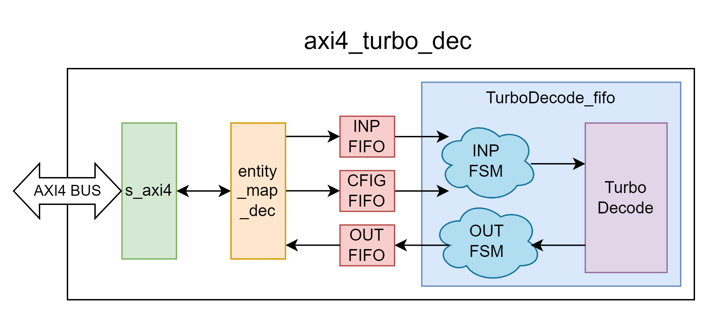
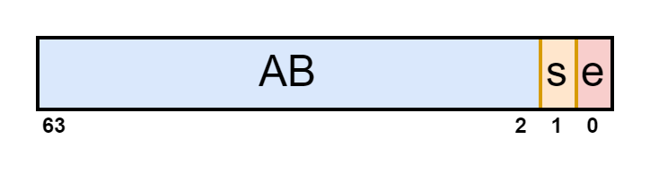
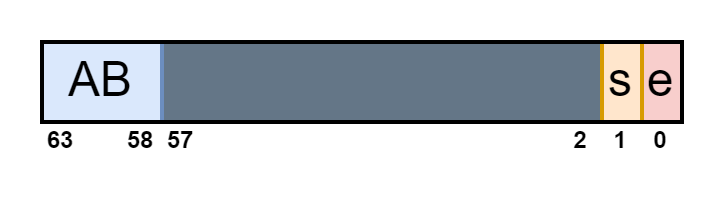
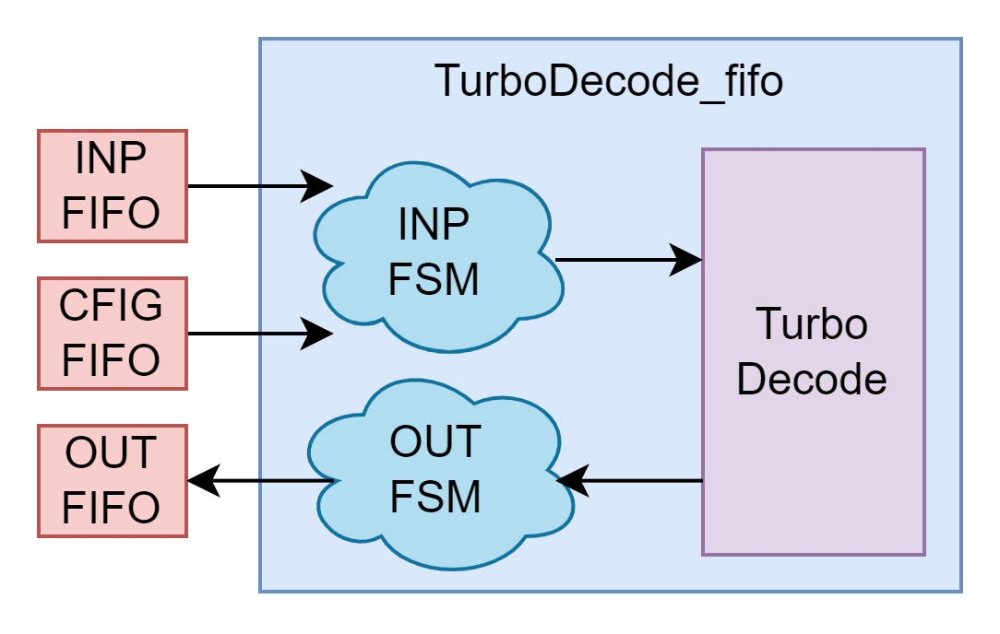
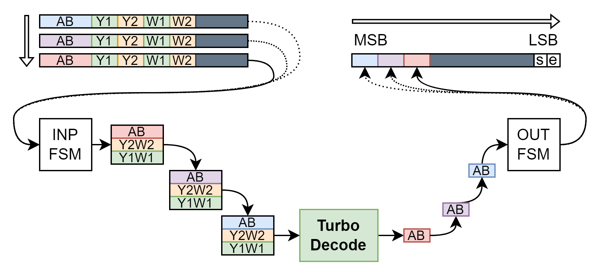
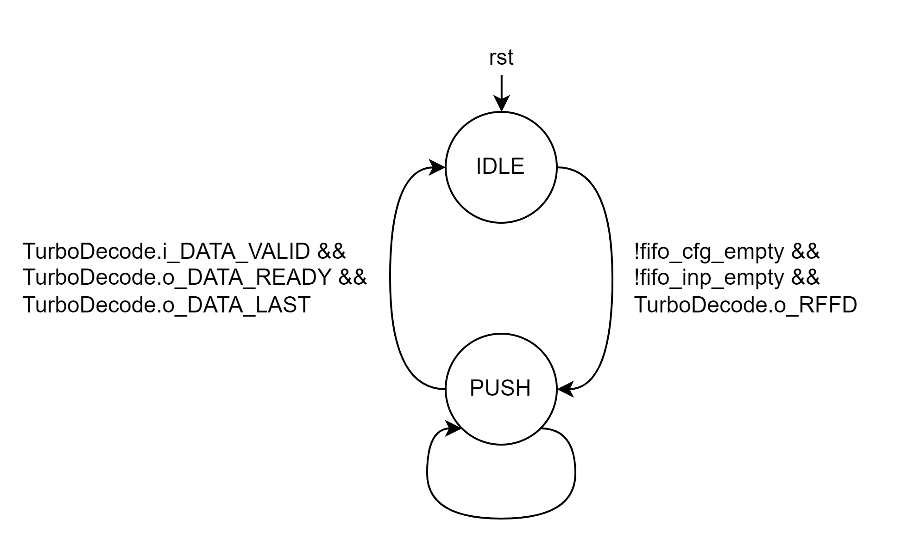
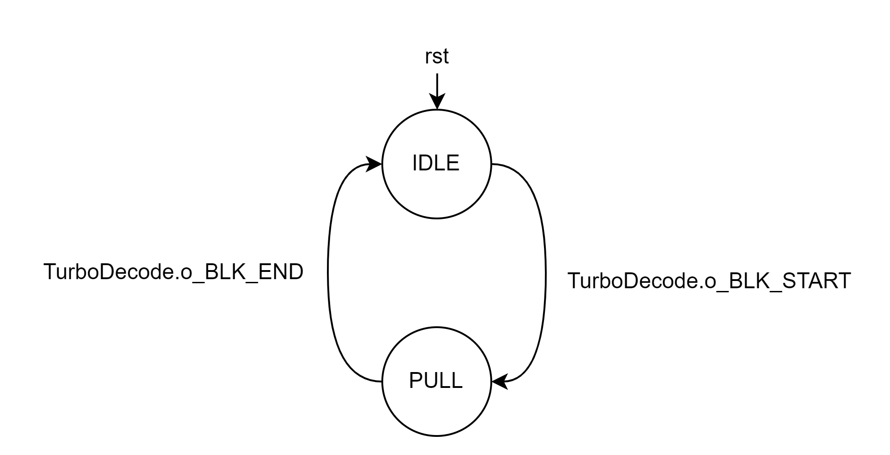

# Turbo Decode IP


## Cấu trúc phân cấp

- [axi4_turbo_dec (TOP)](#entity-axi4_turbo_dec-top)
    - [s_axi4](./s_axi4.md): s_axi4_inst
    - [entity_map_dec](#entity-entity_map_dec): entity_map_dec_inst
    - [TurboDecode_fifo](#entity-turbodecode_fifo): TurboDecode_fifo_inst
        - [TurboDecode](./TurboCodeDecoder.md): TurboDecode_inst
    - [fifo](common.md) x3: fifo_cfg, fifo_inp, fifo_out

<details open>
<summary>Entity: axi4_turbo_dec (TOP)</summary>

# Entity: axi4_turbo_dec (TOP)

- **File**: axi4_turbo_dec.v

## Diagram



## Generics

| Generic name | Type | Default Value | Description   |
| ------------ | ---- | ------------- | ------------- |
| DATA_WIDTH   | parameter | 64            | Độ rộng dữ liệu dùng cho kênh AXI4 xDATA |
| ADDR_WIDTH   | parameter | 5             | Độ rộng địa chỉ dùng cho kênh AXI4 AxADDR |
| ID_WIDTH     | parameter | 8             | Độ rộng ID dùng cho kênh AXI4 xID |
| MAP_ADDR_WIDTH | localparam | 2 | Độ rộng địa chỉ dùng cho Custom bus. |
| FIFO_CFG_DW  | localparam | 10 | Độ rộng dữ liệu FIFO CFG
| FIFO_INP_DW  | localparam | floor(DATA_WIDTH / (INP_DW * 6)) * (INP_DW * 6) | Độ rộng dữ liệu FIFO INP
| FIFO_OUT_DW  | localparam | DATA_WIDTH | Độ rộng dữ liệu FIFO OUT
| FIFO_CFG_DD  | localparam | 8192        | Số lượng phần tử FIFO CFG
| FIFO_INP_DD  | localparam | 512        | Số lượng phần tử FIFO INP
| FIFO_OUT_DD  | localparam | 512       | Số lượng phần tử FIFO OUT
| nbSymbolsOfTheProlog | localparam     | 24     | Số mẫu cần tính cho quá trình Precode Alpha, Beta    |
| INP_DW           |   localparam   | 8     | Data Width của các LLR đầu vào A, B, Y1, Y2, W1, W2|
| EXT_DW           |   localparam   | 32    | Data Width của các tham số Alpha, Beta, Gamma, EXT,... trong quá trình giải mã. (Tiền tố EXT_* có thể gây hiểu nhầm rằng đây chỉ là tham số cài đặt cho EXT) |
| EXT_FW           |   localparam   | 5     | Fractional Width của tham số thông tin trao đổi (extrinsic infomation - EXT) trong quá trình giải mã |
| EXT_LN_1_8 |localparam | -66 | Giá trị của ln(1/8) biểu diễn dưới dạng sfix{EXT_DW}En{EXT_FW} format.
| EXT_FeedBackCoeff |localparam | 24 | Hệ số để tính thông tin trao đổi|
| MEM_AW |localparam | 12 | Address Width cho RAM của các LLR A, B, Y1, W1, Y2, W2, EXT. MEM_AW = 12 hỗ trợ decode cho mọi block size |
      
**NOTE**: Tham số __DATA_WIDTH__ hỗ trợ các giá trị theo chuẩn AXI4: 32, __64__, 128, 256, 512, 1024. Tuy nhiên mới chỉ thiết kế để hỗ trợ `DW = 64`, các cài đặt khác chưa được kiểm chứng.

## Ports

| Port name    | Direction | Type  | Description                                                                             |
| ------------ | :-------: | :---- | --------------------------------------------------------------------------------------  |
| aclk         | input     |       | Tín hiệu đồng hồ. Module hoạt động theo cạnh lên của `aclk`. |
| aresetn      | input     |       | Reset đồng bộ tích cực thấp.                                |
| _AW_
| s_axi_awid   | input  | [ID_WIDTH-1:0] | |
| s_axi_awaddr | input  | [ADDR_WIDTH-1:0] | |
| s_axi_awlen  | input  | [7:0] | |
| s_axi_awsize | input  | [2:0] | |
| s_axi_awburst| input  | [1:0] | |
| s_axi_awvalid| input  |       | |
| s_axi_awready| output |       | |
| _W_
| s_axi_wdata  | input  | [DATA_WIDTH-1:0] | |
| s_axi_wstrb  | input  | [(DATA_WIDTH/8)-1:0] | |
| s_axi_wlast  | input  |       | |
| s_axi_wvalid | input  |       | |
| s_axi_wready | output |       | |
| _B_
| s_axi_bid    | output | [ID_WIDTH-1:0] | |
| s_axi_bresp  | output | [1:0] | |
| s_axi_bvalid | output |       | |
| s_axi_bready | input  |       | |
| _AR_
| s_axi_arid   | input  | [ID_WIDTH-1:0] | |
| s_axi_araddr | input  | [ADDR_WIDTH-1:0] | |
| s_axi_arlen  | input  | [7:0] | |
| s_axi_arsize | input  | [2:0] | |
| s_axi_arburst| input  | [1:0] | |
| s_axi_arvalid| input  |       | |
| s_axi_arready| output |       | |
| _R_
| s_axi_rid    | output | [ID_WIDTH-1:0] | |
| s_axi_rdata  | output | [DATA_WIDTH-1:0] | |
| s_axi_rresp  | output | [1:0] | |
| s_axi_rlast  | output |       | |
| s_axi_rvalid | output |       | |
| s_axi_rready | input  |       | |

## Functional description

__axi4_turbo_dec__ được thiết kế với chức năng chính là để cung cấp giao diện AXI4 cho [TurboDecode](./TurboCodeDecoder.md) thực hiện quá trình giải mã dữ liệu theo thuật toán Turbo Code (chi tiết tham khảo [TurboDecode](./TurboCodeDecoder.md) Functional description). IP bao gồm các khối chức năng chính sau:

- __s_axi4__: Xử lý các AXI transaction, đưa giao diện AXI về giao diện tùy chỉnh để dễ dàng tương tác. 

- __entity_map_dec__: Khối này có nhiệm vụ decode địa chỉ truy cập để mapping luồng đọc/ghi tới các thành phần tương ứng trong hệ thống, bao gồm các FIFO INP, CFG, OUT (~~và các thanh ghi~~).

- __Các FIFO__: FIFO INP giúp đệm dữ liệu đầu vào, FIFO CFG nhận các tham số cài đặt cho lần Turbo decode kế tiếp, và FIFO OUT lưu trữ dữ liệu đầu ra. Giao diện AXI có thể ghi dữ liệu vào INP, CFG hay đọc dữ liệu từ OUT thông qua việc tạo transaction (nên được thiết lập với kiểu burst FIXED) với địa chỉ tương ứng, được ánh xạ bởi khối _entity_map_dec_. Thông tin được pack trong khung dữ liệu đọc/ghi được mô tả tại mục [Cấu trúc khung dữ liệu đọc/ghi](#cấu-trúc-khung-dữ-liệu-đọcghi).
- __TurboDecode_fifo__: Cung cấp giao diện để khối _TurboDecode_ tương tác với các FIFO INP, CFG, OUT. FSM INP thực hiện quá trình unpack luồng dữ liệu từ FIFO INP, tham số cài đặt từ FIFO CFG và điều khiển các tín hiệu đầu vào khối _TurboDecode_ để thực thi quá trình Turbo decode. FSM OUT thực hiện quá trình pack luồng đầu ra khối _TurboDecode_ thành dữ liệu đẩy vào FIFO OUT. Cách pack/unpack tham khảo mục [Cấu trúc khung dữ liệu đọc/ghi](#cấu-trúc-khung-dữ-liệu-đọcghi).

### Cấu trúc khung dữ liệu đọc/ghi

__Kênh CFG__: Khi gửi thiết lập cho lần decode tiếp theo tới IP, [9:0] bit của `wdata` sẽ được sử dụng cho tham số `block_size`, [17:10] cho tham số `niter`.

__Kênh INP__: Khi gửi chuỗi dữ liệu đầu vào cần decode tới IP, cần pack cho đủ `DATA_WIDTH` bit mỗi AXI4 transfer rồi truyền lần lượt `INP_len` transfers. Pack lần lượt các `LLR ABY1Y2W1W2` đầu vào với chỉ số từ `0 đến Nc-1` theo chiều `MSB đến LSB` của AXI `wdata`, các bit còn thừa sẽ được bỏ qua bởi IP, mặc định phía bên gửi padding 0's.

__Kênh OUT__: Khi IP pack chuỗi dữ liệu đầu ra sau decode, sẽ pack cho đủ `DATA_WIDTH` bit mỗi AXI4 transfer rồi truyền lần lượt `OUT_len` transfers. Pack lần lượt chuỗi `AB` đầu ra với chỉ số từ `0 đến Nc-1` theo chiều `MSB đến LSB` của AXI `rdata`. Lưu ý rằng khi pack, 2 bit LSB sẽ được tận dụng để chứa các bit trạng thái lần lượt là `start` và `end`. Transfer đầu tiên có bit trạng thái `start = 1`, transfer cuối cùng có bit trạng thái `end = 1`, còn lại mặc định giá trị trạng thái `start = 0` và `end = 0`. Các bit không dùng tới sẽ được bỏ qua khi unpack dữ liệu, mặc định IP padding 0's.

<p id="equ-INP_len"></p>

Số transfer `INP_len` cần thiết để ghi chuỗi dữ liệu đầu vào tới FIFO INP với thiết lập `BLOCK_SIZE`:

```C
INP_len = ceil(
    Nc / floor(DATA_WIDTH / (INP_DW * 6))
)
```

<p id="equ-OUT_len"></p>

Số transfer `OUT_len` cần thiết để đọc chuỗi dữ liệu đầu ra từ FIFO OUT với thiết lập `BLOCK_SIZE`:

```C
OUT_len = ceil(
    N / (DATA_WIDTH - 2)
)
```

#### Ví dụ: AXI bus width = 64, block size = 24

__Cần thực hiện:__

__B1: Gửi CFG__

Gửi dữ liệu thiết lập cho lần decode này với giá trị block size = 24.


__B2: Gửi inp__

Gửi chuỗi LLR cần decode sử dụng 96 AXI4 transfer 64 bit. Các LLR đầu vào `ABY1Y2W1W2` (48 bit/mẫu) với index từ `0 đến Nc-1` sẽ được packed lại theo chiều `MSB tới LSB` của các transfer.

|Transfer|wdata|
|:-:|:-:|
|#1||
|#2||
|...||
|#96||

__B3: Nhận out__

Nhận 192 bit của chuỗi dữ liệu sau decode sử dụng 4 AXI4 transfer 64 bit. Các chuỗi dữ liệu đầu ra sau giải mã `AB` (2 bit/mẫu) với index từ `0 đến Nc-1` sẽ được packed lại theo chiều `MSB tới LSB` của 64 bit transfer, lưu ý 2 bit LSB cho trạng thái `start` và `end`. Transfer đầu tiên có bit trạng thái `start = 1`, transfer cuối cùng có bit trạng thái `end = 1`, còn lại mặc định giá trị trạng thái `start = 0` và `end = 0`.

|Transfer|rdata|start|end|
|:-:|:-:|:-:|:-:|
|#1||1|0|
|#2||0|0|
|#3||0|0|
|#4||0|1|

### Tính toán độ sâu FIFO

Số bit mỗi LLR `NbLLR = 8`, số bit status `NbStatus = 2`

Trong 1 lần decode:

Độ sâu INP FIFO `INP_depth` cần thiết để lưu trữ các transfers cho INP với thiết lập `BLOCK_SIZE`:
```C
INP_depth = ceil(
    Nc / floor(DATA_WIDTH / (6 * NbLLR))
)
```
Độ sâu OUT FIFO `OUT_depth` cần thiết để lưu trữ các transfers cho OUT với thiết lập `BLOCK_SIZE`:
```C
OUT_depth = ceil(
    (BLK_SIZE * 8) / (DATA_WIDTH - NbStatus)
)
```
#### Ví dụ với DATA_WIDTH = 64

| BLK_SIZE<br>(bytes) | INP_depth<br>(AXI transfers) | OUT_depth<br>(AXI transfers) | BLK_SIZE<br>(bytes) | INP_depth<br>(AXI transfers) | OUT_depth<br>(AXI transfers) |
|:-:|:-:|:-:|:-:|:--:|:-:|
|6  |24 | 1 |48 |192 |7  |
|9  |26 | 2 |54 |216 |7  |
|12 |48 | 2 |60 |240 |8  |
|18 |72 | 3 |120|480 |16 |
|24 |96 | 4 |240|960 |31 |
|27 |108| 4 |360|1440|47 |
|30 |120| 4 |480|1920|62 |
|36 |144| 5 |600|2400|78 |
|45 |180| 5 | - |  - | - |

Với Block size hỗ trợ tối đa lên tới 600, INP FIFO và OUT FIFO lần lượt cần lưu trữ được tối thiểu 2400, 78 AXI transactions để có thể thực hiện 1 lần decode hoàn chỉnh. Nếu cần hỗ trợ `K` lần decode liên tiếp với block size 600 thì cần scale độ sâu FIFO lên `K` lần.

### Độ sâu các FIFO CFG, INP, OUT

Trong thiết kế Turbo Decoder IP, để hỗ trợ lên tới 3 lần đẩy vào dữ liệu cần decode với block size 600 và DATA_WIDTH = 64:
- CFG_depth = 341
- INP_depth = 7200
- OUT_depth = 234

=> FIFO implemented depth X_impl_depth = 2^ceil(log2(X_depth)):
- CFG_impl_depth: 512
- INP_impl_depth: 8192
- OUT_impl_depth: 512

Với cài đặt đó, thiết kế có thể hỗ trợ lưu trữ `k` lần chuỗi đầu ra decode với block size tương ứng:
```C
k(BLK_SIZE) = floor(
    OUT_impl_depth / OUT_depth(BLK_SIZE)
)
```

| BLK_SIZE<br>(bytes) | k<br>(lần decode) | BLK_SIZE<br>(bytes) | k<br>(lần decode) |
|:-:|:--:|:-:|:-:|
|6  | 512|48 |73 |
|9  | 256|54 |73 |
|12 | 256|60 |64 |
|18 | 170|120|32 |
|24 | 128|240|16 |
|27 | 128|360|10 |
|30 | 128|480|8  |
|36 | 102|600|6  |
|45 | 102| - | - |

</details>
<details open>
<summary>Entity: entity_map_dec</summary>

# Entity: entity_map_dec

- **File**: entity_map_dec.sv

## Diagram
|<p style="text-align:center">entity_map_dec<br>Write mapping</p>|<p style="text-align:center">entity_map_dec<br>Read mapping</p>|
|-|-|
 | 
case(__waddr__)<br>__0x0__: CFG<br>__0x1__: INP<br>__others__: <t style="color:red">ERR</t>|case(__waddr__)<br>__0x2__: OUT<br>__others__: <t style="color:red">ERR</t>

## Ports

| Port name    | Direction | Type  | Description                                                                             |
| ------------ | :-------: | :---- | --------------------------------------------------------------------------------------  |
| clk         | input     |       | Tín hiệu đồng hồ. Module hoạt động theo cạnh lên của `aclk`. |
| rst         | input     |       | Reset đồng bộ tích cực cao.                                |
| _FIFO_
| fifo_cfg_full | input  | | Báo hiệu FIFO CFG đầy.
| fifo_cfg_din  | output | [FIFO_CFG_DW-1:0] | Dữ liệu ghi vào FIFO CFG.
| fifo_cfg_wr_en | output | | Ghi dữ liệu vào FIFO CFG.
| fifo_inp_full | input  | | Báo hiệu FIFO INP đầy.
| fifo_inp_din  | output | [FIFO_INP_DW-1:0] | Dữ liệu ghi vào FIFO INP.
| fifo_inp_wr_en | output | | Ghi dữ liệu vào FIFO INP.
| fifo_out_empty | input  | | Báo hiệu FIFO OUT trống.
| fifo_out_din   | input  | [FIFO_OUT_DW-1:0] | Dữ liệu đọc từ FIFO OUT.
| fifo_out_rd_en | output | | Đọc dữ liệu từ FIFO OUT.
| _Custom bus_
| waddr   |  input   | [MAP_ADDR_WIDTH-1:0] | Địa chỉ ghi.
| wdata   |  input   | [DATA_WIDTH-1:0]     | Dữ liệu ghi.
| wstrb   |  input   | [(DATA_WIDTH/8)-1:0] | Byte enable dữ liệu ghi.
| wlast   |  input   |                      | Dữ liệu ghi cuối.
| wvalid  |  input   |                      | Dữ liệu ghi hợp lệ.
| wready  |  output  |                      | Sẵn sàng ghi.
| waddrerr|  output  |                      | Write Address Error. Thường gây bởi master truy cập vào địa chỉ không hợp lệ.
| wack    |  output  |                      |Dữ liệu được handshaked. `wack = wready && wvalid`. 
| raddr   |  input   |                      [MAP_ADDR_WIDTH-1:0] | Địa chỉ đọc.
| rdata   |  output  |                      [DATA_WIDTH-1:0]     | Dữ liệu đọc.
| rvalid  |  output  |                      | Dữ liệu đọc hợp lệ.
| rready  |  input   |                      | Sẵn sàng đọc.
| raddrerr|  output  |                      | Read Address Error. Thường gây ra bởi master truy cập vào địa chỉ không hợp lệ.
| rack    |  output  |                      | Dữ liệu được handshaked. `rack = rready && rvalid`.

## Functional description

Khối _entity_map_dec_ decode địa chỉ truy cập để mapping luồng đọc/ghi tới các thành phần tương ứng trong hệ thống, bao gồm các FIFO INP, CFG, OUT (~~và các thanh ghi~~).

|Address|Region|Access|
|-|-|-|
|0x0|FIFO CFG|Write only|
|0x1|FIFO INP|Write only|
|0x2|FIFO OUT|Read only|
|others|<t style="color:red">ERR</t>|None|

Nếu address decode vào ERR region hoặc cố tình truy cập trái phép (Read từ Non-Readable hoặc Write vào Non-Writable) thì sẽ báo hiệu thông qua việc raise tín hiệu `waddrerr`/`raddr` tương ứng.

__Lưu ý__: FIFO được sử dụng phải hoạt động ở chế độ fall-through, nếu không sẽ cần thêm logic để xử lý quá trình đọc từ FIFO.

</details>

<details open>
<summary>Entity: TurboDecode_fifo</summary>

# Entity: TurboDecode_fifo

- __File__: TurboDecode_fifo.sv

## Diagram



## Functional description

Cung cấp giao diện để khối __TurboDecode__ tương tác với các FIFO INP, CFG, OUT. FSM INP thực hiện quá trình unpack luồng dữ liệu từ FIFO INP, tham số cài đặt từ FIFO CFG và điều khiển các tín hiệu đầu vào khối __TurboDecode__ để thực thi quá trình Turbo decode. FSM OUT thực hiện quá trình pack luồng đầu ra khối __TurboDecode__ thành dữ liệu đẩy vào FIFO OUT. Cách pack/unpack tham khảo mục [Cấu trúc khung dữ liệu đọc/ghi](#cấu-trúc-khung-dữ-liệu-đọcghi).



|<p style="text-align:center">INP FSM</p>|<p style="text-align:center">OUT FSM</p>|
|-|-|
|||
__IDLE__: Chờ tới khi _FIFO CFG_ và _FIFO INP_ đều có dữ liệu (`!fifo_cfg_empty && !fifo_inp_empty`) báo hiệu tham số cài đặt `BLK_SIZE`, `NITER` và chuỗi dữ liệu đầu vào `LLR ABY1Y2W1W2` đang có sẵn cho lần Decode tiếp theo, đồng thời khối _TurboDecode_ sẵn sàng cho một lần Decode mới (`TurboDecode.o_RFFD`). Khi điều kiện thỏa mãn, tham số cài đặt và chuỗi `LLR ABY1Y2W1W2` bắt đầu được đẩy vào khối _TurboDecode_, chuyển trạng thái __PUSH__.<br>__PUSH__: Đọc dữ liệu từ _FIFO INP_, mỗi lần đọc sẽ unpack lần lượt thành chuỗi đầu vào `LLR ABY1Y2W1W2` cho tới khi đủ `Nc` phần tử. Khi phần tử cuối cùng được unpack và đẩy vào khối _TurboDecode_ (kiểm tra bằng điều kiện `TurboDecode.i_DATA_VALID && TurboDecode.o_DATA_READY && TurboDecode.o_DATA_LAST`), chuyển trạng thái __IDLE__.|__IDLE__: Chờ `TurboDecode.o_BLK_START` báo hiệu bắt đầu mẫu đầu tiên của chuỗi đầu ra sau Decode, chuyển trạng thái __PULL__.<br>__PULL__: Pack lần lượt chuỗi đầu ra `AB` thành dữ liệu cho _FIFO OUT_. Chờ `TurboDecode.o_BLK_END` báo hiệu mẫu cuối cùng trong chuỗi đầu ra sau Decode, chuyển trạng thái __IDLE__.

</details>

# Notes for Verification

## VCS

Check [\<SourceFolder\>/WimaxTurbo/VCS/TurboDec/file_list/]() path for file lists, including __verilog.f__ and __vhdl.f__.

|Source type|File list|VCS recommended options|
|-|-|-|
|Verilog|verilog.f|__-sverilog +v2k__
|VHDL|vhdl.f|__-nc -vhdl08__

## C model

Source code C fixed-point model cho Turbo Coding có thể được tìm thấy ở:

|Repository|Branch|Description|
|-|-|-|
|[https://gitlab.vsi.vn/aisi-department/xlth/turbocode_wimax/c_fixedpoint](https://gitlab.vsi.vn/aisi-department/xlth/turbocode_wimax/c_fixedpoint)|fixed_point_ver04|Bản gốc, chuyển giao bởi __thonghv4__, __trungdq8__.
|[https://gitlab.vsi.vn/aisi-department/xlth/turbocode_wimax/c_fixedpoint](https://gitlab.vsi.vn/aisi-department/xlth/turbocode_wimax/c_fixedpoint)|quyetdv-testbench|Modify bởi __quyetdv__, thêm file io task để dump testvector dùng trong direct testbench.

### Chạy source C

```
cd <SourceFolder>/SourceCodeFP/
make all BLK_SIZE=?
```

Thay ? bằng block size cần test. Chuỗi bit dữ liệu cho kênh A và B nằm ở [\<SourceFolder\>/inputData/AB/]()


