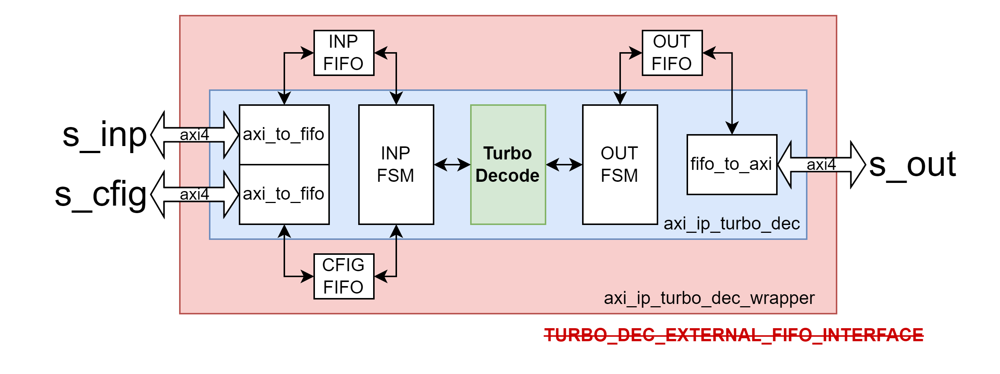
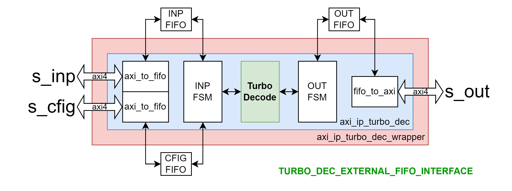

# Turbo Decode IP

## Cấu trúc phân cấp

- [axi_ip_turbo_dec_wrapper (TOP)](#axi_ip_turbo_dec_wrapper)
    - [axi_ip_turbo_dec](#axi_ip_turbo_dec_wrapper): axi_ip_turbo_dec_inst
        - [TurboDecode](./TurboCodeDecoder.md): TurboDecode_inst
        - [axi_to_fifo]() x2: axi_to_fifo_CFG, axi_to_fifo_inp
        - [fifo_to_axi](): fifo_to_axi_out
    - [fifo]() x3: fifo_CFG, fifo_inp, fifo_out

## Diagram

Turbo Decoder IP bao gồm 3 lớp bọc lên module TurboDecode theo thứ tự từ ngoài vào trong lần lượt là:
- __1. axi_ip_turbo_dec_wrapper__: Lớp ngoài cùng, có chức năng là vỏ Verilog của IP tương tác với AXI bus thông qua 3 AXI slave interfaces: _s_inp_, _s_CFG_, _s_out_. Ngoài ra dựa vào tham số user define - _TURBO_DEC_EXTERNAL_FIFO_INTERFACE_ mà các _fifo inp_, _CFG_, _out_ sẽ được tích hợp bên trong lớp này hoặc interface ra bên ngoài (xem 2 hình mô tả bên dưới). Các fifo được đề cập có chức năng đệm dữ liệu cho các kênh _s_inp_, _s_CFG_, _s_out_ tương ứng.
- __2. axi_ip_turbo_dec__: Lớp logic để thực hiện việc đẩy dữ liệu đầu vào từ _fifo inp_ vào module _TurboDecode_ và đẩy dữ liệu đầu ra từ module _TurboDecode_ vào _fifo out_. Số lượng mẫu dữ liệu đẩy vào/lấy ra sẽ được tùy chỉnh dựa trên tham số cài đặt lấy từ _fifo CFG_.
- __3. TurboEncode__: Module thực hiện chức năng chính của IP. Decode chuỗi đầu vào theo thuật toán Max-log-MAP SISO Decode như được mô tả trong tài liệu [TurboCodeDecoder](./TurboCodeDecoder.md)





# axi_ip_turbo_dec_wrapper

- **File**: axi_ip_turbo_dec_wrapper.sv
- **File**: axi_ip_turbo_dec.sv

## Generics

| Generic name | Type | Value | Description   |
| ------------ | ---- | ----- | ------------- |
| S_CFG_DW    |  | 64    | Data Width của kênh s_CFG |
| DATA_WIDTH    |  | 64    | Data Width của kênh s_inp, s_out |
| nbSymbolsOfTheProlog |      | 24     | Số mẫu cần tính cho quá trình Precode Alpha, Beta    |
| INP_DW           |      | 8     | Data Width của các LLR đầu vào A, B, Y1, Y2, W1, W2|
| EXT_DW           |      | 32    | Data Width của các tham số Alpha, Beta, Gamma, EXT,... trong quá trình giải mã. (Tiền tố EXT_* có thể gây hiểu nhầm rằng đây chỉ là tham số cài đặt cho EXT) |
| EXT_FW           |      | 5     | Fractional Width của tham số thông tin trao đổi (extrinsic infomation - EXT) trong quá trình giải mã |
| EXT_LN_1_8 | | -66 | Giá trị của ln(1/8) biểu diễn dưới dạng sfix{EXT_DW}En{EXT_FW} format.
| EXT_FeedBackCoeff | | 24 | Hệ số để tính thông tin trao đổi|
| MEM_AW | | 12 | Address Width cho RAM của các LLR A, B, Y1, W1, Y2, W2, EXT. MEM_AW = 12 hỗ trợ decode cho mọi block size |

**NOTE**: Các tham số _S_CFG_DW_, _DATA_WIDTH_ cần hỗ trợ các giá trị theo chuẩn AXI4: 32, __64__, 128, 256, 512, 1024. Tuy nhiên mới chỉ thiết kế để hỗ trợ `DW = 64`, các cài đặt khác chưa được kiểm chứng.

## Ports

| Port name    | Direction | Type  | Description                                                                             |
| ------------ | :-------: | :---: | --------------------------------------------------------------------------------------  |
| aclk         | input     |       | Tín hiệu đồng hồ. Module hoạt động theo cạnh lên của `aclk`. |
| aresetn      | input     |       | Reset đồng bộ khi `aresetn = 0`.                                |
| **fifo_CFG_*** | -  | FIFO Interface | Optional. Kết nối tới FIFO CFG |
| **fifo_inp_***  | -  | FIFO Interface | Optional. Kết nối tới FIFO inp |
| **fifo_out_***  | -  | FIFO Interface | Optional. Kết nối tới FIFO out |
| **s_enc_CFG_*** | - | AXI4 Slave | Kênh AXI4 Slave. Nhận thông tin cài đặt cho thuật toán (CFG) |
| **s_enc_inp_*** | - | AXI4 Slave | Kênh AXI4 Slave. Nhận đầu vào dữ liệu cần decode (inp) |
| **s_enc_out_*** | - | AXI4 Slave | Kênh AXI4 Slave. Lấy đầu ra sau decode (out) |


**NOTE**: FIFO Interface tham khảo mục [FIFO Interface](#fifo-interface)

## Functional description

Có 3 kênh AXI4 như được mô tả ở mục [Ports](#ports), kết nối tới FIFO tương ứng thông qua việc pack/unpack dữ liệu cho phù hợp, quá trình này được điều khiển bởi INP FSM và OUT FSM.


### Mô tả cách sử dụng các kênh CFG, inp, out

__Kênh CFG__: Khi gửi thiết lập cho lần decode tiếp theo tới IP, 18 LSB bit của wdata sẽ được sử dụng cho tham số `niter` và `block_size`.

__Kênh INP__: Khi gửi chuỗi dữ liệu đầu vào cần decode tới IP, cần pack cho đủ DATA_WIDTH bit mỗi AXI4 transfer rồi truyền lần lượt các transfer. Pack lần lượt các LLR 8 bit của các kênh `A, B, Y1, Y2, W1, W2` đầu vào với chỉ số từ `0 đến Nc-1` theo chiều `MSB đến LSB` của AXI wdata, các bit còn lại sẽ được bỏ qua bởi IP (phía gửi mặc định padding 0's).

__Kênh OUT__: Khi IP pack chuỗi dữ liệu đầu ra sau decode, sẽ pack cho đủ DATA_WIDTH bit mỗi AXI4 transfer rồi truyền lần lượt các transfer. Pack lần lượt cặp `AB` đầu ra với chỉ số từ `0 đến Nc-1` theo chiều `MSB đến LSB` của AXI rdata. Lưu ý rằng khi pack, 2 bit LSB sẽ chứa các bit trạng thái lần lượt là `start` và `end`. Transfer đầu tiên có bit trạng thái `start = 1`, transfer cuối cùng có bit trạng thái `end = 1`, còn lại mặc định giá trị trạng thái `start = 0` và `end = 0`. Các bit không dùng tới sẽ mặc định được bỏ qua khi unpack dữ liệu.

**NOTE**:
- CFG và INP __không quan tâm thứ tự__ gửi trước sau, chỉ quan tâm có đủ số lượng mẫu dữ liệu cho 1 lần decode với block size tương ứng được config hay không.
- Có thể gửi __1 loạt các lần encode__ bằng cách gửi nhiều CFG và đủ số lượng bit dữ liệu cho các lần encode tương ứng. Cần chủ động lưu ý số lượng phần tử có thể đệm vào FIFO để tránh tràn do chưa có cơ chế xử lý.
- CFG và INP là các __Write-only__ AXI4 Slave, nếu cố tình đọc sẽ trả về phản hồi với mã lỗi `rresp = SLVERR`. 
- OUT là __Read-only__ AXI4 Slave, nếu cố tình ghi sẽ trả về phản hồi với mã lỗi `bresp = SLVERR`.

### Ví dụ: AXI bus width = 64, block size = 24

__Cần thực hiện:__

__B1: Gửi CFG__

Gửi dữ liệu thiết lập cho lần encode này với giá trị block size = 24.


__B2: Gửi inp__

Gửi chuỗi LLR cần decode sử dụng `Nc = 96` AXI4 transfer 64 bit. Các LLR đầu vào `ABY1Y2W1W2` (48 bit/mẫu) với index từ `0 đến Nc-1` sẽ được packed lại theo chiều `MSB tới LSB` của các transfer.

|Transfer index|wdata|
|:-:|:-:|
|[0]||
|[1]||
|...||
|[95]||

__B3: Nhận out__

Nhận 192 bit của chuỗi dữ liệu sau encode sử dụng 4 AXI4 transfer 64 bit. Các chuỗi dữ liệu đầu ra sau giải mã `AB` (2 bit/mẫu) với index từ `0 đến Nc-1` sẽ được packed lại theo chiều `MSB tới LSB` của 64 bit transfer, lưu ý 2 bit LSB cho trạng thái `start` và `end`. Transfer đầu tiên có bit trạng thái `start = 1`, transfer cuối cùng có bit trạng thái `end = 1`, còn lại mặc định giá trị trạng thái `start = 0` và `end = 0`.

|Transfer index|rdata|start|end|
|:-:|:-:|:-:|:-:|
|[0]||1|0|
|[1]||0|0|
|[2]||0|0|
|[3]||0|1|

### Tính toán độ sâu FIFO

Số bit mỗi LLR `NbLLR = 8`, số bit status `NbStatus = 2`

Trong 1 lần decode:

Độ sâu INP FIFO `INP_depth` cần thiết để lưu trữ các transfers cho INP với thiết lập `BLOCK_SIZE`:
```C
INP_depth = ceil(
    Nc / floor(DATA_WIDTH / (6 * NbLLR))
)
```
Độ sâu OUT FIFO `OUT_depth` cần thiết để lưu trữ các transfers cho OUT với thiết lập `BLOCK_SIZE`:
```C
OUT_depth = ceil(
    (BLK_SIZE * 8) / (DATA_WIDTH - NbStatus)
)
```
#### Ví dụ với DATA_WIDTH = 64

| BLK_SIZE<br>(bytes) | INP_depth<br>(AXI transfers) | OUT_depth<br>(AXI transfers) | BLK_SIZE<br>(bytes) | INP_depth<br>(AXI transfers) | OUT_depth<br>(AXI transfers) |
|:-:|:-:|:-:|:-:|:--:|:-:|
|6  |24 | 1 |48 |192 |7  |
|9  |26 | 2 |54 |216 |7  |
|12 |48 | 2 |60 |240 |8  |
|18 |72 | 3 |120|480 |16 |
|24 |96 | 4 |240|960 |31 |
|27 |108| 4 |360|1440|47 |
|30 |120| 4 |480|1920|62 |
|36 |144| 5 |600|2400|78 |
|45 |180| 5 | - |  - | - |

Với Block size hỗ trợ tối đa lên tới 600, INP FIFO và OUT FIFO lần lượt cần lưu trữ được tối thiểu 2400, 78 AXI transactions để có thể thực hiện 1 lần decode hoàn chỉnh. Nếu cần hỗ trợ `K` lần decode liên tiếp với block size 600 thì cần scale độ sâu FIFO lên `K` lần.

#### Triển khai phần cứng

Trong thiết kế Turbo Decoder IP, để hỗ trợ lên tới 3 lần đẩy vào dữ liệu cần decode với block size 600 (`K = 3`) và DATA_WIDTH = 64:
- CFG_depth = 341
- INP_depth = 7200
- OUT_depth = 234

=> FIFO implemented depth X_impl_depth = 2^ceil(log2(X_depth)):
- CFG_impl_depth: 512
- INP_impl_depth: 8192
- OUT_impl_depth: 512

Với cài đặt đó, thiết kế có thể hỗ trợ lưu trữ `k` lần chuỗi đầu ra decode với block size tương ứng:
```C
k(BLK_SIZE) = floor(
    OUT_impl_depth / OUT_depth(BLK_SIZE)
)
```

| BLK_SIZE<br>(bytes) | k<br>(lần decode) | BLK_SIZE<br>(bytes) | k<br>(lần decode) |
|:-:|:--:|:-:|:-:|
|6  | 512|48 |73 |
|9  | 256|54 |73 |
|12 | 256|60 |64 |
|18 | 170|120|32 |
|24 | 128|240|16 |
|27 | 128|360|10 |
|30 | 128|480|8  |
|36 | 102|600|6  |
|45 | 102| - | - |


# Appendix

# FIFO Interface

| Port name    | Direction | Type  | Description                                                                             |
| ------------ | :-------: | :---: | --------------------------------------------------------------------------------------  |
| full | input | | FIFO đầy |
| din | output | [DW-1:0] | Dữ liệu push vào FIFO |
| wr_en | output | | Push dữ liệu vào FIFO |
| empty | input | | FIFO trống |
| dout | input | [DW-1:0] | Dữ liệu pull từ FIFO |
| rd_en | output | | Pull dữ liệu từ FIFO |
| data_count | input | [AW-1:0] | Optional. Số lượng phần tử dữ liệu hiện có trong FIFO |


**NOTE**: WR và RD ports hoạt động đồng bộ. FIFO mặc định được triển khai với cài đặt First Word Fall Throught và Read Before Write.