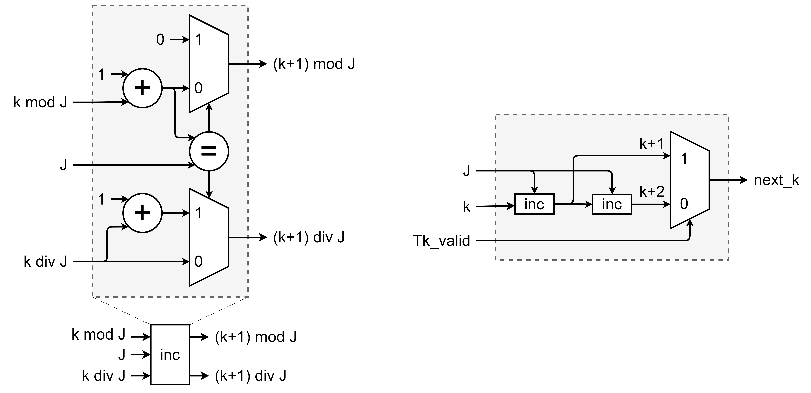

# Tài liệu mô tả Modules trong Turbo Code Encoder

# Cấu trúc phân cấp module top

- [TurboEncode (Top)]()
  <!-- - [punc]() -->
  - [DuobinaryCRSCEncode](#entity-duobinarycrscencode)
    - [INP](#entity-inp)
    - [PRE](#entity-pre)
      - [Interleaver](#entity-interleaver)
      - [CRSC](#entity-crsc) x2
      - [CircStateLUT](#entity-circstatelut) x2
    - [ENC]()
      - [Interleaver](#entity-interleaver)
      - [CRSC](#entity-crsc) x2
    - [TripleBankMem](#entity-triplebankmem)
      - [DualReadPortRAM](#entity-dualreadportram) x3
    - [my_fifo]() x2

# Các tham số chung

| Tham số    | Giá trị                                                           | Giải thích |
| ---------- | ----------------------------------------------------------------- |------------|
| Block size | 6, 9, 12, 18, 24, 27, 30, 45, 48, 54, 60, 120, 240, 360, 480, 600 | Số byte dữ liệu trong một khung truyền|
| N         | = `Block size` * 8| _Number of bits_. Số bit dữ liệu trong 1 khung truyền|
| Nc        | = `N` / 2 = `Block size` * 4| _Number of Couples_. Số cặp bit dữ liệu (AB) trong 1 khung truyền|


<!-- 
# Kết quả tổng hợp

||quyetdv WiMAX Turbo Encoder|Xilinx 802.16e CTC Encoder v3.0|Description|
|:-:|:-:|:-:|---|
|Max freq (MHz)|330|303|Tần số tối đa mà thiết kế có thể hoạt động|
|Latency (chu kỳ)|2 * Nc + 1|2 * Nc + 10|Latency được tính là số chu kỳ đồng hồ từ lúc bắt đầu nhận phần tử đầu tiên của chuỗi đầu vào cho tới khi output phần tử đầu tiên của chuỗi đầu ra, với điều kiện Block size không đổi|
|Throughput (%)|100|94.7 - 99.9|Throughput = (clk đưa input vào) / (clk đưa input vào + clk nghỉ giữa luồng input). Thiết kế của Xilinx yêu cầu khoảng nghỉ 4 chu kỳ clk sau mỗi 3 block input được đưa vào. Trong trường hợp tệ nhất với Block size nhỏ nhất, Throughput = 94.7% và với Block size lớn nhất, Throughput = 99.9%. Thiết kế của quyetdv không yêu cầu khoảng nghỉ mà có thể đưa luồng đầu vào liên tục nên Throughput = 100%.|
|36K RAM (khối)|3|2|
|18K RAM (khối)|0|3|


-->

# Entity: DuobinaryCRSCEncode 
- **File**: DuobinaryCRSCEncode.sv

## Functional description

#### Chi tiết về thuật toán Encode, Interleave,... xem tại tài liệu [__IEEE Standard for Local and metropolitan area networks Part 16: Air Interface for Broadband Wireless Access Systems__](doc/IEEE%20Std%20802.16.pdf) (IEEE Std 802.16), mục __8.4.9.2.3 Convolutional turbo codes__.

### Sơ lược thuật toán encode

Module top thực hiện WiMAX CTC Encode block dữ liệu đầu vào. Chuỗi dữ liệu đầu vào $u$ dạng nhị phân được sắp xếp từng cặp thành 2 kênh A và B:

$$u = [(A_0, B_0), (A_1, B_1), ..., (A_{Nc-1}, B_{Nc-1})]$$

Chuỗi $u$ được thực hiện interleave (xáo trộn) $intl()$ thành chuỗi $u'$:

$$u' = intl(u) = [(A'_0, B'_0), (A'_1, B'_1), ..., (A'_{Nc-1}, B'_{Nc-1})]$$

Quá trình Precode thiết lập thanh ghi trạng thái $S$ về trạng thái $0$, thực hiện double binary Circular Recursive Systematic Convolutional Code (CRSC) encode chuỗi $u$ và chuỗi $u'$. Dựa trên trạng thái $S$ cuối cùng sau khi encode, tra bảng __Table 504—Circulation state lookup table (Sc)__ để có được trạng thái khởi tạo cho quá trình Encode.

Quá trình Encode thiết lập thanh ghi trạng thái $S$ tương ứng với trạng thái khởi tạo tìm được từ quá trình Precode. Thực hiện CRSC encode chuỗi $u$ thành chuỗi $Y1, W1$ và encode chuỗi $u'$ thành chuỗi $Y2, W2$. Chuỗi đầu ra $enc(u)$ của module:

$$enc(u) = [A, B, Y1, Y2, W1, W2]$$

### Chi tiết luồng dữ liệu

__INP__: Module tiếp nhận cấu hình block size $N$, lần lượt nhận từng cặp dữ liệu đầu vào _AB_ cho tới khi đủ $Nc$ mẫu, lưu trong memory.

__PRE__: Quá trình Precode diễn ra khi đã lưu toàn bộ mẫu trong memory. Lần lượt lấy từng cặp _AB_ theo natural order indexing tương ứng với chuỗi $u$ và lấy theo interleaved order indexing tương ứng với chuỗi $u'$ làm đầu vào. Sau khi thực hiện CRSC encode toàn bộ chuỗi, giá trị thanh ghi trạng thái được LUT thành trạng thái khởi tạo cho quá trình Encode.

__ENC__: Quá trình Encode diễn ra khi __PRE__ kết thúc, trạng thái khởi tạo được thiết lập. Lần lượt lấy từng cặp _AB_ theo natural order indexing tương ứng với chuỗi $u$ và lấy theo interleaved order indexing tương ứng với chuỗi $u'$ làm đầu vào. Đầu ra $A, B, Y1, Y2, W1, W2$ lần lượt được tạo ra tương ứng với chuỗi đầu vào với độ trễ 1 chu kỳ.

__Lưu ý__: memory chỉ được lưu chuỗi _AB_ cho một block dữ liệu đầu vào mới khi quá trình __ENC__ cho block dữ liệu trước đó đã hoàn tất.

Để tăng hiệu suất quá trình encode, thiết kế sử dụng 3 khối memory xoay vòng để lần lượt thực hiện __INP__, __PRE__, __ENC__ liên tục. Minh họa việc luân phiên sử dụng 3 khối memory xoay vòng có thể được tham khảo tại [Wave](#wave).

## Diagram
<!--  -->
### Top interface

### Submodules

## Ports

| Port name    | Direction | Type  | Description                                                                             |
| ------------ | --------- | ----- | --------------------------------------------------------------------------------------  |
| clk          | input     |       | Tín hiệu đồng hồ. Module hoạt động theo cạnh lên của `clk`                              |
| rst          | input     |       | Reset đồng bộ khi `rst` = 1.                                                            |
| i_BLK_SIZE   | input     | [9:0] | Số byte của Block size. Được lấy mẫu `block_size` = `i_BLK_SIZE` sau chu kỳ kích hoạt.  |
| i_DATA_IN_AB | input     | [1:0] | Dữ liệu đầu vào từ kênh A, B                                                            |
| i_DARA_VALID | input     |       | Dữ liệu đầu vào từ kênh A, B hợp lệ                                                     |
| i_FD_IN      | input     |       | First Data IN. Báo hiệu bắt đầu một chuỗi dữ liệu đầu vào mới                           |
| o_INP_LAST   | output    |       | Báo hiệu dữ liệu hợp lệ tiếp theo là mẫu cuối cùng, kết thúc chuỗi đầu vào của một block|
| o_BLK_START  | output    |       | Block start. Báo hiệu phần tử đầu tiên của chuỗi đầu ra hợp lệ                          |
| o_BLK_END    | output    |       | Block end. Báo hiệu phần tử cuối cùng của chuỗi đầu ra hợp lệ                           |
| o_SYST_A     | output    |       | Systematic bit A channel từ CRSC encoder tự nhiên                                       |
| o_SYST_B     | output    |       | Systematic bit B channel từ CRSC encoder tự nhiên                                       |
| o_PAR_Y1     | output    |       | Parity bit Y từ CRSC encoder tự nhiên                                                   |
| o_PAR_W1     | output    |       | Parity bit W từ CRSC encoder tự nhiên                                                   |
| o_PAR_Y2     | output    |       | Parity bit Y từ CRSC encoder đan xen                                                    |
| o_PAR_W2     | output    |       | Parity bit W từ CRSC encoder đan xen                                                    |
| o_RDY        | output    |       | Đầu ra hợp lệ                                                                           |
| o_RFFD       | output    |       | Ready For First Data. Sẵn sàng cho một block dữ liệu đầu vào kế tiếp

## Wave

Không thay đổi Block size


Block size tăng


Block size giảm


Thay đổi Block size


# Entity: Interleaver

- **File**: Interleaver.sv

Thực hiện tạo natural order indexing _o_idx_, interleaved order indexing _o_idx_intl_ tương ứng với việc không xáo trộn, xáo trộn cặp _AB_ khi sử dụng chỉ số trên để đọc từ memory.

## Diagram


## Ports

| Port name  | Direction | Type   | Description                                                                                                                                                                                                                                                       |
| ---------- | --------- | ------ | ----------------------------------------------------------------------------------------------------------------------------------------------------------------------------------------------------------------------------------------------------------------- |
| clk        | input     |        | Tín hiệu đồng hồ. Module hoạt động theo cạnh lên của `clk`.                                                                                                                                                                                                       |
| rst        | input     |        | Reset đồng bộ khi `rst` = 1.                                                                                                                                                                                                                                      |
| i_BLK_SIZE | input     | [9:0]  | Số byte của Block size. Được lấy mẫu `block_size` = `i_BLK_SIZE` sau chu kỳ kích hoạt.                                                                                                                                                                            |
| i_start    | input     |        | Khi `o_ready` = 1 và `i_start` = 1, module được kích hoạt, tạo ra chỉ số tự nhiên/gốc (natural) `o_idx` và chỉ số đan xen (interleave) `o_idx_intl` tại mỗi chu kỳ đồng hồ `clk` (bao gồm cả chu kỳ kích hoạt) cho tới khi tạo đủ số mẫu `n` = `block_size` \* 4. |
| o_BLK_SIZE | output    | [9:0]  | Mẫu Block size tại lần cuối lấy mẫu. `o_BLK_SIZE` = `block_size`.                                                                                                                                                                                                 |
| o_idx      | output    | [11:0] | Chỉ số gốc/tự nhiên (natural).                                                                                                                                                                                                                                    |
| o_idx_intl | output    | [11:0] | Chỉ số đan xen (interleave) tương ứng với chỉ số gốc.                                                                                                                                                                                                             |
| o_valid    | output    |        | Đầu ra hợp lệ                                                                                                                                                                                                                                                     |
| o_last     | output    |        | Đầu ra cuối cùng trong `n` = `block_size` \* 4 mẫu.                                                                                                                                                                                                               |
| o_ready    | output    |        | Module sẵn sàng được kích hoạt bởi `i_start`.                                                                                                                                                                                                                     |

## Wave


## Latency

Độ trễ = 0. Module có thể ngay lập tức tạo chuỗi đầu ra trong chính chu kỳ kích hoạt.

Độ trễ của module được tính từ lúc bắt đầu kích hoạt (`o_ready` = 1 và `i_start` = 1) cho tới khi đầu ra hợp lệ đầu tiên được output.

## Functional description

#### Dựa trên tài liệu IEEE Std 802.16-2009 mục 8.4.9.2.3.2 CTC interleaver

Quá trình đan xen (Interleave) phụ thuộc vào các tham số Nc, P0, P1, P2, P3 tương ứng với Block size. Các tham số này được cho trong bảng sau:

<p id="interleave-table">Interleave table:</p>

| Block size |  Nc  | P0  | P1  | P2  | P3  |
| :--------: | :--: | :-: | :-: | :-: | :-: |
|     6      |  24  |  5  |  0  |  0  |  0  |
|     9      |  36  | 11  | 18  |  0  | 18  |
|     12     |  48  | 13  | 24  |  0  | 24  |
|     18     |  72  | 11  |  6  |  0  |  6  |
|     24     |  96  |  7  | 48  | 24  | 72  |
|     27     | 108  | 11  | 54  | 56  |  2  |
|     30     | 120  | 13  | 60  |  0  | 60  |
|     36     | 144  | 17  | 74  | 72  |  2  |
|     40     | 180  | 11  | 90  |  0  | 90  |
|     48     | 192  | 11  | 96  | 48  | 144 |
|     60     | 240  | 13  | 120 | 60  | 180 |
|    120     | 480  | 53  | 62  | 12  |  2  |
|    240     | 960  | 43  | 64  | 300 | 824 |
|    360     | 1440 | 43  | 720 | 360 | 540 |
|    480     | 1920 | 31  |  8  | 24  | 16  |
|    600     | 2400 | 53  | 66  | 24  |  2  |

Quá trình đan xen diễn ra như sau:

<p id="interleave-process">Interleave process:</p>

``` C
Đầu vào:
  Block_size
  u0 = [(A0, B0), (A1, B1), ..., (A Nc-1, B Nc-1)] là chuỗi Nc cặp bit đầu vào bộ CRSC tự nhiên.
Đầu ra:
  u2 là chuỗi Nc cặp bit đầu vào bộ CRSC đan xen.
Bước 1: Trao đổi giá trị theo cặp
  u1 = [] là chuỗi bit sau khi thực hiện bước 1.
  for i = 0:Nc-1
    (A, B) = u0(i)
    if (i % 2) (A, B) = (B, A) // Tráo các cặp tại chỉ số lẻ.
    u1(i) = (A, B)
  // Sau bước 1, u1 = [(A0, B0), (B1, A1), ..., (B Nc-1, A Nc-1)]

Bước 2: Ánh xạ chuỗi các cặp giá trị
  u2 = [] là chuỗi bit đan xen, đầu vào của bộ CRSC đan xen.
  // P(j) cung cấp địa chỉ của cặp của dãy u1 sẽ được ánh xạ lên địa chỉ j của chuỗi đan xen (tức là u2(j) = u1(P(j))).
  for j = 0:Nc–1
    switch (j % 4)
      0: P(j) = (P0*j + 1 ) % Nc
      1: P(j) = (P0*j + 1 + P1 + Nc⁄2) % Nc
      2: P(j) = (P0*j + 1 + P2) % Nc
      3: P(j) = (P0*j + 1 + P3 + Nc/2) % Nc
    u2(j) = u1(P(j))
  // Sau bước 2, u2 = [u1[P(0)], u1[P(1)], ..., u1[P(Nc-1)]]
```
<!-- 
### Thiết kế phù hợp phần cứng

Module `Interleaver` hoạt động tương tự như mô tả trên. Nhưng bỏ qua các bước tạo chuỗi `u1`, `u2` mà chỉ quan tâm tới việc tạo ra giá trị địa chỉ (chỉ số) đan xen `P(j)`, hay `o_idx_intl` tương ứng với giá trị địa chỉ (chỉ số) gốc `j`, hay `o_idx`.

Vòng for ở Bước 2 thể hiện việc chỉ số gốc `j` tăng tuyến tính, điều này gợi ý rằng phép nhân `P0 * j` tại từng vòng lặp là không cần thiết. Với mỗi vòng lặp ta chỉ cần tăng `j` lên 1 và tính `P0_mul_idx = P0_mul_idx + P0`. `P0_mul_idx` sau đó được cộng thêm với giá trị tạm gọi là `K`. `K` lần lượt = `1`, `1 + P1 + Nc/2`, `1 + P2`, `1 + P3 + Nc/2` tương ứng với các `case` (j % 4) = 0, 1, 2, 3 của `switch`.

Về giá trị `K`, giá trị này là hằng số phụ thuộc vào các tham số `P1, P2, P3, Nc/2` và tất cả chúng đều chỉ phụ thuộc vào `Block size`. Vậy thay vì cần lưu bảng tra P1, P2, P3, tính Nc/2,... thì chỉ cần 1 bảng tra duy nhất với đầu vào là `idx_mod_4` = {0, 1, 2, 3} và `blk_sz`.

```verilog
case (idx_mod_4)
  0: K = 1;
  1:
  case (blk_sz)
    6: K = 1 + P1(6) + Nc(blk_sz)/2 = 1 +  0 + 24/2 = 13;
    9: K = 1 + P1(9) + Nc(blk_sz)/2 = 1 + 18 + 36/2 = 1;
    ...
  endcase
  2:
  ...
  3:
  ...
```

Lưu ý rằng `(P * j + K) % Nc = ((P * j) % Nc + (K % Nc)) % Nc` vậy nên giá trị `K` sẽ được tiền xử lý trước bằng cách mod cho `Nc`, bảng tra sẽ lưu giá trị sau bước tiền xử lý. Tại mỗi vòng lặp, giá trị `P_mul_idx` nếu >= `Nc` sẽ được trừ đi `Nc` để đảm bảo tương đương `(P * j) % Nc`, giá trị `P_mul_idx + K` cũng sẽ trừ đi `Nc` nếu >= `Nc` để đảm bảo tương đương `(P * j + K) % Nc`.

Một phân tích về giá trị `P(j)` tại chỉ số `j` dựa vào điều kiện sau của thuật toán:

```
switch (j % 4)
  0: P(j) = (P0*j + 1 ) % Nc
  1: P(j) = (P0*j + 1 + P1 + Nc⁄2) % Nc
  2: P(j) = (P0*j + 1 + P2) % Nc
  3: P(j) = (P0*j + 1 + P3 + Nc/2) % Nc
```

Theo [Interleave table](#interleave-table) thì các giá trị P0 là số lẻ, P1, P2, P3, Nc/2 là số chẵn. Từ đó ta có:

```
switch (j % 4)
  0: P(j) = (E*j + E ) % O = E
  1: P(j) = (E*j + E + O + O) % O = O
  2: P(j) = (E*j + E + O) % O = E
  3: P(j) = (E*j + E + O + O) % O = O

<=>
if (i % 2 == 0)
  P(j) = E
else            
  P(j) = O
```

O là số chẵn và E là số lẻ. Có thể thấy chuỗi chỉ số Interleave P(j) bắt đầu với một giá trị lẻ, sau đó là chẵn, và cứ như vậy chuyển đổi giữa chỉ số chẵn và lẻ.

Chúng ta bỏ qua việc tráo đổi cặp giá trị AB tại các vị trí lẻ như mô tả trong quá trình tạo chuỗi `u1` trong [Interleave process](#interleave-process), lưu trực tiếp từng cặp AB vào trong Memory. Khi cần tạo chuỗi giá trị đan xen `u2` chỉ cần tạo đọc từ các địa chỉ tương ứng với chuỗi `P(j)` nhưng giá trị đầu tiên đọc được (chỉ số gốc `j` là lẻ) sẽ cần tráo đổi cặp giá trị, giá trị tiếp theo thì không cần, cứ như vậy cho tới khi đọc được hết các cặp giá trị từ trong Memory.
-->

# Entity: DualReadPortRAM

Dual Read Port Random Access Memory

- **File**: DualReadPortRAM.sv

## Diagram


## Generics

| Generic name | Type | Value | Description   |
| ------------ | ---- | ----- | ------------- |
| DW           |      | 2     | Data Width    |
| AW           |      | 12    | Address Width |

## Ports

| Port name | Direction | Type     | Description                                                 |
| --------- | --------- | -------- | ----------------------------------------------------------- |
| clk       | input     |          | Tín hiệu đồng hồ. Module hoạt động theo cạnh lên của `clk`. |
| rst       | input     |          | Reset đồng bộ khi `rst` = 1.                                |
| i_wen     | input     |          | Write Enable                                                |
| i_waddr   | input     | [AW-1:0] | Write Address                                               |
| i_wdata   | input     | [DW-1:0] | Write Data                                                  |
| i_raddr_A | input     | [AW-1:0] | Read Address from port A                                    |
| i_raddr_B | input     | [AW-1:0] | Read Address from port B                                    |
| o_rdata_A | output    | [DW-1:0] | Read Data from port A                                       |
| o_rdata_B | output    | [DW-1:0] | Read Data from port B                                       |

## Latency

Độ trễ Write = 1. Độ trễ Read = 1.

Độ trễ Write của module được tính từ lúc `i_wen` được kích hoạt tới lúc `i_wdata` được ghi vào địa chỉ `i_waddr`.

Độ trễ Read của module được tính từ lúc giá trị địa chỉ `i_raddr` hoặc dữ liệu tại `i_raddr` thay đổi tới lúc `o_rdata` được đọc từ địa chỉ `i_raddr`.

## Functional description

Khi `i_wen` = 1, dữ liệu `i_wdata` được ghi vào địa chỉ `i_waddr` tại chu kỳ `clk` kế tiếp. Khi `i_raddr` thay đổi hoặc dữ liệu tại `i_raddr` thay đổi, giá trị `o_rdata` đọc được từ `i_raddr` được cập nhật tại chu kỳ `clk` kế tiếp. Có 1 port để ghi dữ liệu, 2 port để đọc dữ liệu, các port có thể hoạt động độc lập và không ảnh hưởng tới nhau, ưu tiên dữ liệu tại các port là ghi trước, đọc sau.

# Entity: TripleBankMem

Triple Bank Memory

- **File**: TripleBankMem.sv

## Diagram


## Generics

| Generic name | Type | Value | Description     |
| ------------ | ---- | ----- | --------------- |
| DW           |      | 2     | Data Width      |
| AW           |      | 12    | Address Width   |
| NB           |      | 3     | Number of Banks |

## Ports

| Port name | Direction | Type        | Description                                                        |
| --------- | --------- | ----------- | ------------------------------------------------------------------ |
| clk       | input     |             | Tín hiệu đồng hồ. Module hoạt động theo cạnh lên của `clk`.        |
| rst       | input     |             | Reset đồng bộ khi `rst` = 1.                                       |
| i_wen     | input     | [NB-1:0]    | Write Enable. MSB = write to bank NB-1, ..., LSB = wtite to bank 0 |
| i_waddr   | input     | [AW-1:0]    | Write Address                                                      |
| i_wdata   | input     | [DW-1:0]    | Write Data                                                         |
| i_raddr_A | input     | [AW*NB-1:0] | Read Address from port A of all Banks                              |
| i_raddr_B | input     | [AW*NB-1:0] | Read Address from port B of all Banks                              |
| o_rdata_A | output    | [DW*NB-1:0] | Read Data from port A of all Banks                                 |
| o_rdata_B | output    | [DW*NB-1:0] | Read Data from port B of all Banks                                 |

## Constants

| Name | Type | Value | Description     |
| ---- | ---- | ----- | --------------- |
| NB   |      | 3     | Number of Banks |

## Instantiations

- NB x DualReadPortRAM_inst: DualReadPortRAM

## Latency

Độ trễ Write = 1. Độ trễ Read = 1.

Độ trễ của module phụ thuộc vào module con [DualReadPortRAM](#entity-dualreadportram)

Độ trễ Write của module được tính từ lúc `i_wen` tại bank `b` được kích hoạt tới lúc `i_wdata` được ghi vào địa chỉ `i_waddr` của bank `b`.

Độ trễ Read của module được tính từ lúc giá trị địa chỉ `i_raddr` hoặc dữ liệu tại `i_raddr` tại bank `b` bất kỳ thay đổi tới lúc `o_rdata` được đọc từ địa chỉ `i_raddr` tại bank `b`.

## Functional description

Module [TripleBankMem](#entity-triplebankmem) là ghép của `NB = 3` module con [DualReadPortRAM](#entity-dualreadportram), gọi là các bank.

Khi `i_wen` tại bank `b` = 1, dữ liệu `i_wdata` được ghi vào địa chỉ `i_waddr` trên bank `b` tại chu kỳ `clk` kế tiếp. Có thể ghi đồng thời vào nhiều bank khác nhau với cùng một dữ liệu và trên cùng một địa chỉ.

Xét tại bank `b`, khi `i_raddr` thay đổi hoặc dữ liệu tại `i_raddr` thay đổi, giá trị `o_rdata` đọc được từ `i_raddr` được cập nhật tại chu kỳ `clk` kế tiếp. Có thể đọc đồng thời từ nhiều bank khác nhau một cách độc lập.

# Entity: CRSC

Circular Recursive Systematic Convolutional

- **File**: CRSC.sv

## Diagram


<!--  -->
<div style="text-align:center;">
  
</div>

## Ports

| Port name     | Direction | Type  | Description                                                |
| ------------- | --------- | ----- | ---------------------------------------------------------- |
| clk           | input     |       | Tín hiệu đồng hồ. Module hoạt động theo cạnh lên của `clk` |
| i_state       | input     | [2:0] | Trạng thái cần thiết lập                                   |
| i_state_valid | input     |       | Thiết lập trạng thái                                       |
| i_AB          | input     | [1:0] | Dữ liệu đầu vào từ kênh A, B                               |
| i_valid       | input     |       | Đầu vào hợp lệ                                             |
| o_state       | output    | [2:0] | Trạng thái hiện tại {S1, S2, S3}                           |
| o_Y           | output    |       | Bit parity Y. `Y(D) = 1 + D2 + D3`                         |
| o_W           | output    |       | Bit parity W. `W(D) = 1 + D3`                              |
| o_valid       | output    |       | Đầu ra hợp lệ                                              |

## Wave

<a id="fig-wave-CRSC"></a>


## Latency

Độ trễ thiết lập = 1. Độ trễ = 1.

Độ trễ thiết lập của module được tính từ lúc thiết lập trạng thái (`i_state_valid = 1`) cho tới khi trạng thái `state`\_ được thiết lập thành `i_state`. Độ trễ của module được tính từ lúc đầu vào hợp lệ (`i_valid = 1`) cho tới khi đầu ra hợp lệ (`o_valid = 1`), thể hiện rằng các đầu ra `o_state`, `o_Y`, `o_W` đã được cập nhật.

## Functional description

### Dựa trên tài liệu IEEE Std 802.16-2009 mục 8.4.9.2.3.3 Determination of CTC circulation states

Bộ mã hoá tích chập có hệ thống đệ quy tuần hoàn kép (Circular Recursive Systematic Convolutional) xử lý hai bit dữ liệu đầu vào cùng lúc từ hai kênh A và B. Các bit chẵn lẻ Y và W đầu ra phụ thuộc vào trạng thái hiện tại và giá trị của cả hai bit đầu vào.

Bộ mã hoá yêu cầu thiết lập trạng thái trước khi bắt đầu thực hiện chuỗi mã hoá cho một khối (Block) dữ liệu. Các bước tìm trị của trạng thái thiết lập:

1. Tiền mã hoá (precoding): Thiết lập CRSC với trạng thái 0, thực hiện mã hoá khối dữ liệu đầu vào có độ dài `N = Block_size * 4)` cặp dữ liệu A, B . Trạng thái cuối cùng sau quá trình tiền mã hoá được gọi là `S0(N-1)`
2. Dựa vào `N` và `S0(N-1)`, sử dụng bảng dưới để tra giá trị trạng thái thiết lập `S` tương ứng.

|  S0(N-1)  | 0   | 1   | 2   | 3   | 4   | 5   | 6   | 7   |
| :-------: | --- | --- | --- | --- | --- | --- | --- | --- |
| N % 7 = 1 | 0   | 6   | 4   | 2   | 7   | 1   | 3   | 5   |
| N % 7 = 2 | 0   | 3   | 7   | 4   | 5   | 6   | 2   | 1   |
| N % 7 = 3 | 0   | 5   | 3   | 6   | 2   | 7   | 1   | 4   |
| N % 7 = 4 | 0   | 4   | 1   | 5   | 6   | 2   | 7   | 3   |
| N % 7 = 5 | 0   | 2   | 5   | 7   | 1   | 3   | 4   | 6   |
| N % 7 = 6 | 0   | 7   | 0   | 1   | 3   | 4   | 5   | 2   |

### Mô tả thiết kế

Khi `i_state_valid` = 1, thiết lập giá trị `i_state` cho trạng thái `state` tại chu kỳ `clk` kế tiếp. Sau khi thiết lập có thể bắt đầu đưa chuỗi dữ liệu đầu vào `i_AB` thông qua việc đưa tín hiệu `i_valid` = 1.

Khi `i_valid` = 1, trạng thái `state` hiện tại cùng với `i_AB` sẽ được sử dụng để tính toán và cập nhật các giá trị đầu ra `o_AB`, `o_Y`, `o_W`, `o_state` tại chu kỳ `clk` kế tiếp, đồng thời `state` cũng sẽ được cập nhật theo trạng thái mới.

Nếu `i_state_valid` và `i_valid` đồng thời = 1, `state` sẽ được cập nhật theo `i_state` thay vì trạng thái mới (Xem ví dụ `clk` #9 [Wave CRSC](#fig-wave-CRSC)).

# Entity: INP

- **File**: INP.sv

## Diagram

<!--  -->


## Ports

| Port name    | Direction | Type   | Description                                                                            |
| ------------ | --------- | ------ | -------------------------------------------------------------------------------------- |
| clk          | input     |        | Tín hiệu đồng hồ. Module hoạt động theo cạnh lên của `clk`.                            |
| rst          | input     |        | Reset đồng bộ khi `rst` = 1.                                                           |
| i_FD_IN      | input     |        | First Data IN. Báo hiệu bắt đầu một chuỗi dữ liệu đầu vào mới                          |
| i_DATA_IN_AB | input     | [1:0]  | Dữ liệu đầu vào từ kênh A, B                                                           |
| i_BLK_SIZE   | input     | [9:0]  | Số byte của Block size. Được lấy mẫu `block_size` = `i_BLK_SIZE` sau chu kỳ kích hoạt. |
| o_wen        | output    |        | Write Enable                                                                           |
| o_AB         | output    |        | Write Data                                                                             |
| o_waddr      | output    | [11:0] | Write Address                                                                          |
| o_LAST       | output    |        | Báo hiệu kết thúc của chuỗi đầu vào.                                                   |
| o_RFFD       | output    |        | Ready For First Data. module sẵn sàng cho chuỗi dữ liệu đầu vào mới                    |
| o_BLK_SIZE   | output    | [9:0]  | Block size từ lần lấy mẫu cuối cùng.                                                   |

## Wave

<!--  -->


## Latency

Độ trễ khởi đầu = 0. Độ trễ chuyển giao = 0.

Độ trễ khởi đầu được tính từ lúc module được kích hoạt (`o_RFFD` = 1 báo hiệu sẵn sàng cho một chuỗi dữ liệu mới, và đồng thời `i_FD_IN` = 1 báo hiệu bắt đầu một chuỗi dữ liệu mới) cho tới khi dữ liệu `o_AB` đầu tiên được gửi tới Memory bus, ra lệnh ghi vào địa chỉ `o_waddr` tương ứng.

Độ trễ chuyển giao là số chu kỳ đồng hồ `clk` cần thiết để module "nghỉ" giữa 2 chuỗi dữ liệu kế tiếp nhau. Module này có thể hoạt động thông suốt mà không yêu cầu khoảng nghỉ.

## Functional description

Module `INP` kiểm soát việc ghi vào Memory một Block dữ liệu đầu vào một cách tuần tự, cung cấp một số tín hiệu điều khiển quan trọng như `o_LAST`, `o_RFFD` cho luồng xử lý của module cao hơn (Top module).

Khi bắt đầu một chuỗi đầu vào mới `o_RFFD` = 1 và `i_FD_IN` = 1, lần lượt các `i_DATA_IN_AB` (bao gồm cả trong chu kỳ kích hoạt) sẽ được gửi lệnh ghi vào `o_waddr` = 0, 1, ..., Nc-1 (Với số lượng cặp đầu vào AB `Nc = BLK_SIZE \* 4`).

`o_RFFD` = 1 báo hiệu sẵn sàng nhận chuỗi dữ liệu đầu vào mới. Khi `o_RFFD` = 1 và `i_FD_IN` = 1 thì tại chu kỳ kế tiếp `o_RFFD` = 0 cho tới khi Nc cặp đầu vào AB được gửi lệnh ghi tới Memory.

`o_LAST` = 1 báo hiệu phần tử cuối cùng của chuỗi đầu vào, đồng nghĩa với việc hoàn tất việc chuyển tiếp một Block dữ liệu để ghi vào Memory.

# Entity: PRE

- **File**: PRE.sv

## Diagram


Cấu trúc bên trong:


## Ports

| Port name             | Direction | Type   | Description                                                                                                                                                                                                     |
| --------------------- | --------- | ------ | --------------------------------------------------------------------------------------------------------------------------------------------------------------------------------------------------------------- |
| clk                   | input     |        | Tín hiệu đồng hồ. Module hoạt động theo cạnh lên của `clk`.                                                                                                                                                     |
| rst                   | input     |        | Reset đồng bộ khi `rst` = 1.                                                                                                                                                                                    |
| i_start               | input     |        | First Data IN. Báo hiệu bắt đầu Precode một chuỗi dữ liệu mới                                                                                                                                                   |
| i_BLK_SIZE            | input     | [9:0]  | Số byte của Block size. Được lấy mẫu `block_size` = `i_BLK_SIZE` sau chu kỳ kích hoạt.                                                                                                                          |
| o_ren                 | output    |        | Read Enable                                                                                                                                                                                                     |
| o_raddr_A             | output    | [11:0] | Read Address - port A. Địa chỉ đọc cặp dữ liệu AB từ port A của Memory. Địa chỉ đọc từ port A là tuần tự 0, 1, ..., Nc-1 và tương ứng với chỉ số tự nhiên (natural/non-interleave index).                       |
| o_raddr_B             | output    | [11:0] | Read Address - port B. Địa chỉ đọc cặp dữ liệu AB từ port A của Memory. Địa chỉ đọc từ port B tương ứng với chỉ số đan xen (interleave index). Được giải thích trong module [Interleaver](#entity-interleaver). |
| i_rdata_A             | output    | [ 1:0] | Read Data - port A. Cặp dữ liệu AB đọc được từ port A của Memory                                                                                                                                                |
| i_rdata_B             | output    | [ 1:0] | Read Data - port B. Cặp dữ liệu AB đọc được từ port B của Memory                                                                                                                                                |
| o_enc_start           | output    |        | Hoàn thành Precoding, bắt đầu Encoding                                                                                                                                                                          |
| o_enc_init_state      | output    | [2:0]  | Trạng thái khởi đầu cho CRSC tự nhiên (natural) của quá trình Encode.                                                                                                                                           |
| o_enc_intl_init_state | output    | [2:0]  | Trạng thái khởi đầu cho CRSC đan xen (interleave) của quá trình Encode.                                                                                                                                         |
| o_last                | output    |        | Báo hiệu kết thúc của chuỗi dữ liệu đầu vào.                                                                                                                                                                    |
| o_ready               | output    |        | Ready For First Data. Module sẵn sàng nhận chuỗi dữ liệu mới cho việc Precode.                                                                                                                                  |
| o_BLK_SIZE            | output    | [9:0]  | Block size từ lần lấy mẫu cuối cùng.                                                                                                                                                                            |

## Wave

## Latency

## Functional description

Khối Interleaver tạo cặp địa chỉ tuần tự và địa chỉ đan xen, lần lượt đọc các cặp dữ liệu AB từ Memory với địa chỉ tương ứng. Lưu ý rằng tại kênh đan xen, cặp AB đầu tiên đọc được sẽ cần tráo đổi vị trí, cặp tiếp theo thì không cần, cứ như vậy đọc từ Memory (như được mô tả trong [Interleaver](#entity-interleaver)).

Chuỗi các cặp AB đọc được từ địa chỉ tuần tự và đan xen sẽ được đưa vào khối CRSC encoder tương ứng để thực hiện quá trình Precoding. Trạng thái cuối cùng sau quá trình trên sẽ được chuyển đổi thành trạng thái bắt đầu của quá trình Encode thông qua việc tra [CircStateLUT](#entity-circstatelut).

Việc tra CircStateLUT yêu cầu tính Nc mod 7 tuy nhiên phép tính mod trực tiếp là không cần thiết và tiêu tốn nhiều tài nguyên phần cứng. Thay vào đó, sử dụng một thanh ghi tích lũy mod 7 để mỗi khi CRSC Encoder tạo ra một đầu ra hợp lệ (tương ứng với xử lý xong 1 cặp AB) sẽ làm tăng thanh ghi lên 1 đơn vị. Sau khi xử lý xong Nc cặp AB thì giá trị trong thanh ghi nói trên chính là kết quả của Nc mod 7.


# Entity: ENC 
- **File**: ENC.sv

## Diagram

## Ports

| Port name             | Direction | Type   | Description                                                                                                                                                                                  |
| --------------------- | --------- | ------ | -------------------------------------------------------------------------------------------------------------------------------------------------------------------------------------------- |
| clk                   | input     |        | Tín hiệu đồng hồ. Module hoạt động theo cạnh lên của `clk`.                                                                                                                                  |
| rst                   | input     |        | Reset đồng bộ khi `rst` = 1.                                                                                                                                                                 |
| i_start               | input     |        | First Data IN. Báo hiệu bắt đầu Encode một chuỗi dữ liệu mới                                                                                                                                 |
| i_BLK_SIZE            | input     | [9:0]  | Số byte của Block size. Được lấy mẫu `block_size` = `i_BLK_SIZE` sau chu kỳ kích hoạt.                                                                                                       |
| i_enc_init_state      | input     | [2:0]  | Trạng thái khởi tạo CRSC encoder tự nhiên                                                                                                                                                    |
| i_enc_intl_init_state | input     | [2:0]  | Trạng thái khởi tạo CRSC encoder đan xen                                                                                                                                                     |
| o_ren                 | output    |        | Read Enable                                                                                                                                                                                  |
| o_raddr_A             | output    | [11:0] | Read Address - port A. Địa chỉ đọc cặp dữ liệu AB từ port A của Memory. Địa chỉ đọc từ port A là tuần tự 0, 1, ..., Nc-1 và tương ứng với chỉ số tự nhiên (natural/non-interleave index).    |
| o_raddr_B             | output    | [11:0] | Read Address - port B. Địa chỉ đọc cặp dữ liệu AB từ port A của Memory. Địa chỉ đọc từ port B tương ứng với chỉ số đan xen (interleave index). Được giải thích trong module [Interleaver](). |
| i_rdata_A             | output    | [ 1:0] | Read Data - port A. Cặp dữ liệu AB đọc được từ port A của Memory                                                                                                                             |
| i_rdata_B             | output    | [ 1:0] | Read Data - port B. Cặp dữ liệu AB đọc được từ port B của Memory                                                                                                                             |
| o_IDX                 | output    | [11:0] | Chỉ số phần tử của chuỗi đầu ra hợp lệ                                                                                                                                                       |
| o_BLK_START           | output    |        | Block start. Báo hiệu phần tử đầu tiên của chuỗi đầu ra hợp lệ                                                                                                                               |
| o_BLK_END             | output    |        | Block end. Báo hiệu phần tử cuối cùng của chuỗi đầu ra hợp lệ                                                                                                                                |
| o_SYST_A              | output    |        | Systematic bit A channel từ CRSC encoder tự nhiên                                                                                                                                            |
| o_SYST_B              | output    |        | Systematic bit B channel từ CRSC encoder tự nhiên                                                                                                                                            |
| o_PAR_Y1              | output    |        | Parity bit Y từ CRSC encoder tự nhiên                                                                                                                                                        |
| o_PAR_W1              | output    |        | Parity bit W từ CRSC encoder tự nhiên                                                                                                                                                        |
| o_PAR_Y2              | output    |        | Parity bit Y từ CRSC encoder đan xen                                                                                                                                                         |
| o_PAR_W2              | output    |        | Parity bit W từ CRSC encoder đan xen                                                                                                                                                         |
| o_RDY                 | output    |        | Đầu ra hợp lệ                                                                                                                                                                                |
| o_last                | output    |        | Báo hiệu kết thúc của chuỗi dữ liệu đầu vào.                                                                                                                                                 |
| o_ready               | output    |        | Ready For First Data. Module sẵn sàng nhận chuỗi dữ liệu mới cho việc Encode.                                                                                                                |
| o_BLK_SIZE            | output    | [9:0]  | Block size từ lần lấy mẫu cuối cùng.                                                                                                                                                         |

## Functional description

Module bao gồm 2 khối [CRSC](#entity-crsc), lần lượt encode cho chuỗi đầu vào và chuỗi đầu vào xáo trộn. Việc xáo trộn được điều khiển thông qua khối [Interleaver](#entity-interleaver). 

Khi `i_start` = 1, module này nhận Block Size (`i_BLK_SIZE`) và khởi tạo trạng thái cho 2 khối CRSC (thông qua trạng thái khởi tạo `i_enc_init_state`, `i_enc_intl_init_state`) từ module [PRE](#entity-pre). Đồng thời, khối Interleaver bắt đầu việc tạo ra các chỉ số tương ứng với địa chỉ để đọc chuỗi đầu vào từ Memory, đưa vào CRSC để encode.

Chuỗi đầu ra ABY1W1Y2W2 hợp lệ được báo hiệu bằng `o_RDY` = 1, bắt đầu chuỗi và kết thúc chuỗi được đánh dấu bằng `o_BLK_START` và `o_BLK_END`.

# Entity: CircStateLUT 
- **File**: CircStateLUT.sv

## Diagram

## Ports

| Port name     | Direction | Type  | Description                       |
| ------------- | --------- | ----- | --------------------------------- |
| i_Ncoup_mod_7 | input     | [2:0] | Number of couples mod by 7        |
| i_state       | input     | [2:0] | Final state of precoding process  |
| o_state       | output    | [2:0] | Staring state of encoding process |

## Funcional Description

#### Dựa trên tài liệu IEEE Std 802.16-2009 mục 8.4.9.2.3.3 Determination of CTC circulation states

|Nc mod 7|S0N-1 = 0|S0N-1 = 1|S0N-1 = 2|S0N-1 = 3|S0N-1 = 4|S0N-1 = 5|S0N-1 = 6|S0N-1 = 7|
|:-:|:-:|:-:|:-:|:-:|:-:|:-:|:-:|:-:|
|1|0|6|4|2|7|1|3|5|
|2|0|3|7|4|5|6|2|1|
|3|0|5|3|6|2|7|1|4|
|4|0|4|1|5|6|2|7|3|
|5|0|2|5|7|1|3|4|6|
|6|0|7|6|1|3|4|5|2|

<!-- 
# ~~Entity: BlkIntl~~ (UNUSED) 
- **File**: BlkIntl.sv

## Diagram

## Ports

| Port name  | Direction | Type   | Description                                                                            |
| ---------- | --------- | ------ | -------------------------------------------------------------------------------------- |
| clk        | input     |        | Tín hiệu đồng hồ. Module hoạt động theo cạnh lên của `clk`                             |
| rst        | input     |        | Reset đồng bộ khi `rst` = 1.                                                           |
| i_BLK_SIZE | input     | [9:0]  | Số byte của Block size. Được lấy mẫu `block_size` = `i_BLK_SIZE` sau chu kỳ kích hoạt. |
| i_start    | input     |        | Bắt đầu tạo chuỗi chỉ số SubBlock Interleave `o_Tk`                                    |
| o_Tk       | output    | [11:0] | Chỉ số SubBlock Interleave                                                             |
| o_valid    | output    |        | Đầu ra hợp lệ                                                                          |

## Wave


## Latency

## Functional description

### Dựa trên tài liệu IEEE Std 802.16-2009 mục 8.4.9.2.3.4 Subpacket generation

Giải thích trong mục [Subblock Interleaving](#subblock-interleave)

### Thiết kế phù hợp phần cứng

#### Cải thiện thuật toán

##### Phân tích vấn đề

Chỉ số `i` và `k` trong thuật toán có thể được triển khai bằng một bộ đếm. Có thể thấy `i` có giá trị tối đa = `Nc` - 1 còn giá trị tối đa của `k` phụ thuộc vào số lần tạo giá trị `Tk`, bao gồm cả số lần giá trị này được sử dụng để sinh chỉ số Block Interleave tương ứng với `ADi` (Trường hợp `Tk` < `Nc`) và số lần thử lại để tạo ra giá trị hợp lệ. Trong trường hợp tốt nhất ví dụ như khi `Block size` = 6 không cần thử lại bất kỳ lần nào thì `k` có giá trị tối thiểu = `Nc` - 1.

Giả sử mỗi lần tạo `Tk` diễn ra trong một đơn vị thời gian, thuật toán gốc yêu cầu `k` đơn vị thời gian bao gồm những lần `Tk` tạo ra được sử dụng và những lần `Tk` bị bỏ qua và cần tạo lại.

Lập trình đoạn mã sử dụng _MATLAB_ để mô phỏng quá trình tạo chuỗi chỉ số Block Interleave. Với các `Block size` khác nhau, lần lượt ghi lại số lần thử lại để tạo ra `ADi` tại chỉ số `i`. Từ đó có thể thống kê số lần thử lại tối đa trong 1 lần tạo `ADi` cũng như tổng số lần thử lại xuyên suốt toàn bộ thuật toán. Kết quả được cho trong bảng sau:

|Block size|Max try|Total try||Block size|Max try|Total try||Block size|Max try|Total try|
|:-:|:-:|:-:|:-:|:-:|:-:|:-:|:-:|:-:|:-:|:-:|
|6 |0| 0||30|1| 7||120|1|31|
|9 |1|11||36|1|47||240|1|63|
|12|0| 0||45|1|11||360|1|95|
|18|1|23||48|0| 0||480|1|127|
|24|0| 0||54|1|39||600|1|671|
|27|1|19||60|1|15|

$$\text{Độ hiệu quả} = \frac{Nc}{Nc + Total\_try}$$

Độ hiệu quả tối đa = 1 khi không có bất kỳ lần thử lại nào xuyên suốt toàn bộ quá trình. Độ hiệu quả thấp nhất = 0.7539 đối với trường hợp `Block size` = 36.

##### Đề xuất thuật toán

Có thể thấy rằng việc thử lại chỉ diễn ra tối đa là 1 lần nên thay vì triển khai như thuật toán gốc, một thuật toán mới giúp bỏ qua các lần thử lại được đề xuất. Nhờ vào thuật toán này, tại mỗi đơn vị thời gian đều tạo ra được `ADi` hợp lệ vì vậy chỉ mất chính xác `Nc` chu kỳ để tạo đủ `Nc` chỉ số Block Interleave.

1. Từ `Block Size`, sử dụng [Bảng tham số m, J Subblock Interleave](#subblock-interleaving-table) để tìm tham số `m` và `J`. Thiết lập chỉ số `i` = 0 và `Ak` = 0, `Bk` = 1. `Ak` là chỉ số `k` nếu dự kiến đúng, `Bk` = `Ak` + 1 là chỉ số nếu dự kiến sai và cần thử lại. 
2. Tính địa chỉ interleave dự kiến `ATk` = `get_Tk(Ak, m, J)` và địa chỉ interleave nếu `Ak` không hợp lệ `BTk` = `get_Tk(Bk, m, J)`.
3. Nếu `ATk` $\lt$ `Nc`, `ADi` = `ATk` và tăng chỉ số `Ak` và `Bk` thêm 1. Trong trường hợp `ATk` $\ge$ `Nc` thì `ADi` = `BTk`, tăng chỉ số `Ak`, `Bk` thêm 2. Tăng chỉ số `i` thêm 1.
4. Lặp lại bước 2 và 3 cho tới khi `i` đạt giá trị `Nc` - 1, tức là đã tìm đủ `Nc` chỉ số bit xáo trộn `ADi`.

#### Cải thiện lưu trữ và tính toán

Có thể thấy trong [thuật toán đề xuất](#đề-xuất-thuật-toán) chỉ số `k` (`Ak` hoặc `Bk` đều chung tính chất nên sau đây sẽ chỉ đề cập chung là `k`) chỉ tăng 1 hoặc 2 đơn vị nên có thể coi là (gần) tuyến tính. Việc lưu trữ chỉ số `k` để tính toán `k` mod `m` và  ⌊`k` / `J`⌋ là không cần thiết, thay vào đó ta chỉ cần tính và lưu trữ kết quả `k` mod `m` và  ⌊`k` / `J`⌋ sau các lần thay đổi chỉ số `k`. Việc tính chỉ số `next_k`, hay `k` tiếp theo (thực chất là tính `k` mod `m` và  ⌊`k` / `J`⌋ tiếp theo) dựa vào điều kiện `Ak_valid` = `Ak` $\lt$ `Nc` có thể được mô tả như trong sơ đồ dưới:



# ~~Thuật toán sinh subpacket~~ (UNUSED)

## Dựa trên tài liệu IEEE Std 802.16-2009 mục 8.4.9.2.3.4 Subpacket generation

###### Cấu trúc FEC

Cấu trúc FEC (Forward Error Correction) được đề xuất dùng cách "puncturing" (lọc bớt) mã gốc (mother codeword) để tạo ra một subpacket với các tỷ lệ mã khác nhau. Subpacket này cũng sẽ được sử dụng cho việc truyền tải HARQ (Hybrid Automatic Repeat reQuest).


Giải thích chi tiết từng phần:

1. Mã CTC 1/3: Mã mẹ/gốc (mother codeword) được mã hóa với tỷ lệ 1/3 bằng mã CTC (Convolutional Turbo Code).

1. Subblock Interleaver: Sau đó, mã này sẽ trải qua một khối "interleaving" (chuyển đổi thứ tự bit), tức là xáo trộn lại thứ tự các bit trong mã.

1. Puncturing: Sau khi thực hiện interleaving, quá trình "puncturing" (lọc bớt) sẽ được áp dụng để chọn một chuỗi bit liên tiếp đã được xáo trộn, bắt đầu từ bất kỳ vị trí nào trong mã gốc. Điều này giúp giảm số lượng bit truyền tải, từ đó thay đổi tỷ lệ mã (coding rate).

###### Subpacket cho truyền HARQ

Subpacket được tạo ra từ việc chọn một chuỗi bit liên tiếp này có thể được sử dụng cho truyền tải HARQ, tức là nếu có lỗi trong quá trình truyền, hệ thống có thể yêu cầu gửi lại các phần của mã đã bị lỗi mà không cần gửi lại toàn bộ mã gốc.

Lựa chọn độ dài subpacket: Độ dài của subpacket được chọn tùy thuộc vào tỷ lệ mã cần thiết, phản ánh điều kiện kênh truyền (khi kênh xấu, tỷ lệ mã sẽ cao hơn).

Truyền mã trong trường hợp không có HARQ: Subpacket đầu tiên có thể được sử dụng như một mã với tỷ lệ mã cần thiết cho một đợt truyền dữ liệu mà không áp dụng HARQ, tức là không yêu cầu gửi lại mã nếu có lỗi.

### Nhóm thành subblocks

Toàn bộ bit sau mã hóa A, B, Y1, Y2, W1, W2 được nhóm lại thành từng nhóm tương ứng gọi là các subblocks.

<div style="text-align:center;">
  
</div>

### Subblock Interleaving

<p id="subblock-interleave"></p>

Mỗi subblock sẽ được Subblock Interleaving độc lập theo thuật toán dưới đây. Theo đó, chuỗi đầu ra sau khi Interleave có chỉ số bit bị xáo trộn lần lượt là `ADi` với `i` = 0, 1, ..., Nc-1.

1. Từ `Block Size`, sử dụng [Bảng tham số m, J Subblock Interleave](#subblock-interleaving-table) để tìm tham số `m` và `J`. Thiết lập chỉ số `i` = 0 và `k` = 0.
2. Tính địa chỉ interleave dự kiến `Tk` = `get_Tk(k, m, J)`.
3. Nếu `Tk` $\lt$ `Nc`, `ADi` = `Tk` và tăng chỉ số `i`, `k` thêm 1, chuyển tới bước 4. Trong trường hợp `Tk` $\ge$ `Nc` thì bỏ qua giá trị `Tk`, tăng chỉ số `k` thêm 1 và thử lại bước 2.
4. Lặp lại bước 2 và 3 cho tới khi `i` đạt giá trị `Nc` - 1, tức là đã tìm đủ `Nc` chỉ số bit xáo trộn `ADi`.

Với $get\_ Tk(k, m, J) = 2^m(k \mod J) + BRO_m(\lfloor k / J \rfloor)$. Trong đó $BRO_m(y)$ là đảo ngược của `m` bit LSB của giá trị y. Ví dụ: $BRO_3(11)=BRO_3(4'b1\_011)=3'b110=6$.

<p id="subblock-interleaving-table">Bảng tham số m, J Subblock Interleave:</p>

|Block Size|m|J||Block Size|m|J||Block Size|m|J|
|:-:|:-:|:-:|:-:|:-:|:-:|:-:|:-:|:-:|:-:|:-:|
|6 |3|3||30|6|2||120|8|2|
|9 |4|3||36|6|3||240|9|2|
|12|4|3||45|6|3||360|9|3|
|18|5|3||48|6|3||480|10|2|
|24|5|3||54|6|4||600|10|3|
|27|5|4||60|7|2||...|x|x|
-->
