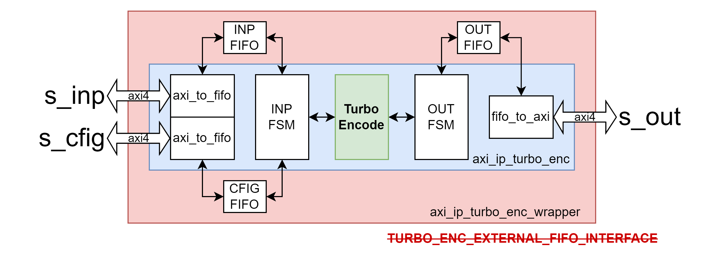
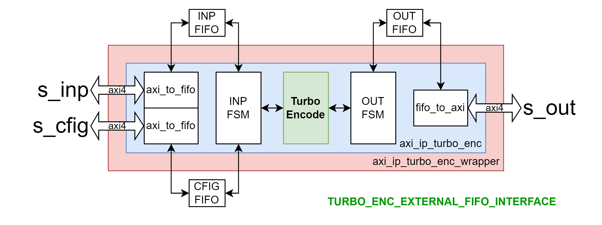

# Tài liệu mô tả Turbo Code IPs

Tài liệu này tập trung mô tả kiến trúc tổng quát, chức năng, cách sử dụng (thông qua mô tả interface) của các IP liên quan tới Turbo Code bao gồm:
- [Turbo Encoder IP](#turbo-encode-ip)
- [Turbo Decoder IP](#turbo-decode-ip)

# Turbo Encode IP

## Cấu trúc phân cấp

- [axi_ip_turbo_enc_wrapper (TOP)]()
    - [axi_ip_turbo_enc](): axi_ip_turbo_enc_inst
        - [TurboEncode](): TurboEncode_inst
        - [axi_to_fifo]() x2: axi_to_fifo_cfig, axi_to_fifo_inp
        - [fifo_to_axi](): fifo_to_axi_out
    - [fifo]() x3: fifo_cfig, fifo_inp, fifo_out

## Diagram

Turbo Encoder IP bao gồm 3 lớp bọc lên module TurboEncode theo thứ tự từ ngoài vào trong lần lượt là:
- __1. axi_ip_turbo_enc_wrapper__: Lớp ngoài cùng, có chức năng là vỏ Verilog của IP tương tác với AXI bus thông qua 3 AXI slave interfaces: _s_inp_, _s_cfig_, _s_out_. Ngoài ra dựa vào tham số user define - _TURBO_ENC_EXTERNAL_FIFO_INTERFACE_ mà các _fifo inp_, _cfig_, _out_ sẽ được tích hợp bên trong lớp này hoặc interface ra bên ngoài (xem 2 hình mô tả bên dưới). Các fifo được đề cập có chức năng đệm dữ liệu cho các kênh _s_inp_, _s_cfig_, _s_out_ tương ứng.
- __2. axi_ip_turbo_enc__: Lớp logic để thực hiện việc đẩy dữ liệu đầu vào từ _fifo inp_ vào module _TurboEncode_ và đẩy dữ liệu đầu ra từ module _TurboEncode_ vào _fifo out_. Số lượng mẫu dữ liệu đẩy vào/lấy ra sẽ được tùy chỉnh dựa trên tham số cài đặt lấy từ _fifo cfig_.
- __3. TurboEncode__: Module thực hiện chức năng chính của IP. Encode chuỗi đầu vào theo chuẩn IEEE-802.16 CTC như được mô tả trong tài liệu [TurboCodeEncoder](./TurboCodeEncoder.md)





# axi_ip_turbo_enc_wrapper

- **File**: axi_ip_turbo_enc_wrapper.sv
- **File**: axi_ip_turbo_enc.sv

## Generics

| Generic name | Type | Value | Description   |
| ------------ | ---- | ----- | ------------- |
| S_CFIG_DW    |      | 64    | Data Width của kênh s_cfig |
| S_DATA_DW    |      | 64    | Data Width của kênh s_inp, s_out |

**NOTE**: Các tham số _S_CFIG_DW_, _S_DATA_DW_ cần hỗ trợ các giá trị theo chuẩn AXI4: 32, __64__, 128, 256, 512, 1024. Tuy nhiên mới chỉ thiết kế để hỗ trợ `DW = 64`, các cài đặt khác chưa được kiểm chứng.

## Ports

| Port name    | Direction | Type  | Description                                                                             |
| ------------ | :-------: | :---: | --------------------------------------------------------------------------------------  |
| aclk         | input     |       | Tín hiệu đồng hồ. Module hoạt động theo cạnh lên của `aclk`. |
| aresetn      | input     |       | Reset đồng bộ khi `aresetn = 0`.                                |
| **fifo_cfig_*** | -  | FIFO Interface | Optional. Kết nối tới FIFO cfig |
| **fifo_inp_***  | -  | FIFO Interface | Optional. Kết nối tới FIFO inp |
| **fifo_out_***  | -  | FIFO Interface | Optional. Kết nối tới FIFO out |
| **s_enc_cfig_*** | - | AXI4 Slave | Kênh AXI4 Slave. Nhận thông tin cài đặt cho thuật toán (cfig) |
| **s_enc_inp_*** | - | AXI4 Slave | Kênh AXI4 Slave. Nhận đầu vào dữ liệu cần encode (inp) |
| **s_enc_out_*** | - | AXI4 Slave | Kênh AXI4 Slave. Lấy đầu ra sau encode (out) |


**NOTE**: FIFO Interface tham khảo mục [FIFO Interface](#fifo-interface)

## Functional description

Module TurboEncode được thiết kế để xử lý được luồng dữ liệu đầu vào là liên tục nên khi thiết kế IP đã hướng tới việc hỗ trợ cho tính năng này.

Có 3 kênh AXI4 như được mô tả ở mục [Ports](#ports), kết nối tới FIFO tương ứng thông qua việc pack/unpack dữ liệu cho phù hợp, quá trình này được điều khiển bởi INP FSM và OUT FSM.


### Mô tả cách sử dụng các kênh cfig, inp, out

__Kênh CFIG__: Khi gửi thiết lập cho lần encode tiếp theo tới IP, 10 LSB bit của wdata sẽ được sử dụng cho tham số `block_size`.

__Kênh INP__: Khi gửi chuỗi dữ liệu đầu vào cần encode tới IP, cần pack cho đủ S_DATA_DW bit mỗi AXI4 transfer rồi truyền lần lượt các transfer. Pack lần lượt các cặp `AB` đầu vào với chỉ số từ `0 đến Nc-1` theo chiều `MSB đến LSB` của AXI wdata, `S_DATA_DW - (N % S_DATA_DW)` LSB còn lại của transfer cuối cùng sẽ được bỏ qua bởi IP (phía gửi mặc định padding 0's).

__Kênh OUT__: Khi IP pack chuỗi dữ liệu đầu ra sau encode, sẽ pack cho đủ S_DATA_DW bit mỗi AXI4 transfer rồi truyền lần lượt các transfer. Pack lần lượt tập `ABY1Y2W1W2` đầu ra với chỉ số từ `0 đến Nc-1` theo chiều `MSB đến LSB` của AXI rdata. Lưu ý rằng khi pack, các transfer sẽ luôn dư 2 hoặc 4 LSB (tùy theo giá trị của S_DATA_DW), 2 bit LSB sẽ được tận dụng để chứa các bit trạng thái lần lượt là `start` và `end`. Transfer đầu tiên có bit trạng thái `start = 1`, transfer cuối cùng có bit trạng thái `end = 1`, còn lại mặc định giá trị trạng thái `start = 0` và `end = 0`. Các bit không dùng tới sẽ mặc định được bỏ qua khi unpack dữ liệu.

**NOTE**:
- CFIG và INP __không quan tâm thứ tự__ gửi trước sau, chỉ quan tâm có đủ số lượng bit dữ liệu cho 1 lần encode với block size tương ứng được config hay không.
- Có thể gửi __1 loạt các lần encode__ bằng cách gửi nhiều CFIG và đủ số lượng bit dữ liệu cho các lần encode tương ứng. Cần chủ động lưu ý số lượng phần tử có thể đệm vào FIFO để tránh tràn do chưa có cơ chế xử lý.
- CFIG và INP là các __Write-only__ AXI4 Slave, nếu cố tình đọc sẽ trả về phản hồi với mã lỗi `rresp = SLVERR`. 
- OUT là __Read-only__ AXI4 Slave, nếu cố tình ghi sẽ trả về phản hồi với mã lỗi `bresp = SLVERR`.

### Ví dụ: AXI bus width = 32, cần encode chuỗi dữ liệu 48 bit (block size = 6) 

__Cần thực hiện:__

__B1: Gửi cfig__

Gửi dữ liệu thiết lập cho lần encode này với giá trị block size = 6.


__B2: Gửi inp__

Gửi 48 bit của chuỗi dữ liệu cần encode sử dụng 2 AXI4 transfer 32 bit. Các cặp dữ liệu đầu vào `AB` (2 bit/mẫu) với index từ `0 đến Nc-1` sẽ được packed lại theo chiều `MSB tới LSB` của 32 bit transfer.

_Transfer #1_:


_Transfer #2_:


__B3: Nhận out__

Nhận 144 bit của chuỗi dữ liệu sau encode sử dụng 5 AXI4 transfer 32 bit. Các tập dữ liệu đầu ra `ABY1Y2W1W2` (6 bit/mẫu) với index từ `0 đến Nc-1` sẽ được packed lại theo chiều `MSB tới LSB` của 32 bit transfer. Transfer đầu tiên có bit trạng thái `start = 1`, transfer cuối cùng có bit trạng thái `end = 1`, còn lại mặc định giá trị trạng thái `start = 0` và `end = 0`.

_Transfer #1_


_Transfer #2_


...

_Transfer #5_


### Tính toán độ sâu FIFO

Trong 1 lần encode:

Độ sâu INP FIFO `INP_depth` cần thiết để lưu trữ các transfers cho INP với thiết lập `BLOCK_SIZE`:
```C
INP_depth = ceil(
    (BLK_SIZE * 8) / S_DATA_DW
)
```
Độ sâu OUT FIFO `OUT_depth` cần thiết để lưu trữ các transfers cho OUT với thiết lập `BLOCK_SIZE`:
```C
OUT_depth = ceil(
    (BLK_SIZE * 8 * 3) / (floor(S_DATA_DW / 6) * 6)
)
```
#### Ví dụ với S_DATA_DW = 64

| BLK_SIZE<br>(bytes) | INP_depth<br>(AXI transfers) | OUT_depth<br>(AXI transfers) | BLK_SIZE<br>(bytes) | INP_depth<br>(AXI transfers) | OUT_depth<br>(AXI transfers) |
|:-:|:-:|:-:|:-:|:-:|:-:|
|6  |1 |3  |48 |6 |20 |
|9  |2 |4  |54 |7 |22 |
|12 |2 |5  |60 |8 |24 |
|18 |3 |8  |120|15|48 |
|24 |3 |10 |240|30|96 |
|27 |4 |11 |360|45|144|
|30 |4 |12 |480|60|192|
|36 |5 |15 |600|75|240|
|45 |6 |18 | - |- | - |

Với Block size hỗ trợ tối đa lên tới 600, INP FIFO và OUT FIFO lần lượt cần lưu trữ được tối thiểu 75, 240 AXI transactions (64 bit) để có thể thực hiện 1 lần encode hoàn chỉnh. Nếu cần hỗ trợ `K` lần encode liên tiếp với block size 600 thì cần scale độ sâu FIFO lên `K` lần.

#### Triển khai phần cứng

Trong thiết kế Turbo Encoder IP:
- K = 3: Hỗ trợ lên tới 3 lần encode liên tiếp với block size 600.
- S_DATA_DW = 64
- INP_depth = 256
- CFIG_depth = 512
- OUT_depth = 1024

=> FIFO actrual depth:
- INP_impl_depth: 256
- CFIG_impl_depth: 512
- OUT_impl_depth: 1024

Với cài đặt đó, thiết kế có thể hỗ trợ tối đa số lần encode liên tiếp `k` với block size tương ứng:
```C
k(BLK_SIZE) = floor(
    OUT_impl_depth / Out_depth(BLK_SIZE)
)
```

| BLK_SIZE<br>(bytes) | k<br>(lần encode) | BLK_SIZE<br>(bytes) | k<br>(lần encode) |
|:-:|:--:|:-:|:-:|
|6  | 341|48 |42 |
|9  | 227|54 |37 |
|12 | 170|60 |34 |
|18 | 113|120|17 |
|24 | 85 |240|8  |
|27 | 75 |360|5  |
|30 | 68 |480|4  |
|36 | 56 |600|3  |
|45 | 45 | - | - |


# Appendix

# FIFO Interface

| Port name    | Direction | Type  | Description                                                                             |
| ------------ | :-------: | :---: | --------------------------------------------------------------------------------------  |
| full | input | | FIFO đầy |
| din | output | [DW-1:0] | Dữ liệu push vào FIFO |
| wr_en | output | | Push dữ liệu vào FIFO |
| empty | input | | FIFO trống |
| dout | input | [DW-1:0] | Dữ liệu pull từ FIFO |
| rd_en | output | | Pull dữ liệu từ FIFO |
| data_count | input | [AW-1:0] | Optional. Số lượng phần tử dữ liệu hiện có trong FIFO |

**NOTE**: WR và RD ports hoạt động đồng bộ. FIFO mặc định được triển khai với cài đặt First Word Fall Throught và Read Before Write.
