# Turbo Encode IP

## Cấu trúc phân cấp

- [axi4_turbo_enc (TOP)](#entity-axi4_turbo_enc-top)
    - [s_axi4](./s_axi4.md): s_axi4_inst
    - [entity_map_enc](#entity-entity_map_enc): entity_map_enc_inst
    - [TurboEncode_fifo](#entity-turboencode_fifo): TurboEncode_fifo_inst
        - [TurboEncode](./TurboCodeEncoder.md): TurboEncode_inst
    - [fifo](common.md) x3: fifo_cfg, fifo_inp, fifo_out

<details open>
<summary>Entity: axi4_turbo_enc (TOP)</summary>

# Entity: axi4_turbo_enc (TOP)

- **File**: axi4_turbo_enc.v

## Diagram

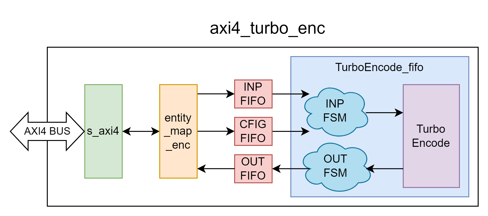

## Generics

| Generic name | Type | Default Value | Description   |
| ------------ | ---- | ------------- | ------------- |
| DATA_WIDTH   | parameter | 64            | Độ rộng dữ liệu dùng cho kênh AXI4 xDATA |
| ADDR_WIDTH   | parameter | 6             | Độ rộng địa chỉ dùng cho kênh AXI4 AxADDR |
| ID_WIDTH     | parameter | 8             | Độ rộng ID dùng cho kênh AXI4 xID |
| MAP_ADDR_WIDTH | localparam | 2 | Độ rộng địa chỉ dùng cho Custom bus. |
| FIFO_CFG_DW  | localparam | 10 | Độ rộng dữ liệu FIFO CFG
| FIFO_INP_DW  | localparam | DATA_WIDTH | Độ rộng dữ liệu FIFO INP
| FIFO_OUT_DW  | localparam | DATA_WIDTH | Độ rộng dữ liệu FIFO OUT
| FIFO_CFG_DD  | localparam | 512        | Số lượng phần tử FIFO CFG
| FIFO_INP_DD  | localparam | 256        | Số lượng phần tử FIFO INP
| FIFO_OUT_DD  | localparam | 1024       | Số lượng phần tử FIFO OUT
      
**NOTE**: Tham số __DATA_WIDTH__ hỗ trợ các giá trị theo chuẩn AXI4: 32, __64__, 128, 256, 512, 1024. Tuy nhiên mới chỉ thiết kế để hỗ trợ `DW = 64`, các cài đặt khác chưa được kiểm chứng.

## Ports

| Port name    | Direction | Type  | Description                                                                             |
| ------------ | :-------: | :---- | --------------------------------------------------------------------------------------  |
| aclk         | input     |       | Tín hiệu đồng hồ. Module hoạt động theo cạnh lên của `aclk`. |
| aresetn      | input     |       | Reset đồng bộ tích cực thấp.                                |
| _AW_
| s_axi_awid   | input  | [ID_WIDTH-1:0] | |
| s_axi_awaddr | input  | [ADDR_WIDTH-1:0] | |
| s_axi_awlen  | input  | [7:0] | |
| s_axi_awsize | input  | [2:0] | |
| s_axi_awburst| input  | [1:0] | |
| s_axi_awvalid| input  |       | |
| s_axi_awready| output |       | |
| _W_
| s_axi_wdata  | input  | [DATA_WIDTH-1:0] | |
| s_axi_wstrb  | input  | [(DATA_WIDTH/8)-1:0] | |
| s_axi_wlast  | input  |       | |
| s_axi_wvalid | input  |       | |
| s_axi_wready | output |       | |
| _B_
| s_axi_bid    | output | [ID_WIDTH-1:0] | |
| s_axi_bresp  | output | [1:0] | |
| s_axi_bvalid | output |       | |
| s_axi_bready | input  |       | |
| _AR_
| s_axi_arid   | input  | [ID_WIDTH-1:0] | |
| s_axi_araddr | input  | [ADDR_WIDTH-1:0] | |
| s_axi_arlen  | input  | [7:0] | |
| s_axi_arsize | input  | [2:0] | |
| s_axi_arburst| input  | [1:0] | |
| s_axi_arvalid| input  |       | |
| s_axi_arready| output |       | |
| _R_
| s_axi_rid    | output | [ID_WIDTH-1:0] | |
| s_axi_rdata  | output | [DATA_WIDTH-1:0] | |
| s_axi_rresp  | output | [1:0] | |
| s_axi_rlast  | output |       | |
| s_axi_rvalid | output |       | |
| s_axi_rready | input  |       | |

## Functional description

__axi4_turbo_enc__ được thiết kế với chức năng chính là để cung cấp giao diện AXI4 cho [TurboEncode](./TurboCodeEncoder.md) thực hiện quá trình mã hóa dữ liệu theo thuật toán Turbo Code (chi tiết tham khảo [TurboEncode](./TurboCodeEncoder.md) Functional description). IP bao gồm các khối chức năng chính sau:

- __s_axi4__: Xử lý các AXI transaction, đưa giao diện AXI về giao diện tùy chỉnh để dễ dàng tương tác. 

- __entity_map_enc__: Khối này có nhiệm vụ decode địa chỉ truy cập để mapping luồng đọc/ghi tới các thành phần tương ứng trong hệ thống, bao gồm các FIFO INP, CFG, OUT (~~và các thanh ghi~~).

- __Các FIFO__: FIFO INP giúp đệm dữ liệu đầu vào, FIFO CFG nhận ~~các~~ tham số cài đặt cho lần Turbo encode kế tiếp, và FIFO OUT lưu trữ dữ liệu đầu ra. Giao diện AXI có thể ghi dữ liệu vào INP, CFG hay đọc dữ liệu từ OUT thông qua việc tạo transaction (nên được thiết lập với kiểu burst FIXED) với địa chỉ tương ứng, được ánh xạ bởi khối _entity_map_enc_. Thông tin được pack trong khung dữ liệu đọc/ghi được mô tả tại mục [Cấu trúc khung dữ liệu đọc/ghi](#cấu-trúc-khung-dữ-liệu-đọcghi).
- __TurboEncode_fifo__: Cung cấp giao diện để khối _TurboEncode_ tương tác với các FIFO INP, CFG, OUT. FSM INP thực hiện quá trình unpack luồng dữ liệu từ FIFO INP, tham số cài đặt từ FIFO CFG và điều khiển các tín hiệu đầu vào khối _TurboEncode_ để thực thi quá trình Turbo encode. FSM OUT thực hiện quá trình pack luồng đầu ra khối _TurboEncode_ thành dữ liệu đẩy vào FIFO OUT. Cách pack/unpack tham khảo mục [Cấu trúc khung dữ liệu đọc/ghi](#cấu-trúc-khung-dữ-liệu-đọcghi).

### Cấu trúc khung dữ liệu đọc/ghi

__Kênh CFG__: Khi gửi thiết lập cho lần encode tiếp theo tới IP, 10 LSB bit của wdata sẽ được sử dụng cho tham số `block_size`.

__Kênh INP__: Khi gửi chuỗi dữ liệu đầu vào cần encode tới IP, cần pack cho đủ DATA_WIDTH bit mỗi AXI4 transfer rồi truyền lần lượt `INP_len` transfers. Pack lần lượt các cặp `AB` đầu vào với chỉ số từ `0 đến Nc-1` theo chiều `MSB đến LSB` của AXI wdata, `DATA_WIDTH - (N % DATA_WIDTH)` LSB còn lại của transfer cuối cùng sẽ được bỏ qua bởi IP (phía gửi mặc định padding 0's).

__Kênh OUT__: Khi IP pack chuỗi dữ liệu đầu ra sau encode, sẽ pack cho đủ DATA_WIDTH bit mỗi AXI4 transfer rồi truyền lần lượt `OUT_len` transfers. Pack lần lượt tập `ABY1Y2W1W2` đầu ra với chỉ số từ `0 đến Nc-1` theo chiều `MSB đến LSB` của AXI rdata. Lưu ý rằng khi pack, các transfer sẽ luôn dư 2 hoặc 4 LSB (tùy theo giá trị của DATA_WIDTH), 2 bit LSB sẽ được tận dụng để chứa các bit trạng thái lần lượt là `start` và `end`. Transfer đầu tiên có bit trạng thái `start = 1`, transfer cuối cùng có bit trạng thái `end = 1`, còn lại mặc định giá trị trạng thái `start = 0` và `end = 0`. Các bit không dùng tới sẽ mặc định được bỏ qua khi unpack dữ liệu.

<p id="equ-INP_len"></p>

Số transfer `INP_len` cần thiết để ghi chuỗi dữ liệu đầu vào tới FIFO INP với thiết lập `BLOCK_SIZE`:

```C
INP_len = ceil(
    (BLK_SIZE * 8) / DATA_WIDTH
)
```

<p id="equ-OUT_len"></p>

Số transfer `OUT_len` cần thiết để đọc chuỗi dữ liệu đầu ra từ FIFO OUT với thiết lập `BLOCK_SIZE`:

```C
OUT_len = ceil(
    (BLK_SIZE * 8 * 3) / (6 * floor(DATA_WIDTH / 6))
)
```

#### Ví dụ: AXI bus width = 32, cần encode chuỗi dữ liệu 48 bit (block size = 6) 

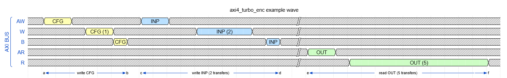

__Cần thực hiện:__

_B1: Gửi CFG_

Gửi dữ liệu thiết lập cho lần encode này với giá trị block size = 6.


_B2: Gửi inp_

Gửi 48 bit của chuỗi dữ liệu cần encode sử dụng 2 AXI4 transfer 32 bit. Các cặp dữ liệu đầu vào `AB` (2 bit/mẫu) với index từ `0 đến Nc-1` sẽ được packed lại theo chiều `MSB tới LSB` của 32 bit transfer.

_Transfer #1_:


_Transfer #2_:


_B3: Nhận out_

Nhận 144 bit của chuỗi dữ liệu sau encode sử dụng 5 AXI4 transfer 32 bit. Các tập dữ liệu đầu ra `ABY1Y2W1W2` (6 bit/mẫu) với index từ `0 đến Nc-1` sẽ được packed lại theo chiều `MSB tới LSB` của 32 bit transfer. Transfer đầu tiên có bit trạng thái `start = 1`, transfer cuối cùng có bit trạng thái `end = 1`, còn lại mặc định giá trị trạng thái `start = 0` và `end = 0`.

_Transfer #1_


_Transfer #2_


...

_Transfer #5_

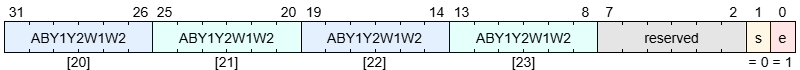

### Độ sâu các FIFO INP, CFG, OUT

Trong thiết kế Turbo Encoder IP, để hỗ trợ lên tới 3 lần đẩy dữ liệu cần encode liên tiếp với block size 600 (`K = 3`) và DATA_WIDTH = 64:
- CFG_depth = 341
- INP_depth = 225
- OUT_depth = 720

=> FIFO implemented depth X_impl_depth = 2 ^ ceil(log2(X_depth)):
- CFG_impl_depth: 512
- INP_impl_depth: 256
- OUT_impl_depth: 1024

Với cài đặt đó, thiết kế có thể hỗ trợ tối đa `k` lần lưu trữ chuỗi đầu ra encode với block size tương ứng:
```C
k(BLK_SIZE) = floor(
    OUT_impl_depth / OUT_len(BLK_SIZE)
)
```

| BLK_SIZE<br>(bytes) | k<br>(lần encode) | BLK_SIZE<br>(bytes) | k<br>(lần encode) |
|:-:|:--:|:-:|:-:|
|6  | 341|48 |42 |
|9  | 227|54 |37 |
|12 | 170|60 |34 |
|18 | 113|120|17 |
|24 | 85 |240|8  |
|27 | 75 |360|5  |
|30 | 68 |480|4  |
|36 | 56 |600|3  |
|45 | 45 | - | - |

</details>

<details open>
<summary>Entity: entity_map_enc</summary>

# Entity: entity_map_enc

- **File**: entity_map_enc.sv

## Diagram
|<p style="text-align:center">entity_map_enc<br>Write mapping</p>|<p style="text-align:center">entity_map_enc<br>Read mapping</p>|
|-|-|
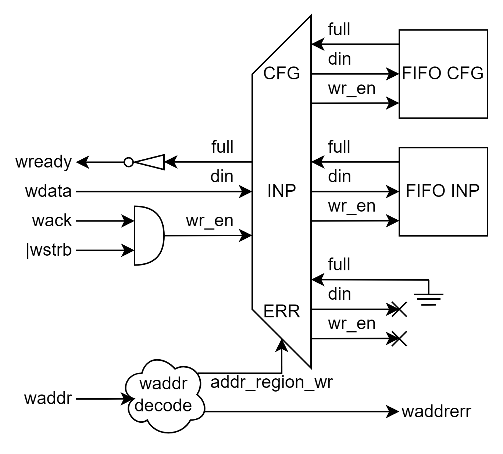 | 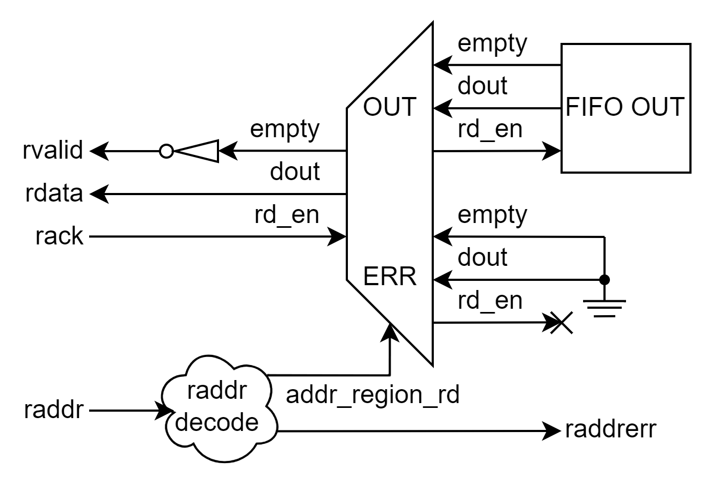
case(__waddr__)<br>__0x0__: CFG<br>__0x1__: INP<br>__others__: <t style="color:red">ERR</t>|case(__waddr__)<br>__0x2__: OUT<br>__others__: <t style="color:red">ERR</t>

## Ports

| Port name    | Direction | Type  | Description                                                                             |
| ------------ | :-------: | :---- | --------------------------------------------------------------------------------------  |
| clk         | input     |       | Tín hiệu đồng hồ. Module hoạt động theo cạnh lên của `aclk`. |
| rst         | input     |       | Reset đồng bộ tích cực cao.                                |
| _FIFO_
| fifo_cfg_full | input  | | Báo hiệu FIFO CFG đầy.
| fifo_cfg_din  | output | [FIFO_CFG_DW-1:0] | Dữ liệu ghi vào FIFO CFG.
| fifo_cfg_wr_en | output | | Ghi dữ liệu vào FIFO CFG.
| fifo_inp_full | input  | | Báo hiệu FIFO INP đầy.
| fifo_inp_din  | output | [FIFO_INP_DW-1:0] | Dữ liệu ghi vào FIFO INP.
| fifo_inp_wr_en | output | | Ghi dữ liệu vào FIFO INP.
| fifo_out_empty | input  | | Báo hiệu FIFO OUT trống.
| fifo_out_din   | input  | [FIFO_OUT_DW-1:0] | Dữ liệu đọc từ FIFO OUT.
| fifo_out_rd_en | output | | Đọc dữ liệu từ FIFO OUT.
| _Custom bus_
| waddr   |  input   | [MAP_ADDR_WIDTH-1:0] | Địa chỉ ghi.
| wdata   |  input   | [DATA_WIDTH-1:0]     | Dữ liệu ghi.
| wstrb   |  input   | [(DATA_WIDTH/8)-1:0] | Byte enable dữ liệu ghi.
| wlast   |  input   |                      | Dữ liệu ghi cuối.
| wvalid  |  input   |                      | Dữ liệu ghi hợp lệ.
| wready  |  output  |                      | Sẵn sàng ghi.
| waddrerr|  output  |                      | Write Address Error. Thường gây bởi master truy cập vào địa chỉ không hợp lệ.
| wack    |  output  |                      |Dữ liệu được handshaked. `wack = wready && wvalid`. 
| raddr   |  input   |                      [MAP_ADDR_WIDTH-1:0] | Địa chỉ đọc.
| rdata   |  output  |                      [DATA_WIDTH-1:0]     | Dữ liệu đọc.
| rvalid  |  output  |                      | Dữ liệu đọc hợp lệ.
| rready  |  input   |                      | Sẵn sàng đọc.
| raddrerr|  output  |                      | Read Address Error. Thường gây ra bởi master truy cập vào địa chỉ không hợp lệ.
| rack    |  output  |                      | Dữ liệu được handshaked. `rack = rready && rvalid`.

## Functional description

Khối _entity_map_enc_ decode địa chỉ truy cập để mapping luồng đọc/ghi tới các thành phần tương ứng trong hệ thống, bao gồm các FIFO INP, CFG, OUT (~~và các thanh ghi~~).

|Address|Region|Access|
|-|-|-|
|0x0|FIFO CFG|Write only|
|0x1|FIFO INP|Write only|
|0x2|FIFO OUT|Read only|
|others|<t style="color:red">ERR</t>|None|

Nếu address decode vào ERR region hoặc cố tình truy cập trái phép (Read từ Non-Readable hoặc Write vào Non-Writable) thì sẽ báo hiệu thông qua việc raise tín hiệu `waddrerr`/`raddr` tương ứng.

__Lưu ý__: FIFO được sử dụng phải hoạt động ở chế độ fall-through, nếu không sẽ cần thêm logic để xử lý quá trình đọc từ FIFO.

</details>

<details open>
<summary>Entity: TurboEncode_fifo</summary>

# Entity: TurboEncode_fifo

- __File__: TurboEncode_fifo.sv

## Diagram

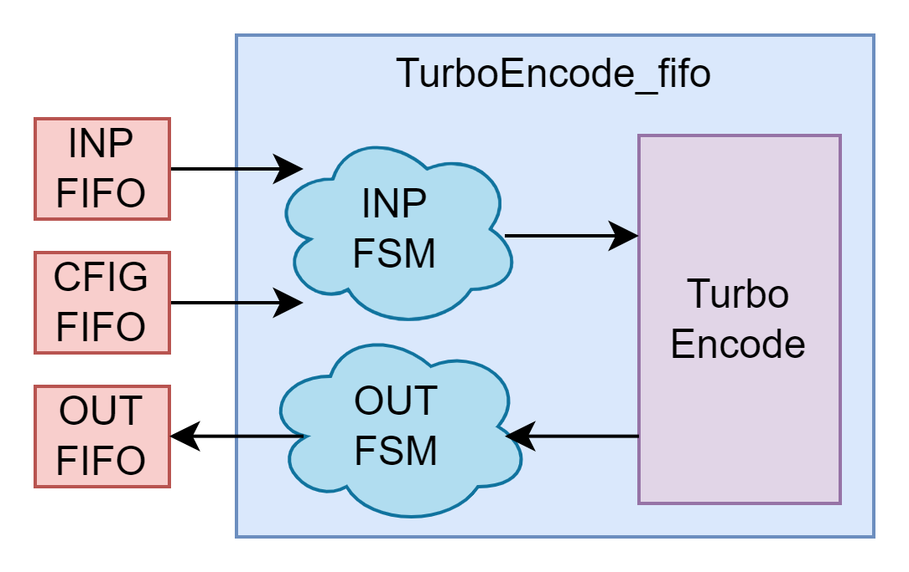

## Functional description

Cung cấp giao diện để khối __TurboEncode__ tương tác với các FIFO INP, CFG, OUT. FSM INP thực hiện quá trình unpack luồng dữ liệu từ FIFO INP, tham số cài đặt từ FIFO CFG và điều khiển các tín hiệu đầu vào khối __TurboEncode__ để thực thi quá trình Turbo encode. FSM OUT thực hiện quá trình pack luồng đầu ra khối __TurboEncode__ thành dữ liệu đẩy vào FIFO OUT. Cách pack/unpack tham khảo mục [Cấu trúc khung dữ liệu đọc/ghi](#cấu-trúc-khung-dữ-liệu-đọcghi).

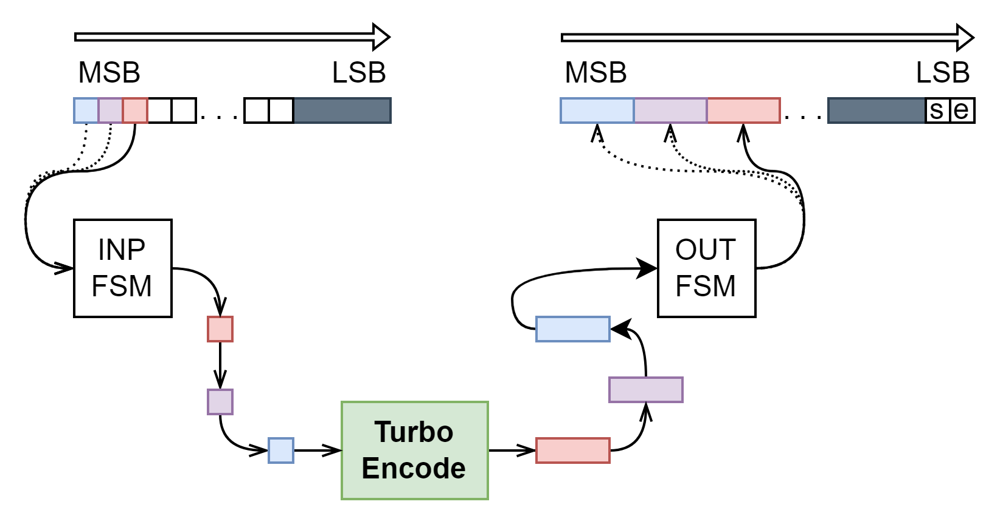

|<p style="text-align:center">INP FSM</p>|<p style="text-align:center">OUT FSM</p>|
|-|-|
|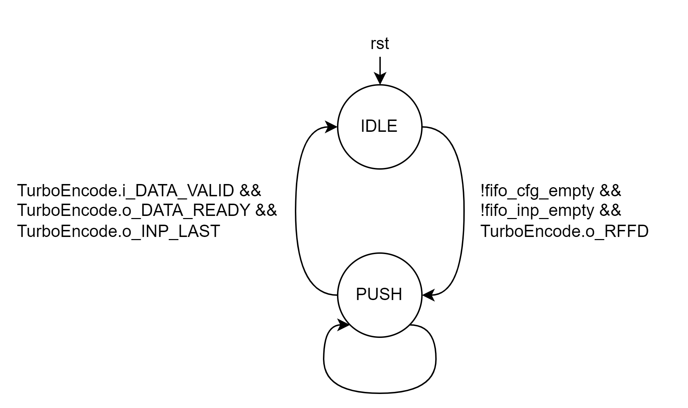|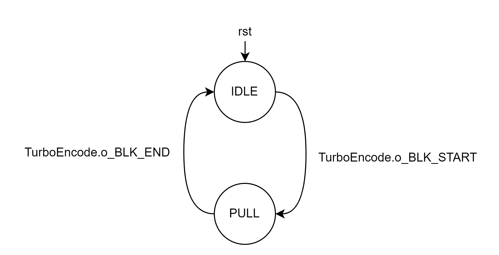|
__IDLE__: Chờ tới khi _FIFO CFG_ và _FIFO INP_ đều có dữ liệu (`!fifo_cfg_empty && !fifo_inp_empty`) báo hiệu tham số cài đặt `BLK_SIZE` và chuỗi dữ liệu đầu vào `AB` đang có sẵn cho lần Encode tiếp theo, đồng thời khối _TurboEncode_ sẵn sàng cho một lần Encode mới (`TurboEncode.o_RFFD`). Khi điều kiện thỏa mãn, tham số cài đặt và chuỗi `AB` bắt đầu được đẩy vào khối _TurboEncode_, chuyển trạng thái __PUSH__.<br>__PUSH__: Đọc dữ liệu từ _FIFO INP_, mỗi lần đọc sẽ unpack lần lượt thành chuỗi đầu vào `AB` cho tới khi đủ `Nc` phần tử. Khi phần tử cuối cùng được unpack và đẩy vào khối _TurboEncode_ (kiểm tra bằng điều kiện `TurboEncode.i_DATA_VALID && TurboEncode.o_DATA_READY && TurboEncode.o_DATA_LAST`), chuyển trạng thái __IDLE__.|__IDLE__: Chờ `TurboEncode.o_BLK_START` báo hiệu bắt đầu mẫu đầu tiên của chuỗi đầu ra sau Encode, chuyển trạng thái __PULL__.<br>__PULL__: Pack lần lượt chuỗi đầu ra `ABY1Y2W1W2` thành dữ liệu cho _FIFO OUT_. Chờ `TurboEncode.o_BLK_END` báo hiệu mẫu cuối cùng trong chuỗi đầu ra sau Encode, chuyển trạng thái __IDLE__.

## Waves

#### Ví dụ INP FSM với DATA_WIDTH = 64

Với `BLK_SIZE = 9`, ta cần lấy `INP_len =  2` dữ liệu từ _FIFO INP_ ([công thức tính INP_len](#equ-INP_len)). Mỗi mẫu dữ liệu có thể được unpack thành `DATA_WIDTH / 2 = 32` mẫu đầu vào `AB` cho khối _TurboEncode_, tuy nhiên tại mẫu dữ liệu cuối cùng chỉ cần unpack thành `NLAST = Nc % (DATA_WIDTH / 2) = 4` mẫu `AB` là đã đủ `Nc` mẫu trong chuỗi đầu vào `AB`.

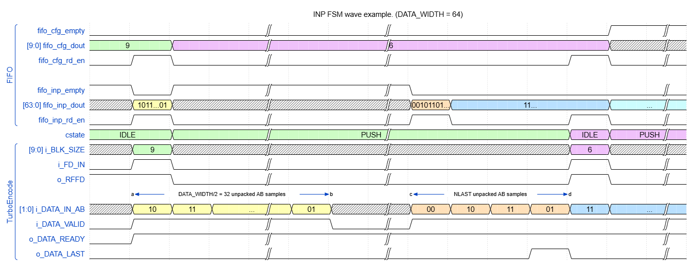

#### Ví dụ OUT FSM với DATA_WIDTH = 64, Encoded BLK_SIZE = 6

Với `BLK_SIZE = 6`, ta cần pack thành `OUT_len = 3` dữ liệu vào _FIFO OUT_ ([công thức tính OUT_len](#equ-OUT_len)). Mỗi lần pack sẽ lấy `NPACK = floor(DATA_WIDTH / 6) = 10` mẫu đầu ra `ABY1Y2W1W2` từ khối TurboEncode. Tại lần pack cuối cùng chỉ cần lấy `NLAST = Nc % NPACK = 4` mẫu là đã pack đủ `Nc` mẫu.

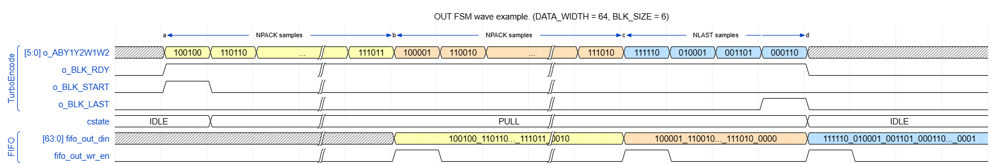

</details>


