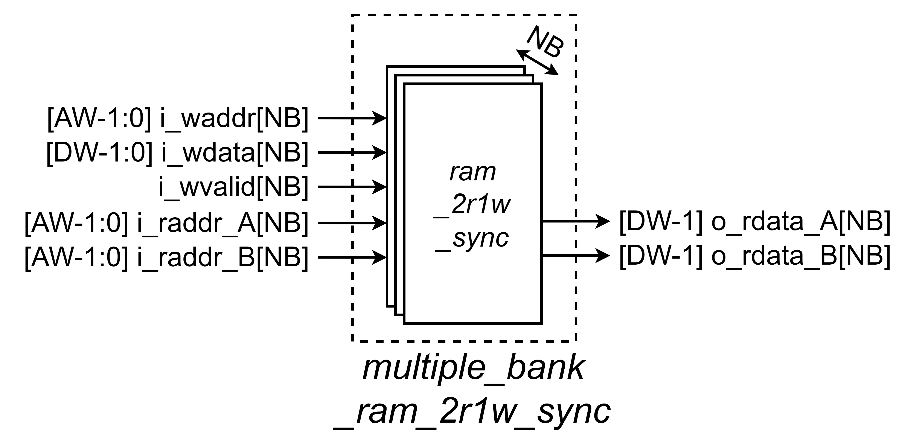

# Entity: fifo

- **File**: base_fifo_sync.v

## Diagram

## Generics

| Generic name | Type | Value | Description   |
| ------------ | ---- | ----- | ------------- |
| Width_g           | parameter      | 8     | Data Width    |
| Depth_g           | parameter     | 16    | Depth of FIFO |
| RamStyle_g | parameter string | "auto" | Through this generic, the exact resource to use for FPGA implementation can be controlled. This generic is applied to the attributes ram_style and ramstyle which vendors offer to control RAM implementation. Commonly used values are given below. __AMD (Xilinx)__: <t style="color:red">"auto" (default)</t>, "block", "distributed", "ultra" - see ug901 for details __Intel (Quartus)__: "M4K", "M9K", "M20K", "M144K", "MLAB" - see quartus-help for details __Efinix__: "block_ram", "registers" - see efinity-synthesis for details __Synplify(Lattice/Microchip)__: "block_ram", "registers", "distributed" - see microchip-attributes-guide for details __Gowin__: "block_ram", "distributed_ram", "registers", "rw_check", "no_rw_check" - see GowinSynthesis User Guide for details.
|RamBehavior_g|	parameter string|	"RBW"	| Controls the RAM behavior. Must match the behavior of RAM resources of the target technology for efficient implementation. If you are unsure what behavior your target device offers, try both settings and check which one is correctly mapped to RAM resources using the synthesis report. __"RBW"__: Read-Before-Write - more common, hence the <t style="color:red">default</t> __"WBR"__: Write-Before-Read

## Ports

| Port name    | Direction | Type  | Description                                                                             |
| ------------ | :-------: | :---- | --------------------------------------------------------------------------------------  |
| clk         | input     |       | Tín hiệu đồng hồ. Module hoạt động theo cạnh lên của `clk`. |
| rst         | input     |       | Reset đồng bộ tích cực cao.                                |
| full | input  | | Báo hiệu FIFO đầy.
| din  | output | [Width_g-1:0] | Dữ liệu ghi vào FIFO.
| wr_en | output | | Ghi dữ liệu vào FIFO.
| empty | input  | | Báo hiệu FIFO trống.
| din   | input  | [Width_g-1:0] | Dữ liệu đọc từ FIFO.
| rd_en | output | | Đọc dữ liệu từ FIFO.

## Functional description

This component implements a FIFO that:
- __Synchronous__: Same clock for write and read port.
- __Symmetric__: Same read and write port width.
- __Fall-through__: Valid read data output is present when possible (FIFO not empty).
- __FPGA oriented__: allows flexible, efficiently implementing FIFOs for different technologies.
    - The memory is described in a way that it utilizes RAM resources (Block-RAM, distributed RAM, etc.) available in FPGAs with commonly used tools.
    - The RAM behavior can be selected.

__NOTE__: No detailed architecture documentation is required for a FIFO. The behavior of the FIFO is sufficiently defined without details about the internals being required.

# Entity: ram_1r1w_sync

_RAM 1 Read ports 1 Write port, read-write SYNChronous_

- **File**: ram_1r1w_sync.sv

## Diagram

## Generics

| Generic name | Type | Value | Description   |
| ------------ | ---- | ----- | ------------- |
| DW           |      | 2     | Data Width    |
| AW           |      | 12    | Address Width |

## Ports

| Port name | Direction | Type     | Description                                                 |
| --------- | --------- | -------- | ----------------------------------------------------------- |
| clk       | input     |          | Tín hiệu đồng hồ. Module hoạt động theo cạnh lên của `clk`. |
| rst       | input     |          | Reset đồng bộ khi `rst = 1`.                                |
| i_waddr   | input     | [AW-1:0] | Write Address                                               |
| i_wdata   | input     | [DW-1:0] | Write Data                                                  |
| i_wvalid  | input     |          | Write Valid                                                |
| i_raddr   | input     | [AW-1:0] | Read Address                                    |
| o_rdata   | output    | [DW-1:0] | Read Data                                       |

## Functional description

Khi `i_wvalid` = 1, dữ liệu `i_wdata` được ghi vào địa chỉ `i_waddr` tại chu kỳ `clk` kế tiếp. Khi `i_raddr` thay đổi hoặc dữ liệu tại `i_raddr` thay đổi, giá trị `o_rdata` đọc được từ `i_raddr` được cập nhật tại chu kỳ `clk` kế tiếp. Có 1 port để ghi dữ liệu, 2 port để đọc dữ liệu, các port có thể hoạt động độc lập và không ảnh hưởng tới nhau, ưu tiên dữ liệu tại các port là đọc trước, ghi sau.

## Latency

Độ trễ Write = 1. Độ trễ Read = 1.

Độ trễ Write của module được tính từ lúc `i_wvalid` được kích hoạt tới lúc `i_wdata` được ghi vào địa chỉ `i_waddr`.

Độ trễ Read của module được tính từ lúc giá trị địa chỉ `i_raddr` hoặc dữ liệu tại `i_raddr` thay đổi tới lúc `o_rdata` được đọc từ địa chỉ `i_raddr`.

# Entity: ram_2r1w_sync

_RAM 2 Read ports 1 Write port, read-write SYNChronous_

- **File**: ram_2r1w_sync.sv

## Diagram

## Generics

| Generic name | Type | Value | Description   |
| ------------ | ---- | ----- | ------------- |
| DW           |      | 2     | Data Width    |
| AW           |      | 12    | Address Width |

## Ports

| Port name | Direction | Type     | Description                                                 |
| --------- | --------- | -------- | ----------------------------------------------------------- |
| clk       | input     |          | Tín hiệu đồng hồ. Module hoạt động theo cạnh lên của `clk`. |
| rst       | input     |          | Reset đồng bộ khi `rst = 1`.                                |
| i_waddr   | input     | [AW-1:0] | Write Address                                               |
| i_wdata   | input     | [DW-1:0] | Write Data                                                  |
| i_wvalid  | input     |          | Write Valid                                                |
| i_raddr_A | input     | [AW-1:0] | Read Address from port A                                    |
| i_raddr_B | input     | [AW-1:0] | Read Address from port B                                    |
| o_rdata_A | output    | [DW-1:0] | Read Data from port A                                       |
| o_rdata_B | output    | [DW-1:0] | Read Data from port B                                       |

## Functional description

Khi `i_wvalid` = 1, dữ liệu `i_wdata` được ghi vào địa chỉ `i_waddr` tại chu kỳ `clk` kế tiếp. Khi `i_raddr_X` thay đổi hoặc dữ liệu tại `i_raddr_X` thay đổi, giá trị `o_rdata_X` đọc được từ `i_raddr_X` được cập nhật tại chu kỳ `clk` kế tiếp. Có 1 port để ghi dữ liệu, 1 port để đọc dữ liệu, các port có thể hoạt động độc lập và không ảnh hưởng tới nhau, ưu tiên dữ liệu tại các port là đọc trước, ghi sau.

## Latency

Độ trễ Write = 1. Độ trễ Read = 1.

Độ trễ Write của module được tính từ lúc `i_wvalid` được kích hoạt tới lúc `i_wdata` được ghi vào địa chỉ `i_waddr`.

Độ trễ Read của module được tính từ lúc giá trị địa chỉ `i_raddr` hoặc dữ liệu tại `i_raddr` thay đổi tới lúc `o_rdata` được đọc từ địa chỉ `i_raddr`.

# Entity: multiple_bank_ram_2r1w_sync

_Multiple bank 2 Read ports 1 Write port, read-write SYNChronous_.

- **File**: multiple_bank_ram_2r1w_sync.sv

## Diagram

## Generics

| Generic name | Type | Value | Description     |
| ------------ | ---- | ----- | --------------- |
| DW           |      | 2     | Data Width      |
| AW           |      | 12    | Address Width   |
| NB           |      | 3     | Number of Banks |

## Ports

| Port name | Direction | Type        | Description |
| --------- | --------- | ----------- | ----------- |
| clk       | input     |             | Tín hiệu đồng hồ. Module hoạt động theo cạnh lên của `clk`.
| rst       | input     |             | Reset đồng bộ khi `rst = 1`.
| i_wvalid  | input     | [NB-1:0]    | Write Valid
| i_waddr   | input     | [AW-1:0]    | Write Address
| i_wdata   | input     | [DW-1:0]    | Write Data
| i_raddr_A | input     | [AW-1:0] [NB] | Read Address from port A
| i_raddr_B | input     | [AW-1:0] [NB] | Read Address from port B
| o_rdata_A | output    | [DW-1:0] [NB] | Read Data from port A
| o_rdata_B | output    | [DW-1:0] [NB] | Read Data from port B

## Functional description

Khối này là ghép của `NB` khối [ram_2r1w_sync](#entity-ram_2r1w_sync), gọi là các bank.

## Latency

Độ trễ của module phụ thuộc vào module [ram_2r1w_sync](#entity-ram_2r1w_sync)