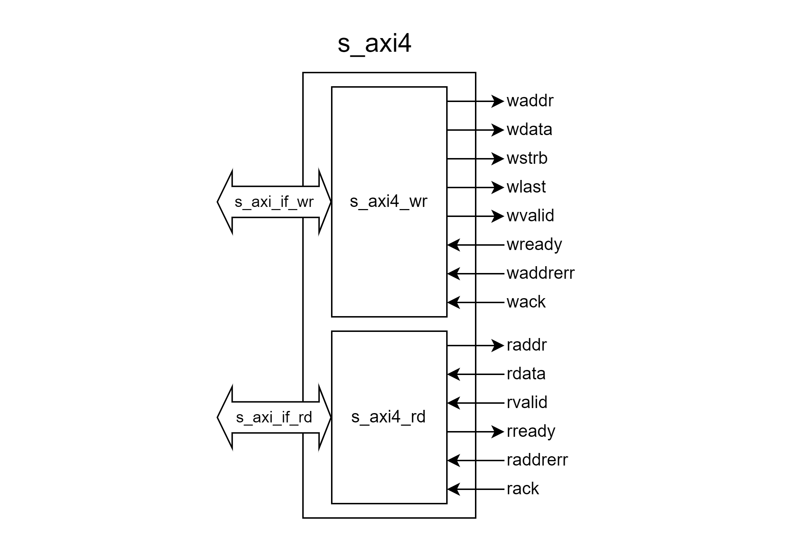
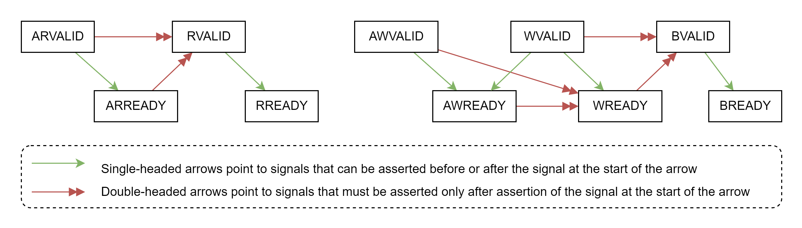
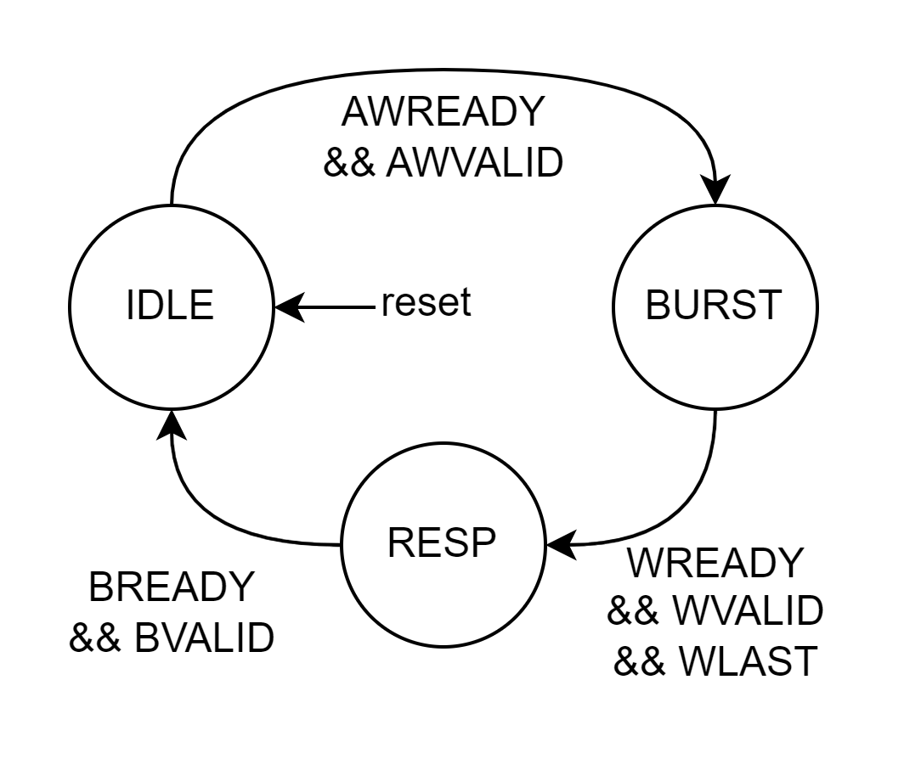
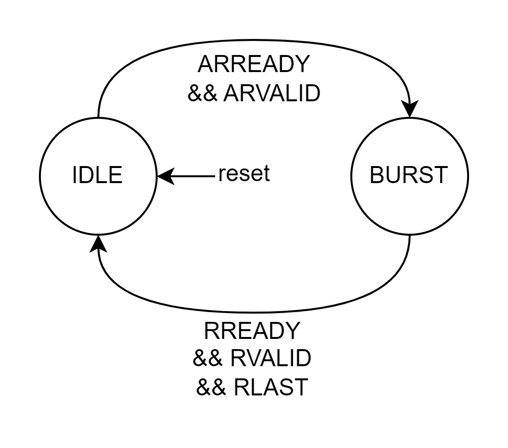
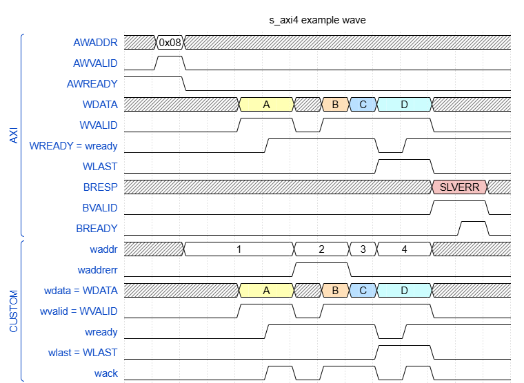
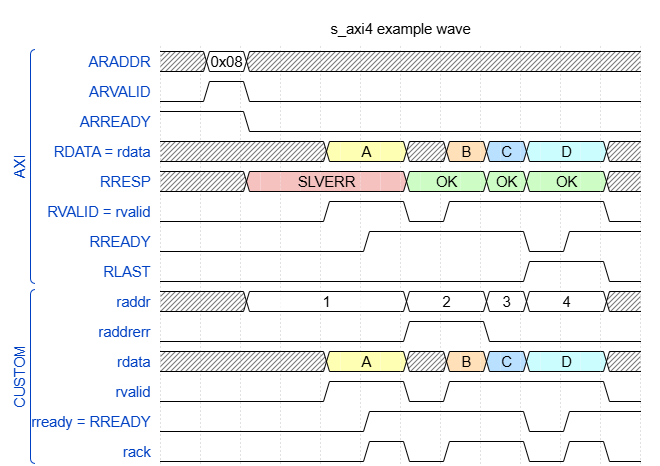

# Entity: s_axi4
- __File__: s_axi4.sv

## Cấu trúc phân cấp

- [s_axi4 (TOP)](#entity-s_axi4)
    - [s_axi4_wr](#entity-s_axi4_wr): s_axi4_wr_inst
    - [s_axi4_rd](#entity-s_axi4_rd): s_axi4_rd_inst

## Diagram



## Ports

| Port name    | Direction | Type  | Description |
| ------------ | :-------: | ----- | ----------- |
| aclk         | input     |       | Tín hiệu đồng hồ. Module hoạt động theo cạnh lên của `aclk`. |
| aresetn      | input     |       | Reset đồng bộ tích cực thấp.                                |
| _AXI Interface_
| s_axi_if_wr  | - | axi_if_wr.slv interface | Giao diện này bao gồm các kênh _AW_, _W_, _B_ của giao diện AXI4.|
| s_axi_if_rd  | - | axi_if_rd.slv interface| Giao diện này bao gồm các kênh _AR_, _R_ của giao diện AXI4.|
| _Custom bus_
| waddr   | output | [MAP_ADDR_WIDTH-1:0] | Địa chỉ ghi.
| wdata   | output | [DATA_WIDTH-1:0]     | Dữ liệu ghi.
| wstrb   | output | [(DATA_WIDTH/8)-1:0] | Byte enable dữ liệu ghi.
| wlast   | output |                      | Dữ liệu ghi cuối.
| wvalid  | output |                      | Dữ liệu ghi hợp lệ.
| wready  | input  |                      | Sẵn sàng ghi
| waddrerr| input  |                      | Write Address Error. Thường gây bởi master truy cập vào địa chỉ không hợp lệ.
| wack    | input  |                      | `wack = wready && wvalid` 
| raddr   | output | [MAP_ADDR_WIDTH-1:0] | Địa chỉ đọc.
| rdata   | input  | [DATA_WIDTH-1:0]     | Dữ liệu đọc.
| rvalid  | input  |                      | Dữ liệu đọc hợp lệ.
| rready  | output |                      | Sẵn sàng đọc
| raddrerr| input  |                      | Read Address Error. Thường gây ra bởi master truy cập vào địa chỉ không hợp lệ.
| rack    | input  |                      | Dữ liệu được handshaked.

## Functional description

__s_axi4__ xử lý các AXI transaction, đưa giao diện AXI về giao diện tùy chỉnh để dễ dàng tương tác. Khối này bao gồm các khối chính:
- __s_axi4_wr__: Xử lý các kênh _AW_, _W_, _B_ của bus AXI. Chuyển đổi write transaction thành các tín hiệu custom bus.
- __s_axi4_rd__: Xử lý các kênh _AR_, _R_ của bus AXI. Chuyển đổi read transaction thành các tín hiệu custom bus.

|Tín hiệu|Yêu cầu?|Desciption|
|-|:-:|-|
__xLAST__   | Có    |Tín hiệu xLAST là bắt buộc có. Slave phụ thuộc vào WLAST để xác định transfer cuối cùng, kết thúc một write transaction.
__AxBURST__ | Có    |Hỗ trợ các kiểu burst hợp lệ INCR, FIXED, WRAP như được quy định trong chuẩn.
__AxREGION__| Không | Nếu yêu cầu, giá trị mặc định nên là 0.
__AxLOCK__  | Không | Nếu yêu cầu, giá trị mặc định nên là 0 (NORM).
__AxCACHE__ | Không | Nếu yêu cầu, giá trị mặc định nên là 0.
__AxPROT__  | Không | Nếu yêu cầu, giá trị mặc định nên là 0.
__AxQOS__   | Không | Nếu yêu cầu, giá trị mặc định nên là 0.


|<a id="Transaction-Handshake-Dependencies"></a> ___Transaction Handshake Dependencies___|
|:-:|
||

Đặc điểm| Description
-|-|
__Transaction dependencies__| Kênh Address cần được handshake trước khi có thể handshake kênh Data. (Hình [Transaction Handshake Dependencies](#Transaction-Handshake-Dependencies))
__Outstanding transaction__| Không hỗ trợ. Read/Write transaction cần hoàn tất trước khi bắt đầu một transaction mới.
__Registed output__| Giao diện AXI đảm bảo không có logic tổ hợp tại các tín hiệu đầu ra (được quy định trong AMBA AXI Protocol Specification mục A3.2.1 Handshake process, phát biểu rằng _"On master and slave interfaces there must be no combinatorial paths between input and output signals"_).
__Unaligned transfer start address__| Không hỗ trợ. Master bắt buộc phải align địa chỉ truy cập, nếu không, slave tự động align bằng cách bỏ các LSB tương ứng trên địa chỉ và điều này có thể dẫn tới hành vi không mong muốn.
__Early burst termination__| Không hỗ trợ. Mọi transaction bắt buộc hoàn tất.

### Mapping địa chỉ AXI thành địa chỉ custom bus

Với `OFFSET = log2(DATA_WIDTH/8)`, địa chỉ `xaddr(i)` tương ứng với transfer thứ `i` được tính theo:

```C
xaddr(i) = (AxADDR + i * (1 << AxSIZE)) >> OFFSET
```


## FSM

|<p style="text-align:center">s_axi4_wr<br>FSM</p>|<p style="text-align:center">s_axi4_rd<br>FSM</p>|
|-|-|
|||
|__IDLE__: Chờ handshake Address để chốt các tham số cần thiết như `AWID`, `AWADDR`, `AWSIZE`, `AWBURST`,... và chuyển trạng thái __BURST__.<br>__BURST__: Dựa vào các tham số, thực hiện việc handshake Data, tính toán địa chỉ ghi, kiểm tra lỗi,... cho tới khi master raise tín hiệu `WLAST` báo hiệu transfer cuối cùng trong chuỗi `(AWLEN + 1)` transfers thì chuyển trạng thái __RESP__. Khi chuyển trạng thái, dựa vào quá trình ghi có phát sinh lỗi hay không mà chốt giá trị phản hồi `BRESP = SLVERR` hoặc `BRESP = OK` tới master. <br>__RESP__: Chờ handshake Response, chuyển trạng thái __IDLE__.|__IDLE__: Chờ handshake Address để chốt các tham số cần thiết như `ARID`, `ARADDR`, `ARLEN`, `ARSIZE`, `ARBURST`,... và chuyển trạng thái __BURST__.<br>__BURST__: Dựa vào các tham số, thực hiện việc handshake Data, tính toán địa chỉ đọc, kiểm tra lỗi,... cho tới khi kết thúc chuỗi `(ARLEN + 1)` transfers. Tại transfer cuối cùng, slave raise tín hiệu `RLAST`. Với mỗi transfer, dựa vào quá trình đọc có phát sinh lỗi hay không mà phản hồi `RRESP = SLVERR` hoặc `RRESP = OK` tới master.|

## Wave

### Ví dụ quá trình ghi

Giả sử `DATA_WIDTH = 64`, `OFFSET = log2(DATA_WIDTH / 8) = 3`. Ghi 4 transfers (`AWLEN = 3`) vào địa chỉ bắt đầu `AWADDR = 0x08` với `BURST = INCR`, `SIZE = log2(DATA_WIDTH / 8)` tương ứng với max size mà `DATA_WIDTH` hỗ trợ.

Sau khi handshake Address, chốt `ADDR = AWADDR`. Ta tính `waddr = ADDR >> OFFSET = 1`. Mỗi lần handshake Data sẽ tăng `ADDR` lên tương ứng `(1 << SIZE)`, từ đó `waddr` cũng sẽ thay đổi.

Giả sử không cho phép ghi vào `waddr = 2`, khi đó `waddrerr` được raise lên, báo hiệu Write Address Error.

Lần handshake Data cuối (`WLAST = 1`) kết thúc quá trình ghi. Slave sẽ trả về `BRESP = SLVERR` báo hiệu cho master biết trong quá trình ghi có phát sinh lỗi.



### Ví dụ quá trình đọc

Giả sử `DATA_WIDTH = 64`, `OFFSET = log2(DATA_WIDTH / 8) = 3`. Đọc 4 transfers (`ARLEN = 3`) vào địa chỉ bắt đầu `ARADDR = 0x08` với `BURST = INCR`, `SIZE = log2(DATA_WIDTH / 8)` tức là tương ứng với max mà `DATA_WIDTH` hỗ trợ.

Sau khi handshake Address, chốt `ADDR = ARADDR`. Ta tính `raddr = ADDR >> OFFSET = 1`. Mỗi lần handshake Data sẽ tăng `ADDR` lên tương ứng `(1 << SIZE)`, từ đó `raddr` cũng sẽ thay đổi.

Giả sử không cho phép đọc từ `raddr = 1`, khi đó `raddrerr` được raise lên, báo hiệu Read Address Error.

Lần handshake Data cuối (`RLAST = 1`) kết thúc quá trình đọc. Slave sẽ trả về `RRESP = SLVERR hoặc OK` tại mỗi transfer, báo hiệu cho master biết có lỗi hay không.


